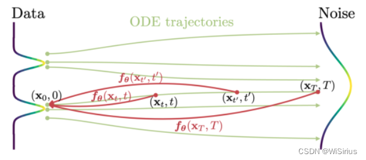
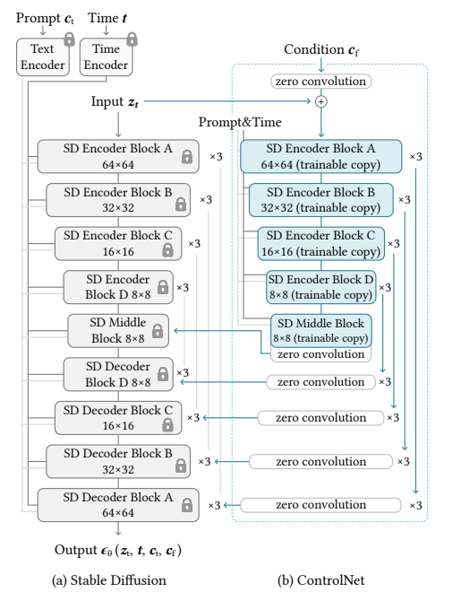

# 目录

- [1.目前主流的AI绘画大模型有哪些？](#1.目前主流的AI绘画大模型有哪些？)
- [2.SD模型训练时需要设置timesteps=1000，在推理时却只用几十步就可以生成图片？](#2.SD模型训练时需要设置timesteps=1000，在推理时却只用几十步就可以生成图片？)
- [3.SD模型中的CFGClassifier-Free-Guidance的原理？](#3.SD模型中的CFG(Classifier-Free-Guidance)的原理？)
- [4.SD模型中的（negative-prompt）反向提示词如何加入的？](#4.SD模型中的(negative-prompt)反向提示词如何加入的？)
- [5.SD中潜在一致性模型LCM、LCM-lora加速原理](#5.SD中潜在一致性模型LCM、LCM-lora加速原理)
- [6.Ip-adapter的模型结构与原理](#6.Ip-adapter原理)
- [7.Controlnet的模型结构与原理](#7.Controlnet原理)
- [8.人物一致性模型PhotoMaker原理](#8.人物一致性模型PhotoMaker原理)
- [9.人物一致性模型InstantID原理](#9.人物一致性模型InstantID原理)
- [10.单ID图像为什么InstantID人物一致性比Photomaker效果好](#10.单ID图像为什么InstantID人物一致性比Photomaker效果好)
- [11.大模型常见模型文件格式简介](#11.大模型常见模型文件格式简介)
- [12.safetensors模型文件的使用](#12.safetensors模型文件的使用)
- [13.GGUF模型文件的组成](#13.GGUF模型文件的组成)
- [14.diffusion和diffusers模型的相互转换](#14.diffusion和diffusers模型的相互转换)
- [15.什么是DreamBooth技术？](#15.什么是DreamBooth技术？)
- [16.正则化技术在AI绘画模型中的作用？](#16.正则化技术在AI绘画模型中的作用？)


<h2 id="1.目前主流的AI绘画大模型有哪些？">1.目前主流的AI绘画大模型有哪些？</h2>

目前，几个主流的文生图大模型包括：

1. Midjourney系列（V5-V6）
2. Stable Diffusion系列（1.x、2.x、XL、3）
3. DaLL·E系列（2-3）
4. PixArt系列（α、Σ）
5. Ideogram 1.0
6. Playground v2.5
7. Imagen系列（1、2）

<h2 id="2.SD模型训练时需要设置timesteps=1000，在推理时却只用几十步就可以生成图片？">2.SD模型训练时需要设置timesteps=1000，在推理时却只用几十步就可以生成图片？</h2>

目前扩散模型训练一般使用DDPM（Denoising Diffusion Probabilistic Models）采样方法，但推理时可以使用DDIM（Denoising Diffusion Implicit Models）采样方法，DDIM通过去马尔可夫化，大大减少了扩散模型在推理时的步数。

<h2 id="3.SD模型中的CFG(Classifier-Free-Guidance)的原理？">3.SD模型中的CFG(Classifier-Free-Guidance)的原理？ </h2>

### Classifier Guidance：
条件生成只需额外添加一个classifier的梯度来引导。Classifier Guidance 需要训练噪声数据版本的classifier网络，推理时每一步都需要额外计算classifier的梯度。

Classifier Guidance 使用显式的分类器引导条件生成有几个问题：①是需要额外训练一个噪声版本的图像分类器。②是该分类器的质量会影响按类别生成的效果。③是通过梯度更新图像会导致对抗攻击效应，生成图像可能会通过人眼不可察觉的细节欺骗分类器，实际上并没有按条件生成。

### Classifier-Free Guidance:
核心是通过一个隐式分类器来替代显示分类器，而无需直接计算显式分类器及其梯度。根据贝叶斯公式，分类器的梯度可以用条件生成概率和无条件生成概率表示.

把上面的分类器梯度代入到classifier guidance的分类器梯度中可得：

训练时，Classifier-Free Guidance需要训练两个模型，一个是无条件生成模型，另一个是条件生成模型。但这两个模型可以用同一个模型表示，训练时只需要以一定概率将条件置空即可。推理时，最终结果可以由条件生成和无条件生成的线性外推获得，生成效果可以引导系数可以调节，控制生成样本的逼真性和多样性的平衡。

<h2 id="4.SD模型中的(negative-prompt)反向提示词如何加入的？">4.SD模型中的(negative-prompt)反向提示词如何加入的？ </h2>

### 假想方案
容易想到的一个方案是 unet 输出 3 个噪声，分别对应无prompt，positive prompt 和 negative prompt 三种情况，那么最终的噪声就是


理由也很直接，因为 negative prompt 要反方向起作用，所以加个负的系数.

### 真正实现方法

 stable diffusion webui 文档中看到了 negative prompt 真正的[实现方法](https://github.com/AUTOMATIC1111/stable-diffusion-webui/wiki/Negative-prompt)。一句话概况：将无 prompt 的情形替换为 negative prompt，公式则是

 

就是这么简单，其实也很说得通，虽说设计上预期是无 prompt 的，但是没有人拦着你加上 prompt（反向的），公式上可以看出在正向强化positive prompt的同时也反方向强化——也就是弱化了 negative prompt。同时这个方法相对于我想的那个方法还有一个优势就是只需预测 2 个而不是 3 个噪声。

<h2 id="5.SD中潜在一致性模型LCM、LCM-lora加速原理">5.SD中潜在一致性模型LCM、LCM-lora加速原理 </h2>

### CM模型：
OpenAI 的宋飏博士提出的一致性模型（Consistency Model，CM）为解决多步采样问题提供了一个思路。一致性模型并不依赖于预训练的扩散模型，是一种独立的新型生成模型。一致性函数f的核心为这样一个性质：对于任意一个输入xt，经过f输出后，其输出是一致的。



缺点：一致性模型局限于无条件图片生成，导致包括文生图、图生图等在内的许多实际应用还难以享受这一模型的潜在优势。

### LCM模型
关键技术点：

（1）使用预训练的自动编码器将原始图片编码到潜在空间，在压缩图片中冗余信息的同时让图片在语义上具有更好的一致性；

（2）将无分类器引导（CFG）作为模型的一个输入参数蒸馏进潜在一致性模型中，在享受无分类器引导带来的更好的图片 - 文本的一致性的同时，由于无分类器引导幅度被作为输入参数蒸馏进了潜在一致性模型，从而能够减少推理时的所需要的计算开销；

（3）使用跳步策略来计算一致性损失，大大加快了潜在一致性模型的蒸馏过程。
潜在一致性模型的蒸馏算法的伪代码见下图。


<h2 id="6.Ip-adapter模型结构与原理">6.Ip-adapter模型结构与原理 </h2>
IP-Adapter 采用了一种解耦的交叉注意力机制，将文本特征和图像特征分开处理，从而使得生成的图像能够更好地继承和保留输入图像的特征。


图像编码：IP-Adapter 使用预训练的 CLIP（Contrastive Language-Image Pre-training）图像编码器来提取图像提示的特征。

解耦交叉注意力机制：IP-Adapter 通过这种机制，将文本特征的 Cross-Attention 和图像特征的 Cross-Attention 分区开来。在Unet 的模块中新增了一路 Cross-Attention 模块，用于引入图像特征。

适配模块：IP-Adapter 包含一个图像编码器和包含解耦交叉注意力机制的适配器。这个适配器允许模型在生成图像时，同时考虑文本提示和图像提示，生成与文本描述相匹配的图像。

<h2 id="7.Controlnet的模型结构与原理">7.Controlnet的模型结构与原理 </h2>



权重克隆：ControlNet 将大型扩散模型的权重克隆为两个副本，一个“可训练副本”和一个“锁定副本”。锁定副本保留了从大量图像中学习到的网络能力，而可训练副本则在特定任务的数据集上进行训练，以学习条件控制。

零卷积：ControlNet 引入了一种特殊类型的卷积层，称为“零卷积”。这是一个 1x1 的卷积层，其权值和偏差都初始化为零。零卷积层的权值会从零逐渐增长到优化参数，这样设计允许模型在训练过程中逐渐调整和学习条件控制，而不会对深度特征添加新的噪声。

特征融合：ControlNet 通过零卷积层将额外的条件信息融合到神经网络的深层特征中。这些条件可以是姿势、线条结构、颜色分布等，它们作为输入调节图像，引导图像生成过程。

灵活性和扩展性：ControlNet 允许用户根据需求选择不同的模型和预处理器进行组合使用，以实现更精准的图像控制和风格化。例如，可以结合线稿提取、颜色控制、背景替换等多种功能，创造出丰富的视觉效果。

<h2 id="8.人物一致性模型PhotoMaker原理">8.人物一致性模型PhotoMaker原理 </h2>

编码器（Encoders）：PhotoMaker使用CLIP图像编码器来提取图像嵌入（image embeddings），并通过微调部分Transformer层来优化模型对于屏蔽图像中ID特征的提取能力。

堆叠ID嵌入（Stacked ID Embedding）：通过将多个输入ID图像的编码堆叠起来，构建了一个统一的ID表示。这个表示能够保留每个输入ID图像的原始特征，并在推理阶段接受任意数量的ID图像作为输入，从而保持高生成效率。

融合（Merging）：利用扩散模型中的交叉注意力机制来自适应地合并堆叠的ID嵌入中包含的ID信息，从而在生成过程中实现对ID特征的有效控制。

ID导向的数据构建流程（ID-Oriented Human Data Construction）：为了支持PhotoMaker的训练，研究者设计了一个自动化流程来构建一个以ID为中心的人类数据集。这个数据集包含大量具有不同表情、属性、场景的图像，有助于训练过程中的ID信息学习。


<h2 id="9.人物一致性模型InstantID原理">9.人物一致性模型InstantID原理 </h2>
ID Embedding：InstantID利用预训练的人脸模型（如insightface库中的模型）来提取面部特征的语义信息，这些特征被称为ID Embedding。与使用CLIP模型相比，这种方法能够更精准和丰富地捕获人物面部表情的特征。

Image Adapter：这是一个轻量级的自适应模块，它结合了文本提示信息和图像提示信息。该模块的设计思路与IP-Adapter相似，通过解耦交叉注意力机制来适应不同的生成任务。

IdentityNet：为了在粗粒度上改进图像生成并更精确地控制人物ID图像的生成，InstantID引入了IdentityNet模块。这个模块利用弱空间信息（如面部关键点）和强语义信息（从ID Embedding模块提取的面部表情特征）来引导图像的生成。

ControlNet：InstantID还使用了ControlNet来增强面部特征提取，进一步提高图像生成的质量和准确性。

<h2 id="10.单ID图像为什么InstantID人物一致性比Photomaker效果好">10.单ID图像为什么InstantID人物一致性比Photomaker效果好</h2>

1.InstantID利用预训练的人脸模型（如insightface库中的模型）来提取面部特征的语义信息。与Photomaker所使用的CLIP模型相比，这种方法能够更精准和丰富地捕获人物面部表情的特征。

2.InstantID还使用ControlNet来增强面部特征提取，进一步提高图像生成的质量和准确性。

3.Photomaker是先将文本特征和图像特征通过MLPs融合，再做CrossAttention加入U-net.InstantID是图像特征和文本特征分开做CrossAttention,再融合。（可以认为是区别，不要一定是效果好的原因）

<h2 id="11.大模型常见模型文件格式简介">11.大模型常见模型文件格式简介 </h2>

### 1、safetensors模型
1) 这是由 Hugging Face 推出的一种新型安全模型存储格式，特别关注模型安全性、隐私保护和快速加载。
2) 它仅包含模型的权重参数，而不包括执行代码，这样可以减少模型文件大小，提高加载速度。
3) 加载方式：使用 Hugging Face 提供的相关API来加载 .safetensors 文件，例如 safetensors.torch.load_file() 函数。

### 2、ckpt模型
全称checkpoint，通过Dreambooth训练的模型，包含了模型参数，还包括优化器状态以及可能的训练元数据信息，使得用户可以无缝地恢复训练或执行推理
### 3、bin模型
1) 通常是一种通用的二进制格式文件，它可以用来存储任意类型的数据。
2) 在机器学习领域，.bin 文件有时用于存储模型权重或其他二进制数据，但并不特指PyTorch的官方标准格式。
3) 对于PyTorch而言，如果用户自己选择将模型权重以二进制格式保存，可能会使用 .bin 扩展名，加载时需要自定义逻辑读取和应用这些权重到模型结构中。
### 4、pth模型
1) 是 PyTorch 中用于保存模型状态的标准格式。
2) 主要用于保存模型的 state_dict，包含了模型的所有可学习参数，或者整个模型（包括结构和参数）。
3) 加载方式：使用 PyTorch 的 torch.load() 函数直接加载 .pth 文件，并通过调用 model.load_state_dict() 将加载的字典应用于模型实例。
### 5、gguf模型
GGUF文件全称是GPT-Generated Unified Format，是由Georgi Gerganov定义发布的一种大模型文件格式。Georgi Gerganov是著名开源项目[llama.cpp](https://github.com/ggerganov/llama.cpp)的创始人。  
GGUF是一种二进制格式文件的规范，原始的大模型预训练结果经过转换后变成GGUF格式可以更快地被载入使用，也会消耗更低的资源。原因在于GGUF采用了多种技术来保存大模型预训练结果，包括采用紧凑的二进制编码格式、优化的数据结构、内存映射等。  
#### 特性  
1) 二进制格式：GGUF作为一种二进制格式，相较于文本格式的文件，可以更快地被读取和解析。二进制文件通常更紧凑，减少了读取和解析时所需的I/O操作和处理时间。
2) 优化的数据结构：GGUF可能采用了特别优化的数据结构，这些结构为快速访问和加载模型数据提供了支持。例如，数据可能按照内存加载的需要进行组织，以减少加载时的处理。
3) 内存映射（mmap）兼容性：如果GGUF支持内存映射（mmap），这允许直接从磁盘映射数据到内存地址空间，从而加快了数据的加载速度。这样，数据可以在不实际加载整个文件的情况下被访问，特别是对于大型模型非常有效。
4) 高效的序列化和反序列化：GGUF可能使用高效的序列化和反序列化方法，这意味着模型数据可以快速转换为可用的格式。
5) 少量的依赖和外部引用：如果GGUF格式设计为自包含，即所有需要的信息都存储在单个文件中，这将减少解析和加载模型时所需的外部文件查找和读取操作。
6) 数据压缩：GGUF格式可能采用了有效的数据压缩技术，减少了文件大小，从而加速了读取过程。
7) 优化的索引和访问机制：文件中数据的索引和访问机制可能经过优化，使得查找和加载所需的特定数据片段更加迅速。

<h2 id="12.safetensors模型文件的使用">12.safetensors模型文件的使用 </h2>

Safetensors 是一种新的格式，用于安全地存储 Tensor（相比于 pickle），而且速度很快（零拷贝）。

安装
```
pip install safetensors
```
保存
```
import torch
from safetensors.torch import save_file

tensors = {
    "embedding": torch.zeros((1, 2)),
    "attention": torch.zeros((3, 4))
}
save_file(tensors, "model.safetensors")
```
加载
```
from safetensors import safe_open

tensors = {}
with safe_open("model.safetensors", framework="pt", device=0) as f:
    for k in f.keys():
        tensors[k] = f.get_tensor(k)
```

与ckpt的相互转换
```
import torch
import safetensors
from safetensors.torch import load_file, save_file
 
def ckpt2safetensors():
    loaded = torch.load('xxx.ckpt')
    if "state_dict" in loaded:
        loaded = loaded["state_dict"]
    safetensors.torch.save_file(loaded, 'xxx.safetensors')
 
def safetensors2ckpt():
    data = safetensors.torch.load_file('xxx.safetensors.bk')
    data["state_dict"] = data
    torch.save(data, os.path.splitext('xxx.safetensors')[0] + '.ckpt')
```
<h2 id="13.GGUF模型文件的组成">13.GGUF模型文件的组成 </h2>

#### 元数据和数据类型
GGUF支持多种数据类型，如整数、浮点数和字符串等。这些数据类型用于定义模型的不同方面，如结构、大小和参数。
#### 文件组成
一个GGUF文件包括文件头、元数据键值对和张量信息等。这些组成部分共同定义了模型的结构和行为。
#### 端序支持
GGUF支持小端和大端格式，确保了其在不同计算平台上的可用性。端序（Endianness）是指数据在计算机内存中的字节顺序排列方式，主要有两种类型：大端（Big-Endian）和小端（Little-Endian）。不同的计算平台可能采用不同的端序。例如，Intel的x86架构是小端的，而某些旧的IBM和网络协议通常是大端的。因此，文件格式如果能支持这两种端序，就可以确保数据在不同架构的计算机上正确读取和解释。

1. 文件头 (Header)

   - 作用：包含用于识别文件类型和版本的基本信息。
   - 内容：
     - `Magic Number`：一个特定的数字或字符序列，用于标识文件格式。
     - `Version`：文件格式的版本号，指明了文件遵循的具体规范或标准。

2. 元数据键值对 (Metadata Key-Value Pairs)

   - 作用：存储关于模型的额外信息，如作者、训练信息、模型描述等。
   - 内容：
     - `Key`：一个字符串，标识元数据的名称。
     - `Value Type`：数据类型，指明值的格式（如整数、浮点数、字符串等）。
     - `Value`：具体的元数据内容。

3. 张量计数 (Tensor Count)

   - 作用：标识文件中包含的张量（Tensor）数量。
   - 内容：
     - `Count`：一个整数，表示文件中张量的总数。

4. 张量信息 (Tensor Info)

   - 作用：描述每个张量的具体信息，包括形状、类型和数据位置。
   - 内容：
     - `Name`：张量的名称。
     - `Dimensions`：张量的维度信息。
     - `Type`：张量数据的类型（如浮点数、整数等）。
     - `Offset`：指明张量数据在文件中的位置。

5. 对齐填充 (Alignment Padding)

   - 作用：确保数据块在内存中正确对齐，有助于提高访问效率。
   - 内容：
     - 通常是一些填充字节，用于保证后续数据的内存对齐。

6. 张量数据 (Tensor Data)

   - 作用：存储模型的实际权重和参数。
   - 内容：
     - `Binary Data`：模型的权重和参数的二进制表示。

7. 端序标识 (Endianness)

   - 作用：指示文件中数值数据的字节顺序（大端或小端）。
   - 内容：
     - 通常是一个标记，表明文件遵循的端序。

8. 扩展信息 (Extension Information)

   - 作用：允许文件格式未来扩展，以包含新的数据类型或结构。
   - 内容：
     - 可以是新加入的任何额外信息，为将来的格式升级预留空间。

整体来看，GGUF文件格式通过这些结构化的组件提供了一种高效、灵活且可扩展的方式来存储和处理机器学习模型。这种设计不仅有助于快速加载和处理模型，而且还支持未来技术的发展和新功能的添加。

<h2 id="14.diffusion和diffusers模型的相互转换">14.diffusion和diffusers模型的相互转换 </h2>

diffusion模型：使用webui加载的safetensors模型，
路径：stable-diffusion-webui/models/Stable-diffusion
diffusers模型：使用stablediffuser pipeline加载的模型，目录结构如图：
<br>
[diffusers](https://github.com/huggingface/diffusers)
转换脚本路径：diffusers/scripts  
diffusers-->diffusion:
```
python convert_diffusers_to_original_stable_diffusion.py --model_path model_dir --checkpoint_path path_to_ckpt.ckpt
```
其他参数：
  --half：使用fp16数据格式
  --use_safetensors：使用safetensors保存
diffusion-->diffusers:
```
python convert_original_stable_diffusion_to_diffusers.py --checkpoint_path path_to_ckpt.ckpt --dump_path model_dir --image_size 512 --prediction_type epsilon
```

<h2 id="15.什么是DreamBooth技术？">15.什么是DreamBooth技术？ </h2>

### 基本原理

DreamBooth是由Google于2022年发布的一种通过将自定义主题注入扩散模型的微调训练技术，它通过少量数据集微调Stable Diffusion系列模型，让其学习到稀有或个性化的图像特征。DreamBooth技术使得SD系列模型能够在生成图像时，更加精确地反映特定的主题、对象或风格。

DreamBooth首先为特定的概念寻找一个特定的描述词[V]，这个特定的描述词一般需要是稀有的，DreamBooth需要对SD系列模型的U-Net部分进行微调训练，同时DreamBooth技术也可以和LoRA模型结合，用于训练DreamBooth_LoRA模型。

在微调训练完成后，Stable Diffusion系列模型或者LoRA模型能够在生成图片时更好地响应特定的描述词（prompts），这些描述词与自定义主题相关联。这种方法可以被视为在视觉大模型的知识库中添加或强化特定的“记忆”。

同时为了防止过拟合，DreamBooth技术在训练时增加了一个class-specific prior preservation loss（基于SD模型生成相同class的图像加入batch里面一起训练）来进行正则化。


### 微调训练过程

DreamBooth技术在微调训练过程中，主要涉及以下几个关键步骤：

1. **选择目标实体**：在开始训练之前，首先需要明确要生成的目标实体或主题。这通常是一组代表性强、特征明显的图像，可以是人物、宠物、艺术品等。例如，如果目标是生成特定人物的图像，那么这些参考图像应该从不同角度捕捉该人物。

2. **训练数据准备**：收集与目标实体相关的图像。这些图像不需要非常多，但应该从多个角度展示目标实体，以便模型能够学习到尽可能多的细节。此外，还需要收集一些通用图像作为负样本，帮助模型理解哪些特征是独特的，哪些是普遍存在的。

3. **数据标注**：为了帮助模型更好地识别和学习特定的目标实体，DreamBooth技术使用特定的描述词[V]来标注当前训练任务的数据。这些标注将与目标实体的图像一起输入模型，以此强调这些图像中包含的特定特征。

4. **模型微调**：使用这些特定的训练样本，对Stable Diffusion模型或者LoRA模型进行微调训练，并在微调训练过程中增加class-specific prior preservation loss来进行正则化。

5. **验证测试**：微调完成后，使用不同于训练时的文本提示词（但是包含特定的描述词[V]），验证模型是否能够根据新的文本提示词生成带有目标实体特征的图像。这一步骤是检验微调效果的重要环节。

6. **调整和迭代**：基于生成的图像进行评估，如果生成结果未达到预期，可能需要调整微调策略，如调整学习率、增加训练图像数量或进一步优化特殊标签的使用。

DreamBooth技术的关键在于通过微调Stable Diffusion模型，令其能够在不失去原有生成能力的同时，添加一定程度的个性化特征。

### 应用

DreamBooth技术的应用非常广泛，包括但不限于：

- **个性化内容创作**：为特定个体或品牌创建独特的视觉内容。
- **艺术创作**：艺术家可以使用这种技术来探索新的视觉风格或加深特定主题的表达。

总体来说，DreamBooth 是一项令人兴奋的技术，它扩展了生成模型的应用范围，使得个性化和定制化的图像生成成为可能。这种技术的发展有望在多个领域带来创新的应用。

<h2 id="16.正则化技术在AI绘画模型中的作用？">16.正则化技术在AI绘画模型中的作用？ </h2>

在生成式模型的训练中，正则化技术是一种常用的方法，用于增强模型的泛化能力，防止过拟合，以及在一些情况下，帮助模型更稳定和可靠地训练。正则化对生成式模型的主要作用包括：

### 1. 防止过拟合
生成式模型，特别是参数众多的模型（如Stable Diffusion、GAN和VAE），容易在训练数据上过度拟合，从而导致模型在未见过的数据上性能下降。通过使用正则化技术，如L1或L2正则化（权重衰减），可以惩罚模型权重的大值，从而限制模型复杂度，帮助模型在保留训练数据重要特性的同时，防止过分依赖特定训练样本的噪声或非代表性特征。

### 2. 提高模型的稳定性
在生成对抗网络（GAN）等生成式模型中，训练过程中的稳定性是一个重要问题。正则化技术，如梯度惩罚（gradient penalty）和梯度裁剪（gradient clipping），可以防止梯度爆炸或消失，从而帮助模型更稳定地训练。这些技术通过控制权重更新的幅度，确保训练过程中的数值稳定性。

### 3. 改善收敛性
正则化技术有助于改善生成式模型的收敛性，特别是在对抗性的训练环境中。例如，在GANs中，使用梯度惩罚或Batch Normalization可以帮助生成器和判别器更均衡地训练，避免一方过早地主导训练过程，从而促进整个模型的稳健收敛。

### 4. 增加输出的多样性
尤其在GAN中，模式坍塌（mode collapse）是一个常见的问题，其中生成器倾向于生成非常相似的输出样本，忽视输入的多样性。这意味着生成器无法覆盖到数据分布的多样性，仅在潜在空间中的某个点或几个点上“坍塌”。通过应用正则化技术，如Mini-batch discrimination或使用dropout，可以鼓励生成器探索更多的数据分布，从而提高生成样本的多样性。

### 5. 防止梯度消失或爆炸
在视觉大模型中，梯度消失或爆炸（Gradient Vanishing/Exploding）是常见问题，特别是在训练复杂的生成式模型时。正则化技术，如Batch Normalization和Layer Normalization，通过规范化中间层的输出，帮助控制梯度的规模，从而避免这两种问题，使训练过程更加稳定。

### 6. 减少训练过程中的噪声敏感性
生成式模型可能对训练数据中的噪声过于敏感，导致生成的图像或数据质量低下。通过应用正则化，如Dropout或添加一定量的噪声，模型可以对不重要的输入变化更鲁棒，从而提高生成数据的质量和稳健性。

正则化技术在生成式模型中的运用有助于优化模型性能，提高模型的泛化能力和输出质量，同时确保训练过程的稳定性和效率。这些技术是设计和训练高效、可靠生成式模型的重要组成部分。
