# 目录

- [1.目前主流的AI绘画大模型有哪些？](#1.目前主流的AI绘画大模型有哪些？)
- [2.SD模型训练时需要设置timesteps=1000，在推理时却只用几十步就可以生成图片？](#2.SD模型训练时需要设置timesteps=1000，在推理时却只用几十步就可以生成图片？)
- [3.SD模型中的CFGClassifier-Free-Guidance的原理？](#3.SD模型中的CFG(Classifier-Free-Guidance)的原理？)
- [4.SD模型中的（negative-prompt）反向提示词如何加入的？](#4.SD模型中的(negative-prompt)反向提示词如何加入的？)
- [5.SD中潜在一致性模型LCM、LCM-lora加速原理](#5.SD中潜在一致性模型LCM、LCM-lora加速原理)
- [6.Ip-adapter的模型结构与原理](#6.Ip-adapter原理)
- [7.Controlnet的模型结构与原理](#7.Controlnet原理)
- [8.人物一致性模型PhotoMaker原理](#8.人物一致性模型PhotoMaker原理)
- [9.人物一致性模型InstantID原理](#9.人物一致性模型InstantID原理)
- [10.单ID图像为什么InstantID人物一致性比Photomaker效果好](#10.单ID图像为什么InstantID人物一致性比Photomaker效果好)
- [11.大模型常见模型文件格式简介](#11.大模型常见模型文件格式简介)
- [12.safetensors模型文件的使用](#12.safetensors模型文件的使用)
- [13.GGUF模型文件的组成](#13.GGUF模型文件的组成)
- [14.diffusion和diffusers模型的相互转换](#14.diffusion和diffusers模型的相互转换)
- [15.什么是DreamBooth技术？](#15.什么是DreamBooth技术？)
- [16.正则化技术在AI绘画模型中的作用？](#16.正则化技术在AI绘画模型中的作用？)
- [17.DiT模型](#17.DiT模型)
- [18.AI生成图像的常用评价指标](#18.AI生成图像的常用评价指标)
- [19.SDXL相比SD有那些改进](#19.SDXL相比SD有那些改进)
- [20.Stable_Diffusion文本信息是如何控制图像生成的](#20.Stable_Diffusion文本信息是如何控制图像生成的)
- [21.简述Stable_Diffusion核心网络结构](#21.简述Stable_Diffusion核心网络结构)
- [22.EasyPhoto的训练和推理流程是什么样的？](#22.EasyPhoto的训练和推理流程是什么样的？)
- [23.Stable_Diffusion中的Unet模型](#23.Stable_Diffusion中的Unet模型)
- [24.使用lora微调Stable_Diffusion模型](#24.使用lora微调Stable_Diffusion模型)
- [25.用于图像生成的多lora组合](#25.用于图像生成的多lora组合)
- [26.cfg参数的介绍](#26.cfg参数的介绍)
- [27.目前主流的AI绘画框架有哪些？](#27.目前主流的AI绘画框架有哪些？)
- [28.FaceChain的训练和推理流程是什么样的？](#28.FaceChain的训练和推理流程是什么样的？)
- [29.什么是diffusers?](#29.什么是diffusers?)
- [30.文生图和图生图的区别是什么?](#30.文生图和图生图的区别是什么?)
- [31.为什么Stable Diffusion 3使用三个文本编码器?](#31.为什么Stable-Diffusion-3使用三个文本编码器?)
- [32.什么是重参数化技巧](#32.什么是重参数化技巧)
- [33.Gan的损失函数推导](#33.Gan的损失函数推导)
- [34.Gan的收敛性分析](#34.Gan的收敛性分析)
- [35.Gan的缺陷](#35.Gan的缺陷)
- [36.Stable-Diffusion-3有哪些改进点？](#36.Stable-Diffusion-3有哪些改进点？)
- [37.Playground-V2模型有哪些特点？](#37.Playground-V2模型有哪些特点？)
- [38.Cross-Attention介绍](#38.Cross-Attention介绍)
- [39.扩散模型中的引导技术：CG与CFG](#39.扩散模型中的引导技术：CG与CFG)


<h2 id="1.目前主流的AI绘画大模型有哪些？">1.目前主流的AI绘画大模型有哪些？</h2>

目前，几个主流的文生图大模型包括：

1. Midjourney系列（V5-V6）
2. Stable Diffusion系列（1.x、2.x、XL、3）
3. DaLL·E系列（2-3）
4. PixArt系列（α、Σ）
5. Ideogram 1.0
6. Playground v2.5
7. Imagen系列（1、2）

<h2 id="2.SD模型训练时需要设置timesteps=1000，在推理时却只用几十步就可以生成图片？">2.SD模型训练时需要设置timesteps=1000，在推理时却只用几十步就可以生成图片？</h2>

目前扩散模型训练一般使用DDPM（Denoising Diffusion Probabilistic Models）采样方法，但推理时可以使用DDIM（Denoising Diffusion Implicit Models）采样方法，DDIM通过去马尔可夫化，大大减少了扩散模型在推理时的步数。

<h2 id="3.SD模型中的CFG(Classifier-Free-Guidance)的原理？">3.SD模型中的CFG(Classifier-Free-Guidance)的原理？ </h2>

### Classifier Guidance：
条件生成只需额外添加一个classifier的梯度来引导。Classifier Guidance 需要训练噪声数据版本的classifier网络，推理时每一步都需要额外计算classifier的梯度。

Classifier Guidance 使用显式的分类器引导条件生成有几个问题：①是需要额外训练一个噪声版本的图像分类器。②是该分类器的质量会影响按类别生成的效果。③是通过梯度更新图像会导致对抗攻击效应，生成图像可能会通过人眼不可察觉的细节欺骗分类器，实际上并没有按条件生成。

### Classifier-Free Guidance:
核心是通过一个隐式分类器来替代显示分类器，而无需直接计算显式分类器及其梯度。根据贝叶斯公式，分类器的梯度可以用条件生成概率和无条件生成概率表示.

把上面的分类器梯度代入到classifier guidance的分类器梯度中可得：

训练时，Classifier-Free Guidance需要训练两个模型，一个是无条件生成模型，另一个是条件生成模型。但这两个模型可以用同一个模型表示，训练时只需要以一定概率将条件置空即可。推理时，最终结果可以由条件生成和无条件生成的线性外推获得，生成效果可以引导系数可以调节，控制生成样本的逼真性和多样性的平衡。

<h2 id="4.SD模型中的(negative-prompt)反向提示词如何加入的？">4.SD模型中的(negative-prompt)反向提示词如何加入的？ </h2>

### 假想方案
容易想到的一个方案是 unet 输出 3 个噪声，分别对应无prompt，positive prompt 和 negative prompt 三种情况，那么最终的噪声就是


理由也很直接，因为 negative prompt 要反方向起作用，所以加个负的系数.

### 真正实现方法

 stable diffusion webui 文档中看到了 negative prompt 真正的[实现方法](https://github.com/AUTOMATIC1111/stable-diffusion-webui/wiki/Negative-prompt)。一句话概况：将无 prompt 的情形替换为 negative prompt，公式则是

 

就是这么简单，其实也很说得通，虽说设计上预期是无 prompt 的，但是没有人拦着你加上 prompt（反向的），公式上可以看出在正向强化positive prompt的同时也反方向强化——也就是弱化了 negative prompt。同时这个方法相对于我想的那个方法还有一个优势就是只需预测 2 个而不是 3 个噪声。可以减少时间复杂度。

<h2 id="5.SD中潜在一致性模型LCM、LCM-lora加速原理">5.SD中潜在一致性模型LCM、LCM-lora加速原理 </h2>

### CM模型：
OpenAI 的宋飏博士提出的一致性模型（Consistency Model，CM）为解决多步采样问题提供了一个思路。一致性模型并不依赖于预训练的扩散模型，是一种独立的新型生成模型。一致性函数f的核心为这样一个性质：对于任意一个输入xt，经过f输出后，其输出是一致的。


缺点：一致性模型局限于无条件图片生成，导致包括文生图、图生图等在内的许多实际应用还难以享受这一模型的潜在优势。

### LCM模型
关键技术点：

（1）使用预训练的自动编码器将原始图片编码到潜在空间，在压缩图片中冗余信息的同时让图片在语义上具有更好的一致性；

（2）将无分类器引导（CFG）作为模型的一个输入参数蒸馏进潜在一致性模型中，在享受无分类器引导带来的更好的图片 - 文本的一致性的同时，由于无分类器引导幅度被作为输入参数蒸馏进了潜在一致性模型，从而能够减少推理时的所需要的计算开销；

（3）使用跳步策略来计算一致性损失，大大加快了潜在一致性模型的蒸馏过程。
潜在一致性模型的蒸馏算法的伪代码见下图。

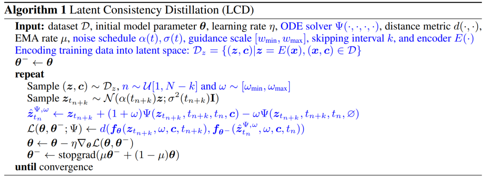

<h2 id="6.Ip-adapter模型结构与原理">6.Ip-adapter模型结构与原理 </h2>
IP-Adapter 采用了一种解耦的交叉注意力机制，将文本特征和图像特征分开处理，从而使得生成的图像能够更好地继承和保留输入图像的特征。


图像编码：IP-Adapter 使用预训练的 CLIP（Contrastive Language-Image Pre-training）图像编码器来提取图像提示的特征。

解耦交叉注意力机制：IP-Adapter 通过这种机制，将文本特征的 Cross-Attention 和图像特征的 Cross-Attention 分区开来。在Unet 的模块中新增了一路 Cross-Attention 模块，用于引入图像特征。

适配模块：IP-Adapter 包含一个图像编码器和包含解耦交叉注意力机制的适配器。这个适配器允许模型在生成图像时，同时考虑文本提示和图像提示，生成与文本描述相匹配的图像。

<h2 id="7.Controlnet的模型结构与原理">7.Controlnet的模型结构与原理 </h2>


权重克隆：ControlNet 将大型扩散模型的权重克隆为两个副本，一个“可训练副本”和一个“锁定副本”。锁定副本保留了从大量图像中学习到的网络能力，而可训练副本则在特定任务的数据集上进行训练，以学习条件控制。

零卷积：ControlNet 引入了一种特殊类型的卷积层，称为“零卷积”。这是一个 1x1 的卷积层，其权值和偏差都初始化为零。零卷积层的权值会从零逐渐增长到优化参数，这样设计允许模型在训练过程中逐渐调整和学习条件控制，而不会对深度特征添加新的噪声。

特征融合：ControlNet 通过零卷积层将额外的条件信息融合到神经网络的深层特征中。这些条件可以是姿势、线条结构、颜色分布等，它们作为输入调节图像，引导图像生成过程。

灵活性和扩展性：ControlNet 允许用户根据需求选择不同的模型和预处理器进行组合使用，以实现更精准的图像控制和风格化。例如，可以结合线稿提取、颜色控制、背景替换等多种功能，创造出丰富的视觉效果。

<h2 id="8.人物一致性模型PhotoMaker原理">8.人物一致性模型PhotoMaker原理 </h2>

编码器（Encoders）：PhotoMaker使用CLIP图像编码器来提取图像嵌入（image embeddings），并通过微调部分Transformer层来优化模型对于屏蔽图像中ID特征的提取能力。

堆叠ID嵌入（Stacked ID Embedding）：通过将多个输入ID图像的编码堆叠起来，构建了一个统一的ID表示。这个表示能够保留每个输入ID图像的原始特征，并在推理阶段接受任意数量的ID图像作为输入，从而保持高生成效率。

融合（Merging）：利用扩散模型中的交叉注意力机制来自适应地合并堆叠的ID嵌入中包含的ID信息，从而在生成过程中实现对ID特征的有效控制。

ID导向的数据构建流程（ID-Oriented Human Data Construction）：为了支持PhotoMaker的训练，研究者设计了一个自动化流程来构建一个以ID为中心的人类数据集。这个数据集包含大量具有不同表情、属性、场景的图像，有助于训练过程中的ID信息学习。


<h2 id="9.人物一致性模型InstantID原理">9.人物一致性模型InstantID原理 </h2>
ID Embedding：InstantID利用预训练的人脸模型（如insightface库中的模型）来提取面部特征的语义信息，这些特征被称为ID Embedding。与使用CLIP模型相比，这种方法能够更精准和丰富地捕获人物面部表情的特征。

Image Adapter：这是一个轻量级的自适应模块，它结合了文本提示信息和图像提示信息。该模块的设计思路与IP-Adapter相似，通过解耦交叉注意力机制来适应不同的生成任务。

IdentityNet：为了在粗粒度上改进图像生成并更精确地控制人物ID图像的生成，InstantID引入了IdentityNet模块。这个模块利用弱空间信息（如面部关键点）和强语义信息（从ID Embedding模块提取的面部表情特征）来引导图像的生成。

ControlNet：InstantID还使用了ControlNet来增强面部特征提取，进一步提高图像生成的质量和准确性。


<h2 id="10.单ID图像为什么InstantID人物一致性比Photomaker效果好">10.单ID图像为什么InstantID人物一致性比Photomaker效果好</h2>

1.InstantID利用预训练的人脸模型（如insightface库中的模型）来提取面部特征的语义信息。与Photomaker所使用的CLIP模型相比，这种方法能够更精准和丰富地捕获人物面部表情的特征。

2.InstantID还使用ControlNet来增强面部特征提取，进一步提高图像生成的质量和准确性。

3.Photomaker是先将文本特征和图像特征通过MLPs融合，再做CrossAttention加入U-net.InstantID是图像特征和文本特征分开做CrossAttention,再融合。（可以认为是区别，不要一定是效果好的原因）

<h2 id="11.大模型常见模型文件格式简介">11.大模型常见模型文件格式简介 </h2>

### 1、safetensors模型
1) 这是由 Hugging Face 推出的一种新型安全模型存储格式，特别关注模型安全性、隐私保护和快速加载。
2) 它仅包含模型的权重参数，而不包括执行代码，这样可以减少模型文件大小，提高加载速度。
3) 加载方式：使用 Hugging Face 提供的相关API来加载 .safetensors 文件，例如 safetensors.torch.load_file() 函数。

### 2、ckpt模型
全称checkpoint，通过Dreambooth训练的模型，包含了模型参数，还包括优化器状态以及可能的训练元数据信息，使得用户可以无缝地恢复训练或执行推理
### 3、bin模型
1) 通常是一种通用的二进制格式文件，它可以用来存储任意类型的数据。
2) 在机器学习领域，.bin 文件有时用于存储模型权重或其他二进制数据，但并不特指PyTorch的官方标准格式。
3) 对于PyTorch而言，如果用户自己选择将模型权重以二进制格式保存，可能会使用 .bin 扩展名，加载时需要自定义逻辑读取和应用这些权重到模型结构中。
### 4、pth模型
1) 是 PyTorch 中用于保存模型状态的标准格式。
2) 主要用于保存模型的 state_dict，包含了模型的所有可学习参数，或者整个模型（包括结构和参数）。
3) 加载方式：使用 PyTorch 的 torch.load() 函数直接加载 .pth 文件，并通过调用 model.load_state_dict() 将加载的字典应用于模型实例。
### 5、gguf模型
GGUF文件全称是GPT-Generated Unified Format，是由Georgi Gerganov定义发布的一种大模型文件格式。Georgi Gerganov是著名开源项目[llama.cpp](https://github.com/ggerganov/llama.cpp)的创始人。  
GGUF是一种二进制格式文件的规范，原始的大模型预训练结果经过转换后变成GGUF格式可以更快地被载入使用，也会消耗更低的资源。原因在于GGUF采用了多种技术来保存大模型预训练结果，包括采用紧凑的二进制编码格式、优化的数据结构、内存映射等。  
#### 特性  
1) 二进制格式：GGUF作为一种二进制格式，相较于文本格式的文件，可以更快地被读取和解析。二进制文件通常更紧凑，减少了读取和解析时所需的I/O操作和处理时间。
2) 优化的数据结构：GGUF可能采用了特别优化的数据结构，这些结构为快速访问和加载模型数据提供了支持。例如，数据可能按照内存加载的需要进行组织，以减少加载时的处理。
3) 内存映射（mmap）兼容性：如果GGUF支持内存映射（mmap），这允许直接从磁盘映射数据到内存地址空间，从而加快了数据的加载速度。这样，数据可以在不实际加载整个文件的情况下被访问，特别是对于大型模型非常有效。
4) 高效的序列化和反序列化：GGUF可能使用高效的序列化和反序列化方法，这意味着模型数据可以快速转换为可用的格式。
5) 少量的依赖和外部引用：如果GGUF格式设计为自包含，即所有需要的信息都存储在单个文件中，这将减少解析和加载模型时所需的外部文件查找和读取操作。
6) 数据压缩：GGUF格式可能采用了有效的数据压缩技术，减少了文件大小，从而加速了读取过程。
7) 优化的索引和访问机制：文件中数据的索引和访问机制可能经过优化，使得查找和加载所需的特定数据片段更加迅速。

<h2 id="12.safetensors模型文件的使用">12.safetensors模型文件的使用 </h2>

Safetensors 是一种新的格式，用于安全地存储 Tensor（相比于 pickle），而且速度很快（零拷贝）。

安装
```
pip install safetensors
```
保存
```
import torch
from safetensors.torch import save_file

tensors = {
    "embedding": torch.zeros((1, 2)),
    "attention": torch.zeros((3, 4))
}
save_file(tensors, "model.safetensors")
```
加载
```
from safetensors import safe_open

tensors = {}
with safe_open("model.safetensors", framework="pt", device=0) as f:
    for k in f.keys():
        tensors[k] = f.get_tensor(k)
```

与ckpt的相互转换
```
import torch
import safetensors
from safetensors.torch import load_file, save_file
 
def ckpt2safetensors():
    loaded = torch.load('xxx.ckpt')
    if "state_dict" in loaded:
        loaded = loaded["state_dict"]
    safetensors.torch.save_file(loaded, 'xxx.safetensors')
 
def safetensors2ckpt():
    data = safetensors.torch.load_file('xxx.safetensors.bk')
    data["state_dict"] = data
    torch.save(data, os.path.splitext('xxx.safetensors')[0] + '.ckpt')
```
<h2 id="13.GGUF模型文件的组成">13.GGUF模型文件的组成 </h2>

#### 元数据和数据类型
GGUF支持多种数据类型，如整数、浮点数和字符串等。这些数据类型用于定义模型的不同方面，如结构、大小和参数。
#### 文件组成
一个GGUF文件包括文件头、元数据键值对和张量信息等。这些组成部分共同定义了模型的结构和行为。
#### 端序支持
GGUF支持小端和大端格式，确保了其在不同计算平台上的可用性。端序（Endianness）是指数据在计算机内存中的字节顺序排列方式，主要有两种类型：大端（Big-Endian）和小端（Little-Endian）。不同的计算平台可能采用不同的端序。例如，Intel的x86架构是小端的，而某些旧的IBM和网络协议通常是大端的。因此，文件格式如果能支持这两种端序，就可以确保数据在不同架构的计算机上正确读取和解释。

1. 文件头 (Header)

   - 作用：包含用于识别文件类型和版本的基本信息。
   - 内容：
     - `Magic Number`：一个特定的数字或字符序列，用于标识文件格式。
     - `Version`：文件格式的版本号，指明了文件遵循的具体规范或标准。

2. 元数据键值对 (Metadata Key-Value Pairs)

   - 作用：存储关于模型的额外信息，如作者、训练信息、模型描述等。
   - 内容：
     - `Key`：一个字符串，标识元数据的名称。
     - `Value Type`：数据类型，指明值的格式（如整数、浮点数、字符串等）。
     - `Value`：具体的元数据内容。

3. 张量计数 (Tensor Count)

   - 作用：标识文件中包含的张量（Tensor）数量。
   - 内容：
     - `Count`：一个整数，表示文件中张量的总数。

4. 张量信息 (Tensor Info)

   - 作用：描述每个张量的具体信息，包括形状、类型和数据位置。
   - 内容：
     - `Name`：张量的名称。
     - `Dimensions`：张量的维度信息。
     - `Type`：张量数据的类型（如浮点数、整数等）。
     - `Offset`：指明张量数据在文件中的位置。

5. 对齐填充 (Alignment Padding)

   - 作用：确保数据块在内存中正确对齐，有助于提高访问效率。
   - 内容：
     - 通常是一些填充字节，用于保证后续数据的内存对齐。

6. 张量数据 (Tensor Data)

   - 作用：存储模型的实际权重和参数。
   - 内容：
     - `Binary Data`：模型的权重和参数的二进制表示。

7. 端序标识 (Endianness)

   - 作用：指示文件中数值数据的字节顺序（大端或小端）。
   - 内容：
     - 通常是一个标记，表明文件遵循的端序。

8. 扩展信息 (Extension Information)

   - 作用：允许文件格式未来扩展，以包含新的数据类型或结构。
   - 内容：
     - 可以是新加入的任何额外信息，为将来的格式升级预留空间。

整体来看，GGUF文件格式通过这些结构化的组件提供了一种高效、灵活且可扩展的方式来存储和处理机器学习模型。这种设计不仅有助于快速加载和处理模型，而且还支持未来技术的发展和新功能的添加。

<h2 id="14.diffusion和diffusers模型的相互转换">14.diffusion和diffusers模型的相互转换 </h2>

diffusion模型：使用webui加载的safetensors模型，
路径：stable-diffusion-webui/models/Stable-diffusion<br>
diffusers模型：使用stable diffuser pipeline加载的模型，目录结构如图：

  

[diffusers](https://github.com/huggingface/diffusers)
转换脚本路径：diffusers/scripts  
diffusers-->diffusion:
```
python convert_diffusers_to_original_stable_diffusion.py --model_path model_dir --checkpoint_path path_to_ckpt.ckpt
```
其他参数：
  --half：使用fp16数据格式<br>
  --use_safetensors：使用safetensors保存<br>
diffusion-->diffusers:
```
python convert_original_stable_diffusion_to_diffusers.py --checkpoint_path path_to_ckpt.ckpt --dump_path model_dir --image_size 512 --prediction_type epsilon
```

<h2 id="15.什么是DreamBooth技术？">15.什么是DreamBooth技术？ </h2>

### 基本原理

DreamBooth是由Google于2022年发布的一种通过将自定义主题注入扩散模型的微调训练技术，它通过少量数据集微调Stable Diffusion系列模型，让其学习到稀有或个性化的图像特征。DreamBooth技术使得SD系列模型能够在生成图像时，更加精确地反映特定的主题、对象或风格。

DreamBooth首先为特定的概念寻找一个特定的描述词[V]，这个特定的描述词一般需要是稀有的，DreamBooth需要对SD系列模型的U-Net部分进行微调训练，同时DreamBooth技术也可以和LoRA模型结合，用于训练DreamBooth_LoRA模型。

在微调训练完成后，Stable Diffusion系列模型或者LoRA模型能够在生成图片时更好地响应特定的描述词（prompts），这些描述词与自定义主题相关联。这种方法可以被视为在视觉大模型的知识库中添加或强化特定的“记忆”。

同时为了防止过拟合，DreamBooth技术在训练时增加了一个class-specific prior preservation loss（基于SD模型生成相同class的图像加入batch里面一起训练）来进行正则化。


### 微调训练过程

DreamBooth技术在微调训练过程中，主要涉及以下几个关键步骤：

1. **选择目标实体**：在开始训练之前，首先需要明确要生成的目标实体或主题。这通常是一组代表性强、特征明显的图像，可以是人物、宠物、艺术品等。例如，如果目标是生成特定人物的图像，那么这些参考图像应该从不同角度捕捉该人物。

2. **训练数据准备**：收集与目标实体相关的图像。这些图像不需要非常多，但应该从多个角度展示目标实体，以便模型能够学习到尽可能多的细节。此外，还需要收集一些通用图像作为负样本，帮助模型理解哪些特征是独特的，哪些是普遍存在的。

3. **数据标注**：为了帮助模型更好地识别和学习特定的目标实体，DreamBooth技术使用特定的描述词[V]来标注当前训练任务的数据。这些标注将与目标实体的图像一起输入模型，以此强调这些图像中包含的特定特征。

4. **模型微调**：使用这些特定的训练样本，对Stable Diffusion模型或者LoRA模型进行微调训练，并在微调训练过程中增加class-specific prior preservation loss来进行正则化。

5. **验证测试**：微调完成后，使用不同于训练时的文本提示词（但是包含特定的描述词[V]），验证模型是否能够根据新的文本提示词生成带有目标实体特征的图像。这一步骤是检验微调效果的重要环节。

6. **调整和迭代**：基于生成的图像进行评估，如果生成结果未达到预期，可能需要调整微调策略，如调整学习率、增加训练图像数量或进一步优化特殊标签的使用。

DreamBooth技术的关键在于通过微调Stable Diffusion模型，令其能够在不失去原有生成能力的同时，添加一定程度的个性化特征。

### 应用

DreamBooth技术的应用非常广泛，包括但不限于：

- **个性化内容创作**：为特定个体或品牌创建独特的视觉内容。
- **艺术创作**：艺术家可以使用这种技术来探索新的视觉风格或加深特定主题的表达。

总体来说，DreamBooth 是一项令人兴奋的技术，它扩展了生成模型的应用范围，使得个性化和定制化的图像生成成为可能。这种技术的发展有望在多个领域带来创新的应用。

<h2 id="16.正则化技术在AI绘画模型中的作用？">16.正则化技术在AI绘画模型中的作用？ </h2>

在生成式模型的训练中，正则化技术是一种常用的方法，用于增强模型的泛化能力，防止过拟合，以及在一些情况下，帮助模型更稳定和可靠地训练。正则化对生成式模型的主要作用包括：

### 1. 防止过拟合
生成式模型，特别是参数众多的模型（如Stable Diffusion、GAN和VAE），容易在训练数据上过度拟合，从而导致模型在未见过的数据上性能下降。通过使用正则化技术，如L1或L2正则化（权重衰减），可以惩罚模型权重的大值，从而限制模型复杂度，帮助模型在保留训练数据重要特性的同时，防止过分依赖特定训练样本的噪声或非代表性特征。

### 2. 提高模型的稳定性
在生成对抗网络（GAN）等生成式模型中，训练过程中的稳定性是一个重要问题。正则化技术，如梯度惩罚（gradient penalty）和梯度裁剪（gradient clipping），可以防止梯度爆炸或消失，从而帮助模型更稳定地训练。这些技术通过控制权重更新的幅度，确保训练过程中的数值稳定性。

### 3. 改善收敛性
正则化技术有助于改善生成式模型的收敛性，特别是在对抗性的训练环境中。例如，在GANs中，使用梯度惩罚或Batch Normalization可以帮助生成器和判别器更均衡地训练，避免一方过早地主导训练过程，从而促进整个模型的稳健收敛。

### 4. 增加输出的多样性
尤其在GAN中，模式坍塌（mode collapse）是一个常见的问题，其中生成器倾向于生成非常相似的输出样本，忽视输入的多样性。这意味着生成器无法覆盖到数据分布的多样性，仅在潜在空间中的某个点或几个点上“坍塌”。通过应用正则化技术，如Mini-batch discrimination或使用dropout，可以鼓励生成器探索更多的数据分布，从而提高生成样本的多样性。

### 5. 防止梯度消失或爆炸
在视觉大模型中，梯度消失或爆炸（Gradient Vanishing/Exploding）是常见问题，特别是在训练复杂的生成式模型时。正则化技术，如Batch Normalization和Layer Normalization，通过规范化中间层的输出，帮助控制梯度的规模，从而避免这两种问题，使训练过程更加稳定。

### 6. 减少训练过程中的噪声敏感性
生成式模型可能对训练数据中的噪声过于敏感，导致生成的图像或数据质量低下。通过应用正则化，如Dropout或添加一定量的噪声，模型可以对不重要的输入变化更鲁棒，从而提高生成数据的质量和稳健性。

正则化技术在生成式模型中的运用有助于优化模型性能，提高模型的泛化能力和输出质量，同时确保训练过程的稳定性和效率。这些技术是设计和训练高效、可靠生成式模型的重要组成部分。


<h2 id="17.DiT模型">17.DiT模型 </h2>

论文链接：https://arxiv.org/pdf/2212.09748.pdf

DiT（Diffusion Transformers）是Meta提出的一种完全基于Transformer架构的扩散模型。传统的扩散模型多采用U-Net架构，因为U-Net能够自然地实现输入输出维度一致，并且混合了卷积模块和self-attention。然而，随着Vision Transformers（ViT）的发展，Transformer架构在图像任务中变得越来越普遍。DiT将这种架构成功应用于扩散模型中，并探索了其在扩散模型中的可扩展性。

在DiT模型中，图像首先被编码器转换为潜在表示（latent representation），然后这些潜在表示被分割成较小的补丁（patches），每个补丁被线性嵌入到一个固定维度的序列中。

#### DiT的核心结构

1. **Patch Embedding**：将输入图像分割成小块，并将每个小块线性嵌入到一个固定维度的序列中。这个过程生成了一系列嵌入标记（tokens），每个标记代表图像的一个补丁。

2. **Transformer Blocks**：这些嵌入标记通过多个Transformer块进行处理。每个Transformer块包含多头自注意力（Multi-Head Self-Attention）和前馈神经网络（Feedforward Neural Network），并且使用层归一化（Layer Norm）。

3. **条件嵌入**：在扩散模型中，需要嵌入额外的条件信息，如时间步（timesteps）和类别标签（class labels）。DiT设计了四种嵌入方案：

   - **In-context Conditioning**：将条件信息作为额外的标记加入输入序列。

   - **Cross-Attention Block**：在Transformer块中加入一个多头交叉注意力层，条件embeddings作为cross attention的key和value。

   - **Adaptive Layer Norm (adaLN) Block**：使用自适应层归一化，条件信息用于调整归一化参数。

   - **adaLN-Zero Block**：在adaLN的基础上，零初始化残差块，使其初始为恒等函数。

     最终发现采用**adaLN-Zero**效果是最好的。

4. **线性解码器**：在最后一个Transformer块之后，使用linear层将处理后的标记解码为原始图像的维度。这个过程生成的输出包括预测的噪音和方差。


<h2 id="18.AI生成图像的常用评价指标">18.AI生成图像的常用评价指标 </h2>

随着图像生成AI的发展，如Stable Diffusion和Midjourney，能够根据自然语言生成“高品质”的图像。然而，“高品质”图像的定义和评价并不简单，目前有多种评价指标来衡量图像的质量和相关性。

#### 1. FID（Frechet Inception Distance）

FID是用于评估生成图像与真实图像相似度的量化指标。它使用Inception网络将生成图像和真实图像转换为特征向量，假设这些特征向量的分布为高斯分布，并计算其均值和协方差矩阵。通过测量这两个高斯分布之间的“距离”来评估相似性，值越小，图像质量越高。

#### 2. CLIP Score

CLIP Score通过学习自然语言和图像对之间的语义关系来评估图像和文本的匹配度。它将自然语言和图像分别转换为特征向量，然后计算它们之间的余弦相似度。CLIP Score越高，图像和文本对之间的相关性越高。

#### 3. Inception Score（IS）

Inception Score评估生成图像的质量和多样性。它使用Inception网络对生成图像进行分类，正确分类结果越集中，质量越高。同时，当生成图像被分类为不同标签时，多样性越大。IS综合考虑了图像的质量和多样性，得分越高表示质量和多样性越好。

<h2 id="19.SDXL相比SD有那些改进">19.SDXL相比SD有那些改进 </h2>

1、模型参数更大。SDXL 基础模型所使用的 Unet 包含了2.6B（26亿）的参数，对比 SD1.5的 860M（8600万），相差超过三倍。因此从模型参数来看，SDXL 相比 SD 有显著优势。

2、语义理解能力更强。使用了两个 CLIP 模型的组合，包括 OpenClip 最大的模型 ViT-G/14 和在 SD v1 中使用的 CLIP ViT-L，既保证了对旧提示词的兼容，也提高了 SDXL 对语言的理解能力

3、训练数据库更大。由于 SDXL 将图片尺寸也作为指导参数，因此可以使用更低分辨率的图片作为训练数据，比如小于256x256分辨率的图片。如果没有这项改进，数据库中高达39%的图片都不能用来训练 SDXL，原因是其分辨率过低。但通过改进训练方法，将图片尺寸也作为训练参数，大大扩展了训练 SDXL 的图片数量，这样训练出来的模型具有更强的性能表现。

4、生图流程改进。SDXL 采用的是两阶段生图，第一阶段使用 base model（基础模型）生成，第二阶段则使用 refiner model（细化模型）进一步提升画面的细节表现。当然只使用 SDXL 基础模型进行绘图也是可以的。

<h2 id="20.Stable_Diffusion文本信息是如何控制图像生成的">20.Stable_Diffusion文本信息是如何控制图像生成的</h2>

1.文本编码：CLIP Text Encoder模型将输入的文本Prompt进行编码，转换成Text Embeddings（文本的语义信息），由于预训练后CLIP模型输入配对的图片和标签文本，Text Encoder和Image Encoder可以输出相似的embedding向量，所以这里的Text Embeddings可以近似表示所要生成图像的image embedding。

2.CrossAttention模块：在U-net的corssAttention模块中Text Embeddings用来生成K和V，Latent Feature用来生成Q。因为需要文本信息注入到图像信息中里，所以用图片token对文本信息做 Attention实现逐步的文本特征提取和耦合。

<h2 id="21.简述Stable_Diffusion核心网络结构">21.简述Stable_Diffusion核心网络结构</h2>

1.CLIP：CLIP模型是一个基于对比学习的多模态模型，主要包含Text Encoder和Image Encoder两个模型。在Stable Diffusion中主要使用了Text Encoder部分。CLIP Text Encoder模型将输入的文本Prompt进行编码，转换成Text Embeddings（文本的语义信息），通过的U-Net网络的CrossAttention模块嵌入Stable Diffusion中作为Condition条件，对生成图像的内容进行一定程度上的控制与引导。

2.VAE：基于Encoder-Decoder架构的生成模型。VAE的Encoder（编码器）结构能将输入图像转换为低维Latent特征，并作为U-Net的输入。VAE的Decoder（解码器）结构能将低维Latent特征重建还原成像素级图像。在Latent空间进行diffusion过程可以大大减少模型的计算量。
U-Net

3.U-net:进行Stable Diffusion模型训练时，VAE部分和CLIP部分都是冻结的，主要是训练U-net的模型参数。U-net结构能够预测噪声残差，并结合Sampling method对输入的特征进行重构，逐步将其从随机高斯噪声转化成图像的Latent Feature.训练损失函数与DDPM一致:
 


<h2 id="22.EasyPhoto的训练和推理流程是什么样的？">22.EasyPhoto的训练和推理流程是什么样的？</h2>

## EasyPhoto的训练流程

1. 人像得分排序：人像排序流程需要用到人脸特征向量、图像质量评分与人脸偏移角度。其中人脸特征向量用于选出最像本人的图片，用于LoRA的训练；图像质量评分用于判断图片的质量，选出质量最低的一些进行超分，提升图片质量；人脸偏移角度用于选出最正的人像，这个最正的人像会在推理阶段中作为参考人像进行使用，进行人脸融合。
2. Top-k个人像选取：选出第一步中得分最高的top-k个人像用于LoRA模型的训练。
3. 显著性分割：将背景进行去除，然后通过人脸检测模型选择出人脸周围的区域。
4. 图像修复：使用图像修复算法进行图像修复，并且超分，并使用美肤模型，最终获得高质量的训练图像。
5. LoRA模型训练：使用处理好的数据进行LoRA模型的训练。
6. LoRA模型融合：在训练过程中，会保存很多中间结果，选择几个效果最好的模型，进行模型融合，获得最终的LoRA模型。

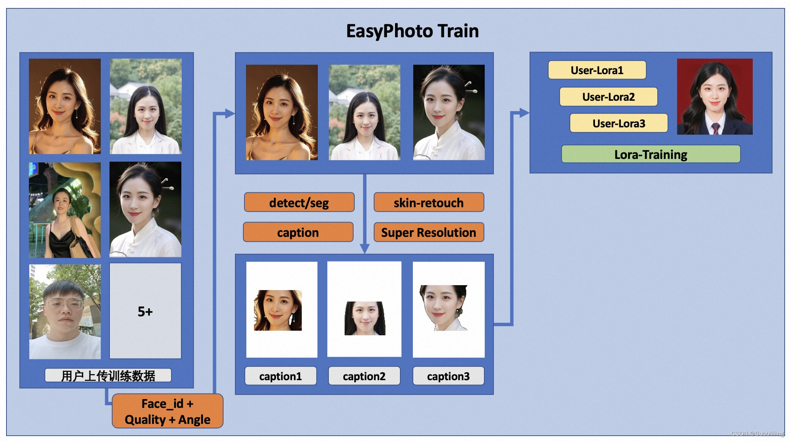 

## EasyPhoto的推理流程

### 初步重建

1. 人脸融合：使用人脸融合算法，给定一张模板图和一张最佳质量的用户图，人脸融合算法能够将用户图中的人脸融合到模板人脸图像中，生成一张与目标人脸相似，且具有模版图整体外貌特征的新图像。
2. 人脸裁剪与仿射变换：将训练过程中生成的最佳人脸图片进行裁剪和仿射变换，利用五个人脸关键点，将其贴到模板图像上，获得一个Replaced Image，这个图像会在下一步中提供openpose信息。
3. Stable Diffusion + LoRA重绘和ControlNet控制：使用Canny控制（防止人像崩坏）、颜色控制（使生成的颜色符合模板）以及Replaced Image的Openpose+Face pose控制（使得眼睛与轮廓更像本人），开始使用Stable Diffusion + LoRA进行重绘，用脸部的Mask让重绘区域限制在脸部。

### 边缘完善

1. 人脸再次融合：和初步重建阶段一样，我们再做一次人脸融合以提升人脸的相似程度。
2. Stable Diffusion + LoRA重绘和ControlNet控制：使用tile控制（防止颜色过于失真）和canny控制（防止人像崩坏），开始第二次重绘，主要对边缘（非人像区域）进行完善。

### 后处理

后处理主要是提升生成图像的美感与清晰度。

1. 人像美肤：使用人像美肤模型，进一步提升写真图片的质感。
2. 超分辨率重建：对写真图片进行超分辨率重建，获取高清大图。

 


<h2 id="23.Stable_Diffusion中的Unet模型">23.Stable_Diffusion中的Unet模型</h2>

### UNet的结构具有以下特点：

- **整体结构**：UNet由多个大层组成。在每个大层中，特征首先通过下采样变为更小尺寸的特征，然后通过上采样恢复到原来的尺寸，形成一个U形的结构。
- **特征通道变化**：在下采样过程中，特征图的尺寸减半，但通道数翻倍；上采样过程则相反。
- **信息保留机制**：为了防止在下采样过程中丢失信息，UNet的每个大层在下采样前的输出会被拼接到相应的大层上采样时的输入上，这类似于ResNet中的“shortcut”.

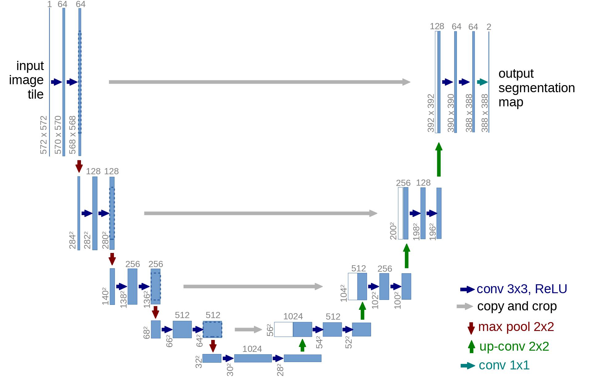

​	U-Net 具有编码器部分和解码器部分，均由 ResNet 块组成。编码器将图像表示压缩为较低分辨率图像表示，并且解码器将较低分辨率图像表示解码回据称噪声较小的原始较高分辨率图像表示。更具体地说，U-Net 输出预测噪声残差，该噪声残差可用于计算预测的去噪图像表示。为了防止U-Net在下采样时丢失重要信息，通常在编码器的下采样ResNet和解码器的上采样ResNet之间添加快捷连接。

​	Stable Diffusion的U-Net 能够通过交叉注意力层在文本嵌入上调节其输出。交叉注意力层被添加到 U-Net 的编码器和解码器部分，通常位于 ResNet 块之间。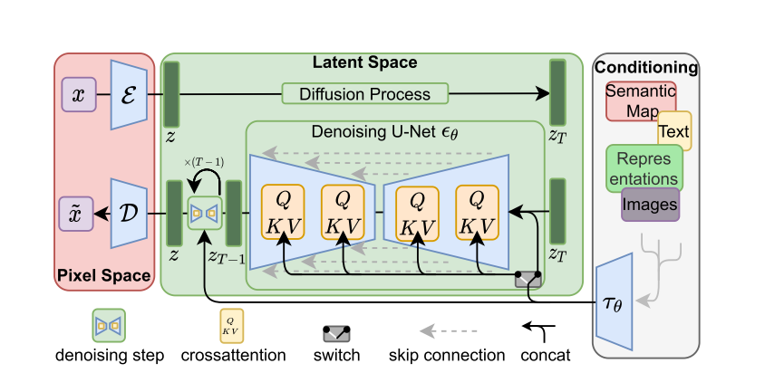

<h2 id="24.使用lora微调Stable_Diffusion模型">24.使用lora微调Stable_Diffusion模型</h2>

[LoRA: Low-Rank Adaptation of Large Language Models](https://arxiv.org/abs/2106.09685) 是微软研究员引入的一项新技术，主要用于处理大模型微调的问题。目前超过数十亿以上参数的具有强能力的大模型 (例如 GPT-3) 通常在为了适应其下游任务的微调中会呈现出巨大开销。LoRA 建议冻结预训练模型的权重并在每个 Transformer 块中注入可训练层 (*秩-分解矩阵*)。因为不需要为大多数模型权重计算梯度，所以大大减少了需要训练参数的数量并且降低了 GPU 的内存要求。研究人员发现，通过聚焦大模型的 Transformer 注意力块，使用 LoRA 进行的微调质量与全模型微调相当，同时速度更快且需要更少的计算。

LoRA也是一种微调 Stable Diffusion 模型的技术，其可用于对关键的图像/提示交叉注意力层进行微调。其效果与全模型微调相当，但速度更快且所需计算量更小。

训练代码可参考以下链接：

[全世界 LoRA 训练脚本，联合起来! (huggingface.co)](https://huggingface.co/blog/zh/sdxl_lora_advanced_script)

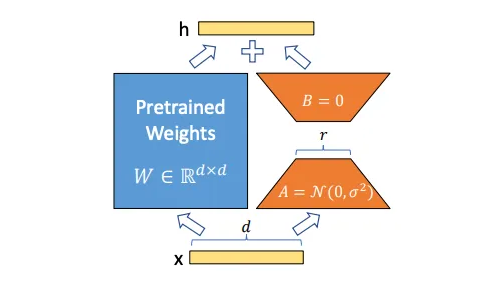


<h2 id="25.用于图像生成的多lora组合">25.用于图像生成的多lora组合</h2>

论文链接:https://arxiv.org/abs/2402.16843.pdf


### **LoRA Merge**:

- 这种方法通过线性组合多个LoRAs来合成一个统一的LoRA，进而整合到文本到图像的模型中。
- 主要优点是能够统一多个元素，但它的一个缺点是没有考虑到生成过程中与扩散模型的交互，可能导致像汉堡包和手指这样的元素在图像中变形。

### **LoRA Switch (LoRA-S)**:

- LoRA Switch旨在每个去噪步骤中激活单个LoRA，通过在解码过程中定时激活各个LoRA，引入了一种动态适应机制。
- 图中用独特的颜色表示每个LoRA，每个步骤中只激活一个LoRA。
- 这种方法允许在扩散模型的不同解码步骤中精确控制元素的影响，提高了生成图像的灵活性和控制精度。

### **LoRA Composite (LoRA-C)**:

- LoRA Composite探索在每个时间步骤中整合所有LoRA，而不是合并权重矩阵。
- 它通过汇总每个LoRA在每一步的无条件和条件评分估计来实现，从而在图像生成过程中提供平衡的指导。
- 这种方法有助于保持所有不同LoRA代表的元素的连贯整合，增强了图像的整体一致性和质量。


<h2 id="26.cfg参数的介绍">26.cfg参数的介绍</h2>

Classifier Guidance，使得扩散模型可以按图像、按文本和多模态条件来生成。Classifier Guidance 需要训练噪声数据版本的classifier网络，推理时每一步都需要额外计算classifier的梯度

Classifier Guidance 使用显式的分类器引导条件生成有几个问题：一是需要额外训练一个噪声版本的图像分类器。二是该分类器的质量会影响按类别生成的效果。三是通过梯度更新图像会导致对抗攻击效应，生成图像可能会通过人眼不可察觉的细节欺骗分类器，实际上并没有按条件生成。

Classifier-Free Guidance方案，可以规避上述问题，而且可以通过调节引导权重，控制生成图像的逼真性和多样性的平衡。Classifier-Free Guidance的核心是通过一个隐式分类器来替代显示分类器，而无需直接计算显式分类器及其梯度。

训练时，Classifier-Free Guidance需要训练两个模型，一个是无条件生成模型，另一个是条件生成模型。但这两个模型可以用同一个模型表示，训练时只需要以一定概率将条件置空即可。

推理时，最终结果可以由条件生成和无条件生成的线性外推获得，生成效果可以引导系数可以调节，控制生成样本的逼真性和多样性的平衡。

在Stable Diffusion模型中，CFG Scale参数用于控制CFG模型捕捉上下文信息的能力。该参数决定了上下文信息的提取范围，对生成文本的质量具有重要影响。当CFG Scale参数设置较高时，模型会更注重捕捉全局信息，从而在生成文本时考虑到更多的上下文关联；而当CFG Scale参数设置较低时，模型更倾向于关注局部信息，可能导致生成文本的上下文连贯性降低。

简单说：通过cfg参数控制图像生成内容和文本之间的关联性


<h2 id="27.目前主流的AI绘画框架有哪些？">27.目前主流的AI绘画框架有哪些？</h2>

Rocky从AIGC时代的工业界、应用界、竞赛界以及学术界出发，总结了目前主流的AI绘画框架：

1. Diffusers：`diffusers` 库提供了一整套用于训练、推理和评估扩散模型的工具。它的设计目标是简化扩散模型的使用和实验，并提供与 `Hugging Face` 生态系统的无缝集成，包括其 `Transformers` 库和 `Datasets` 库。在AIGC时代中，每次里程碑式的模型发布后，Diffusers几乎都在第一时间进行了原生支持。

2. Stable Diffusion WebUI：`Stable Diffusion Webui` 是一个基于 `Gradio` 框架的GUI界面，可以方便的使用Stable Diffusion系列模型，使用户能够轻松的进行AI绘画。

3. ComfyUI：`ComfyUI` 也是一个基于 `Gradio` 框架的GUI界面，与Stable Diffusion WebUI不同的是，ComfyUI框架中侧重构建AI绘画节点和工作流，用户可以通过连接不同的节点来设计和执行AI绘画功能。

4. SD.Next：`SD.Next` 基于Stable Diffusion WebUI开发，构建提供了更多高级的功能。在支持Stable Diffusion的基础上，还支持Kandinsky、DeepFloyd IF、Lightning、Segmind、Kandinsky、Pixart-α、Pixart-Σ、Stable Cascade、Würstchen、aMUSEd、UniDiffusion、Hyper-SD、HunyuanDiT等AI绘画模型的使用。
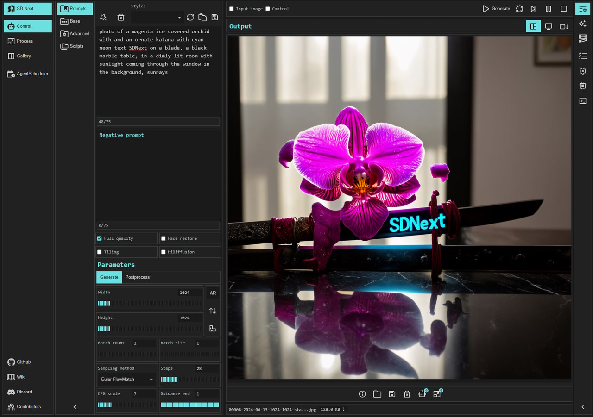
5. Fooocus：`Fooocus` 也是基于 `Gradio` 框架的GUI界面，Fooocus借鉴了Stable Diffusion WebUI和Midjourney的优势，具有离线、开源、免费、无需手动调整、用户只需关注提示和图像等特点。


<h2 id="28.FaceChain的训练和推理流程是什么样的？">28.FaceChain的训练和推理流程是什么样的？</h2>

FaceChain是一个功能上近似“秒鸭相机”的技术，我们只需要输入几张人脸图像，FaceChain技术会帮我们合成各种服装、各种场景下的AI数字分身照片。下面Rocky就给大家梳理一下FaceChain的训练和推理流程：

## 训练阶段

1. 输入包含清晰人脸区域的图像。
2. 使用基于朝向判断的图像旋转模型+基于人脸检测和关键点模型的人脸精细化旋转方法来处理人脸图像，获取包含正向人脸的图像。
3. 使用人体解析模型+人像美肤模型，获得高质量的人脸训练图像。
4. 使用人脸属性模型和文本标注模型，再使用标签后处理方法，生成训练图像的精细化标签。
5. 使用上述图像和标签数据微调Stable Diffusion模型得到人脸LoRA模型。
7. 输出人脸LoRA模型。

## 推理阶段

1. 输入训练阶段的训练图像。
2. 设置用于生成个人写真的Prompt提示词。
3. 将人脸LoRA模型和风格LoRA模型的权重融合到Stable Diffusion模型中。
4. 使用Stable Diffusion模型的文生图功能，基于设置的输入提示词初步生成AI个人写真图像。
5. 使用人脸融合模型进一步改善上述写真图像的人脸细节，其中用于融合的模板人脸通过人脸质量评估模型在训练图像中挑选。
6. 使用人脸识别模型计算生成的写真图像与模板人脸的相似度，以此对写真图像进行排序，并输出排名靠前的个人写真图像作为最终输出结果。


<h2 id="29.什么是diffusers?">29.什么是diffusers?</h2>

Diffusers是一个功能强大的工具箱，旨在帮助用户更加方便地操作扩散模型。通过使用Diffusers，用户可以轻松地生成图像、音频等多种类型的数据，同时可以使用各种噪声调度器来调整模型推理的速度和质量。

### 功能和用途

Diffusers提供了一系列功能，可以帮助用户更好地使用扩散模型。以下是一些主要功能和用途：

#### 1. 生成图像和音频

Diffusers使用户能够使用扩散模型生成高质量的图像和音频数据。无论是生成逼真的图像，还是合成自然的音频，Diffusers都能提供便捷的操作方式，帮助用户轻松实现他们的创意和需求。

#### 2. 噪声调度器

在模型推理过程中，噪声调度器是非常重要的工具。它可以帮助用户调整模型的速度和质量，以满足不同的需求。Diffusers提供了多种类型的噪声调度器，用户可以根据自己的需求选择合适的调度策略，从而获得最佳的结果。

#### 3. 支持多种类型的模型

Diffusers不仅兼容一种类型的模型，还支持多种类型的模型。无论您使用的是图像生成模型、音频生成模型还是其他类型的模型，Diffusers都能提供相应的支持和便利。

​	通过Huggingface Diffusers，用户可以更加方便地操作扩散模型，生成高质量的图像和音频数据。同时，噪声调度器功能也能帮助用户调整模型的速度和质量，以满足不同的需求。无论您是在进行研究、开发还是其他应用场景，Diffusers都是一个非常实用的工具箱。

下面是官方文档的链接：

[🧨 Diffusers (huggingface.co)](https://huggingface.co/docs/diffusers/zh/index)

<h2 id="30.文生图和图生图的区别是什么?">30.文生图和图生图的区别是什么?</h2>

### 文生图（Text2Image）

文生图是根据文本描述来生成相应图像的过程。这项技术通常用于搜索引擎、图像识别和自然语言处理等领域。在文本到图像的生成流程中，输入是一段描述图像的文本，输出是与文本描述相对应的图像。例如，给定描述“一只可爱的猫咪在玩耍”，模型需要生成一张符合描述的猫咪玩耍的图像。

### 图生图（**image2image**）

图生图则是将一张图像转换为另一张图像的过程,广泛应用于图像修复、风格转换和语义分割等领域。输入为带有特定标注或属性的图像,输出为与输入对应的转换后图像。

### 对比在SD模型中这两种流程的区别

在Stable Diffusion等模型中,图生图是在文生图的基础上增加了图片信息来指导生成,增加了可控性,但减少了多样性。它们虽然都依赖扩散过程,但针对的输入类型不同(文本vs图像)。

图生图生成的初始潜在表示不是随机噪声,而是将初始图像通过自动编码器编码后的潜在表示,再加入高斯噪声。该加噪过程实际是扩散过程,使潜在表示包含随机性,为后续图像转换提供更多可能性。

它们在技术使用上有所重叠,但应用场景有别。文生图更注重多样性和创造力,而图生图则侧重于对现有图像的编辑和转换。

<h2 id="31.为什么Stable Diffusion 3使用三个文本编码器?">31.为什么Stable-Diffusion-3使用三个文本编码器?</h2>

Stable Diffusion 3作为一款先进的文本到图像模型,采用了三重文本编码器的方法。这一设计选择显著提升了模型的性能和灵活性。


### 三个文本编码器

Stable Diffusion 3使用以下三个文本编码器:

1. CLIP-L/14
2. CLIP-G/14
3. T5 XXL

### 使用多个文本编码器的原因

#### 1. 提升性能

使用多个文本编码器的主要动机是提高整体模型性能。通过组合不同的编码器,模型能够捕捉更广泛的文本细微差别和语义信息,从而实现更准确和多样化的图像生成。

#### 2. 推理时的灵活性

多个文本编码器的使用在推理阶段提供了更大的灵活性。模型可以使用三个编码器的任意子集,从而在性能和计算效率之间进行权衡。

#### 3. 通过dropout增强鲁棒性

在训练过程中,每个编码器都有46.3%的独立dropout率。这种高dropout率鼓励模型从不同的编码器组合中学习,使其更加鲁棒和适应性强。

### 各个编码器的影响

#### CLIP编码器(CLIP-L/14和OpenCLIP-G/14)

- 这些编码器对大多数文本到图像任务至关重要。
- 它们在广泛的提示范围内提供强大的性能。

#### T5 XXL编码器

- 虽然对复杂提示很重要,但其移除的影响较小:
  - 对美学质量评分没有影响(人类偏好评估中50%的胜率)
  
  - 对提示遵循性有轻微影响(46%的胜率)
  
  - 对生成书面文本的能力有显著贡献(38%的胜率)
  
    （胜率是完整版对比其他模型的效果，下图是对比其他模型以及不使用T5的sd3的胜率图）
  
    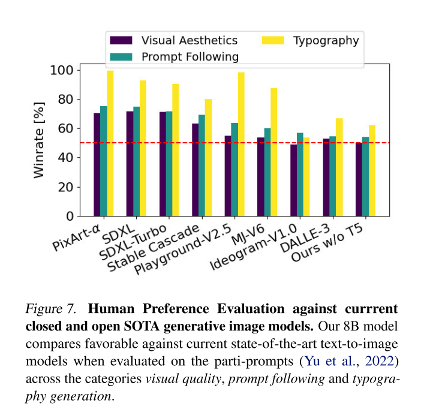

### 实际应用

1. **内存效率**: 用户可以在大多数提示中选择排除T5 XXL编码器(拥有47亿参数),而不会造成显著的性能损失,从而节省大量显存。

2. **任务特定优化**: 对于涉及复杂描述或大量书面文本的任务,包含T5 XXL编码器可以提供明显的改进。

3. **可扩展性**: 多编码器方法允许在模型的未来迭代中轻松集成新的或改进的文本编码器。

<h2 id="32.什么是重参数化技巧">32.什么是重参数化技巧</h2>

主要思路就是引入一个新的随机变量，并将需要求梯度的参数的随机性固定住，这样随机性就完全转移到跟参数无关的变量了。

例如在VAE的网络结构中，从Encoder部分输入至Decoder部分需要进行随机采样，一般来说对随机变量进行求导是比较复杂的，因此作者引入了重参数化技巧

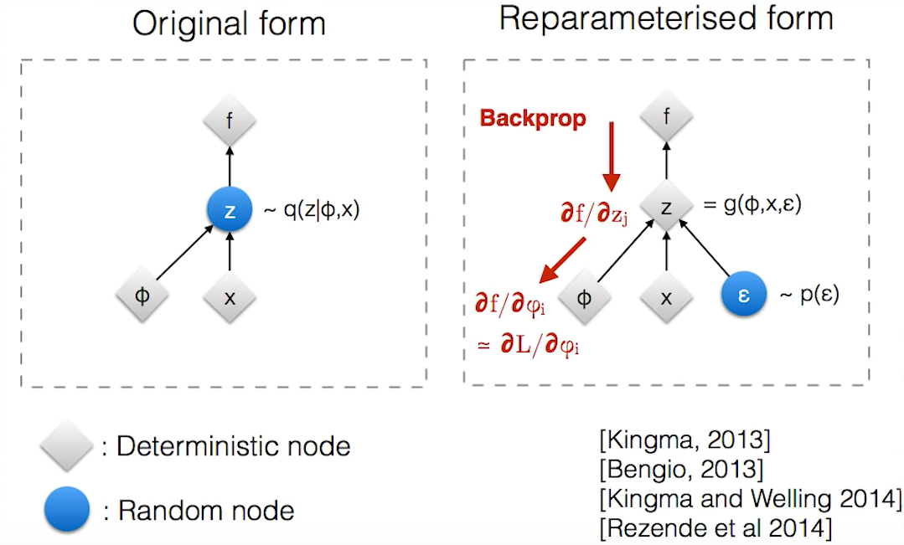

<h2 id="33.Gan的损失函数推导">33.Gan的损失函数推导</h2>

判别器用来识别数据是真实样本还是由生成器生成的模拟样本，使用交叉熵建立损失函数

$\begin{align}
H(p,q) &= -\mathbb{E}_{x\sim p\left(x\right)} \left[\log\left(q\left(x\right)\right)\right]= -\sum_{x}p\left(x\right)\log\left(q\left(x\right)\right)
= -\int\limits_{x}f\left(x\right)\log\left(q\left(x\right)\right) dx
\end{align}$

由于这是一个二分类问题，其中D(x)表示判别器认为x为真实样本的概率，有

$\begin{align}
L &= -\sum_{x} p\left(x\right)\log\left(q\left(x\right)\right)\\
& = -p(x)\log [q(x)] - (1-p(x))log[1-q(x)]\\
& = -p(x,data)\log [D(x)] - p(x,g)log[1-D(x)] \\
& = -p(data)p(x\vert data)\log [D(x)] - p(g)p(x\vert g)log[1-D(x)] \\
& = -\frac{1}{2}\left(p_{data}(x)\log [D(x)] + p_{g}(x)log[1-D(x)]\right) \\
& = -\frac{1}{2}\left(\mathbb{E}_{x\sim p(data)}\left[\log (D(x))\right] + \mathbb{E}_{x\sim p(g)}\left[\log [1-D(x)]\right]\right) \\
\end{align}$

在此基础上可以得到Gans的值函数

$V(G,D) = \mathbb{E}_{x\sim p(data)}\left[\log (D(x))\right] + \mathbb{E}_{x\sim p(g)}\left[\log (1-D(x))\right]$

训练判别器D时,最大化V，训练生成器时，最小化V，整个训练过程可以表示为

$\min_{G}\max_{D}V(G,D)$

给定生成器G，求当下最优判别器D，令V对D的导数等于零，即可求得最优判别器

$\max_{D}V(G,D) = \mathbb{E}_{x\sim p(data)}\left[\log (D(x))\right] + \mathbb{E}_{x\sim p(g)}\left[\log (1-D(x))\right]$
$D^{*}(x)=\frac{\mathrm{P}_{data}(x)}{\mathrm{P}_{data}(x)+\mathrm{P}_{g}(x)}$

如今我们已经找到了最大化的D，现要将其固定，寻找最小化的G，即求下式：

$\begin{align}
\min_{G}V(G,D) &= \mathbb{E}_{x\sim p(data)}\left[\log (D(x))\right] + \mathbb{E}_{x\sim p(g)}\left[\log (1-D(x))\right] \\
&= \mathbb{E}_{x\sim p(data)}\left[\log\frac{p_{data}(x)}{p_{data}(x)+p_{g}(x)}\right] + \mathbb{E}_{x\sim p(g)}\left[\log\frac{p_{g}(x)}{p_{data}(x)+p_{g}(x)}\right] \\
&= \mathbb{E}_{x\sim p(data)}\left[\log\frac{\frac{1}{2}p_{data}(x)}{\frac{1}{2}(p_{data}(x)+p_{g}(x))}\right] + \mathbb{E}_{x\sim p(g)}\left[\log\frac{\frac{1}{2}p_{g}(x)}{\frac{1}{2}(p_{data}(x)+p_{g}(x))}\right] \\
&= KL(p_{data}(x)\|\frac{p_{data}(x)+p_{g}(x)}{2}) + KL(p_{g}(x)\|\frac{p_{data}(x)+p_{g}(x)}{2}) -2\log2 \\
& = 2JS(p_{data}\|p_{g}) - 2\log2
\end{align}$

<h2 id="34.Gan的收敛性分析">34.Gan的收敛性分析</h2>

优化判别器是在度量生成样本分布与真实样本分布的JS距离，优化生成器G实际是在最小化这个JS距离，当 $p_{data} = p_{g}$ 时G达到最优，此时$JS = 0$，最优解 

$G^{*}(x)= x \sim p_{data}(x)$， $D^{*}(x)=\frac{1}{2}$， $V(G^{*},D^{*}) = -2\log2$

<h2 id="35.Gan的缺陷">35.Gan的缺陷</h2>

根据原始GAN定义的判别器loss，我们可以得到最优判别器的形式；而在最优判别器下，我们可以把原始GAN定义的生成器loss等价变换为最小化真实分布与生成分布之间的JS散度。训练判别器是在度量生成器分布和真实数据分布的JS距离，训练生成器是在减小这个JS距离。
两个分布之间越接近它们的JS散度越小，我们通过优化JS散度就能将$p_{data}$ 拉向 $p_{g}$ 最终以假乱真。
看似合理，但问题就出在这个JS散度上。JS散度只有当**两个分布有所重叠的时候才有意义**，如果两个分布完全没有重叠的部分，或者它们重叠的部分可忽略，则它们的JS散度为一个固定的常数！

$\begin{align}
J S\left(P_{1} \| P_{2}\right)&=\frac{1}{2} K L\left(P_{1} \| \frac{P_{1}+P_{2}}{2}\right)+\frac{1}{2} K L\left(P_{2} \| \frac{P_{1}+P_{2}}{2}\right) \\
&= \frac{1}{2} \mathbb{E}_{x \sim p_{1}(x)}\left[\log\frac{2p_{1}(x)}{p_{1}(x)+p_{2}(x)}\right] + \frac{1}{2} \mathbb{E}_{x\sim p_{2}(x)}\left[\log\frac{2p_{2}(x)}{p_{1}(x)+p_{2}(x)}\right] \\
&= \frac{1}{2} \mathbb{E}_{x \sim p_{1}(x)}\left[\log\frac{p_{1}(x)}{p_{1}(x)+p_{2}(x)}\right] + \frac{1}{2} \mathbb{E}_{x\sim p_{2}(x)}\left[\log\frac{p_{2}(x)}{p_{1}(x)+p_{2}(x)}\right] + \log 2\\
&= \frac{1}{2} \sum_{x}p_{1}(x)\left[\log\frac{p_{1}(x)}{p_{1}(x)+p_{2}(x)}\right] + \frac{1}{2} \sum_{x} p_{2}(x)\left[\log\frac{p_{2}(x)}{p_{1}(x)+p_{2}(x)}\right] + \log 2\\
\end{align}$

当两个分布不重合时，对于任意一点x，必有一分布在该点处概率为0，无论x取何值，最终计算出的JS始终等于log2

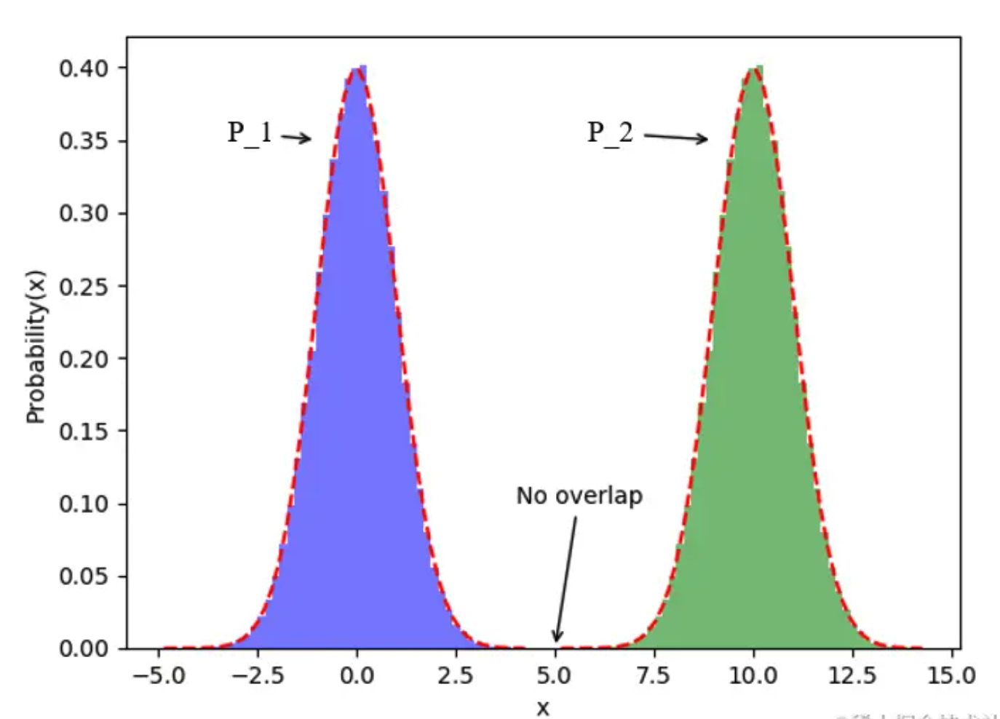

既然这样，那么是否两个分布有重叠，JS就可以正常计算了？

其实不然，**当 **$p_{data}$** 与 **$p_{g}$** 的支撑集（support）是高维空间中的低维流形（manifold）时， **$p_{data}$** 与 **$p_{g}$** 重叠部分测度（measure）为0的概率为1。**

也就是说，当两个分布有重叠时，大概率也是可以忽略不计的重叠，这时的JS值依然是log2

- 支撑集（support）其实就是函数的非零部分子集，比如ReLU函数的支撑集就是，一个概率分布的支撑集就是所有概率密度非零部分的集合。
- 流形（manifold）是高维空间中曲线、曲面概念的拓广，我们可以在低维上直观理解这个概念，比如我们说三维空间中的一个曲面是一个二维流形，因为它的本质维度（intrinsic dimension）只有2，一个点在这个二维流形上移动只有两个方向的自由度。同理，三维空间或者二维空间中的一条曲线都是一个一维流形。
- 测度（measure）是高维空间中长度、面积、体积概念的拓广，可以理解为“超体积”。

GAN中的生成器一般是从某个低维（比如100维）的随机分布中采样出一个编码向量，再经过一个神经网络生成出一个高维样本（比如64x64的图片就有4096维）。当生成器的参数固定时，生成样本的概率分布虽然是定义在4096维的空间上，但它本身所有可能产生的变化已经被那个100维的随机分布限定了，其本质维度就是100，再考虑到神经网络带来的映射降维，最终可能比100还小，所以生成样本分布的支撑集就在4096维空间中构成一个最多100维的低维流形，“撑不满”整个高维空间。

高维空间中不是每个点都能表达一个样本（图片），空间中大部份是多余的，真实数据蜷缩在低维子空间的流形上（高维曲面），因为维度比整个空间低，所占空间的体积几乎为零，像一张薄纸飘在三维空间，不仔细看很难发现。

“撑不满”就会导致真实分布与生成分布难以“碰到面”，这很容易在二维空间中理解：一方面，二维平面中随机取两条曲线，它们之间刚好存在重叠线段的概率为0；另一方面，虽然它们很大可能会存在交叉点，但是相比于重合的曲线而言，交叉点比曲线低一个维度，长度（测度）为0，可忽略。三维空间中也是类似的，随机取两个曲面，它们之间最多就是比较有可能存在交叉线，但是交叉线比曲面低一个维度，面积（测度）是0，可忽略。

从低维空间拓展到高维空间，就有了如下逻辑：因为一开始生成器随机初始化，所以两个分布之间几乎不可能有什么关联，所以它们的支撑集之间的重叠部分要么不存在，要么就比最小维度还要低至少一个维度，因此重叠部份测度为0，从而分布之间重叠的部分可以忽略

**在最优判别器下，求最优生成器即为最小化生成器的loss，等价于最小化 **$p_{data}$** 与 **$p_{g}$** 之间的JS散度，而由于 **$p_{data}$** 与 **$p_{g}$** 的要么没有重叠要么重叠部分测度为0，所以无论它们相距多远JS散度都是常数，最终导致生成器的梯度为0，导致梯度消失。**


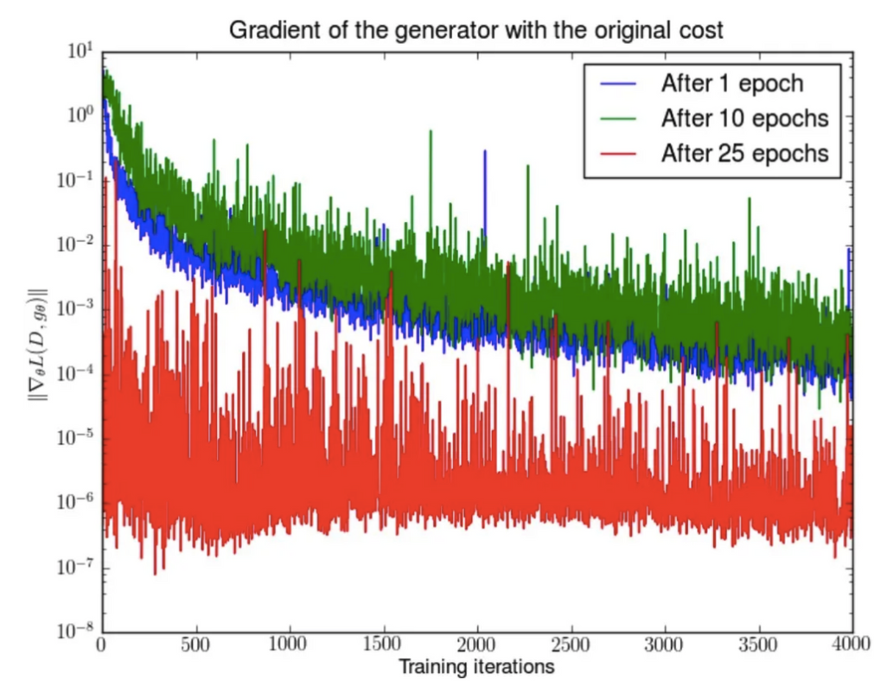


<h2 id="36.Stable-Diffusion-3有哪些改进点？">36.Stable-Diffusion-3有哪些改进点？</h2>

Rocky认为Stable Diffusion 3的价值和传统深度学习时代的“YOLOv4”一样，在AIGC时代的工业界、应用界、竞赛界以及学术界，都有非常大的学习借鉴价值，以下是SD 3相比之前系列的改进点汇总：

1. 使用多模态DiT作为扩散模型核心：多模态DiT（MM-DiT）将图像的Latent tokens和文本的tokens拼接在一起，并采用两套独立的权重处理，但是在进行Attention机制时统一处理。
2. 改进VAE：通过增加VAE通道数来提升图像的重建质量。
3. 3个文本编码器：SD 3中使用了三个文本编码器，分别是CLIP ViT-L（参数量约124M）、OpenCLIP ViT-bigG（参数量约695M）和T5-XXL encoder（参数量约4.7B）。
4. 采用优化的Rectified Flow：采用Rectified Flow来作为SD 3的采样方法，并在此基础上通过对中间时间步加权能进一步提升效果。
5. 采用QK-Normalization：当模型变大，而且在高分辨率图像上训练时，attention层的attention-logit（Q和K的矩阵乘）会变得不稳定，导致训练出现NAN，为了提升混合精度训练的稳定性，MM-DiT的self-attention层采用了QK-Normalization。
6. 多尺寸位置编码：SD 3会先在256x256尺寸下预训练，再以1024x1024为中心的多尺度上进行微调，这就需要MM-DiT的位置编码需要支持多尺度。
7. timestep schedule进行shift：对高分辨率的图像，如果采用和低分辨率图像的一样的noise schedule，会出现对图像的破坏不够的情况，所以SD 3中对noise schedule进行了偏移。
8. 强大的模型Scaling能力：SD 3中因为核心使用了transformer架构，所以有很强的scaling能力，当模型变大后，性能稳步提升。
9. 训练细节：数据预处理（去除离群点数据、去除低质量数据、去除NSFW数据）、图像Caption精细化、预计算图像和文本特征、Classifier-Free Guidance技术、DPO（Direct Preference Optimization）技术


<h2 id="37.Playground-V2模型有哪些特点？">37.Playground-V2模型有哪些特点？</h2>

Playground系列AI绘画大模型到目前已经发展到第三个版本，也就是Playground V2.5，其特点主要有：
1. 与SDXL相同模型架构。
2. 与SDXL相比，增强了色彩和对比度（EDM框架），改善了跨多种长宽比的生成（均衡分桶策略），以及改善了中心人物的细节（SFT策略）。
3. 其中EDM框架能在扩散模型的扩散过程最终“时间步长”上表现出接近零的信噪比。这消除了对偏移噪声的需求，让Playground V2.5能够生成背景是纯黑色或纯白色的图像。
4. 其中SFT策略主要使用一个高质量的小数据集对预训练的扩散模型进行微调训练。而这个数据集通过用户评级自动策划。
5. 从头开始训练（trained from scratch）。
6. 设计MJHQ-30K测试集用于评估AI绘画大模型，主要是在高质量数据集上计算FID来衡量美学质量。MJHQ-30K是从Midjourney上收集的30000个高质量数据集，共包含10个常见的类别，每个类别包含3000个样本。


<h2 id="38.Cross-Attention介绍">38.Cross-Attention介绍</h2>

### 简介
属于Transformer常见Attention机制，用于合并两个不同的sequence embedding。两个sequence是：Query、Key/Value。
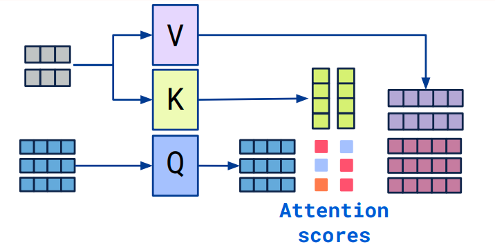Cross-Attention和Self-Attention的计算过程一致，区别在于输入的差别，通过上图可以看出，两个embedding的sequence length 和embedding_dim都不一样，故具备更好的扩展性，能够融合两个不同的维度向量，进行信息的计算交互。而Self-Attention的输入仅为一个。

### 作用
Cross-Attention可以用于将图像与文本之间的关联建立，在stable-diffusion中的Unet部分使用Cross-Attention将文本prompt和图像信息融合交互，控制U-Net把噪声矩阵的某一块与文本里的特定信息相对应。


<h2 id="39.扩散模型中的引导技术：CG与CFG">39.扩散模型中的引导技术：CG与CFG</h2>

在扩散模型的逆向过程中，引导技术被广泛应用于可控生成。目前主要有两种引导技术：分类器引导（Classifier Guidance, CG）和无分类器引导（Classifier-Free Guidance, CFG）。

### 分类器引导（CG）

1. **定义**：CG额外训练一个分类器（如类别标签分类器）来引导逆向过程。

2. **工作原理**：
   
   - 在每个时间步使用类别标签对数似然的梯度来引导：∇xt log pφ(y|xt)
   - 产生条件分数估计
   
3. **公式**：
   $$
   CG :\tilde{\epsilon}_{\theta}(x_{t},t)\leftarrow\epsilon_{\theta}(x_{t},t)-\sqrt{1-\bar{\alpha}_{t}}\gamma\nabla_{x_{t}}\log p_{\phi}(y|x_{t})
   $$
   
   
   其中γ是CG比例。
   
4. **优势**：
   
   - 能够引导生成样本的任何所需属性，前提是有真实标签
   - 在V2A设置中，所需属性指的是音频语义和时间对齐
   
5. **应用示例**：
   如果想从预训练的图像扩散模型生成具有特定属性的图像（如黄发女孩），只需训练一个"黄发女孩"分类器来引导生成过程。

### 无分类器引导（CFG）

1. **定义**：CFG不需要额外的分类器，而是使用条件和无条件分数估计的线性组合来引导逆向过程。

2. **工作原理**：
   - 使用条件c和引导比例ω
   - 在稳定扩散中实现

3. **公式**：
   $$
   CFG:\quad\tilde{\epsilon}_\theta(x_t,t,c)\leftarrow\omega\epsilon_\theta(x_t,t,c)+(1-\omega)\epsilon_\theta(x_t,t,\varnothing)
   $$
   其中ω是CFG比例，c是条件。
   
4. **特点**：
   - 当ω = 1时，CFG退化为条件分数估计
   - 目前是扩散模型中的主流方法

5. **优势**：
   
   - 不需要训练额外的分类器，实现更简单

### 比较

- CFG是当前扩散模型中的主流方法
- CG提供了根据真实标签引导生成样本特定属性的优势
- 两种方法并不相互排斥，可以结合使用以获得更好的效果