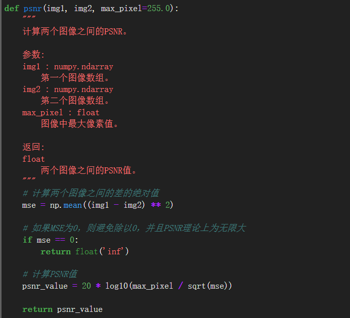

# 目录

- [1.图像二值化的相关概念](#user-content-1.图像二值化的相关概念)
- [2.图像膨胀腐蚀的相关概念](#user-content-2.图像膨胀腐蚀的相关概念)
- [3.高斯滤波的相关概念](#user-content-3.高斯滤波的相关概念)
- [4.边缘检测的相关概念](#user-content-4.边缘检测的相关概念)
- [5.图像高/低通滤波的相关概念](#user-content-5.图像高低通滤波的相关概念)
- [6.图像中低频信息和高频信息的定义](#user-content-6.图像中低频信息和高频信息的定义)
- [7.色深的概念](#user-content-7.色深的概念)
- [8.常用空间平滑技术](#user-content-8.常用空间平滑技术)
- [9.RAW图像和RGB图像的区别？](#user-content-9.raw图像和rgb图像的区别？)
- [10.常用的色彩空间格式](#user-content-10.常用的色彩空间格式)
- [11.模型训练时常用的插值算法？](#user-content-11.模型训练时常用的插值算法？)
- [12.常用图像预处理操作？](#user-content-12.常用图像预处理操作？)
- [13.有哪些常用的图像质量评价指标？](#user-content-13.有哪些常用的图像质量评价指标？)
- [14.什么是图像畸变？](#user-content-14.什么是图像畸变？)
- [15.RGB图像转为灰度图的方法？](#user-content-15.rgb图像转为灰度图的方法？)
- [16.仿射变换和透视变换的概念？](#user-content-16.仿射变换和透视变换的概念？)
- [17.图像噪声的种类？](#user-content-17.图像噪声的种类？)
- [18.Python中OpenCV和PIL的区别？](#user-content-18.python中opencv和pil的区别？)
- [19.有哪些常用的图像去噪算法？](#user-content-19.有哪些常用的图像去噪算法？)
- [20.有哪些常用的图像频域信息分离方法？](#user-content-20.有哪些常用的图像频域信息分离方法？)
- [21.有哪些常用一阶微分梯度算子？](#user-content-21.有哪些常用一阶微分梯度算子？)
- [22.拉普拉斯算子的相关概念](#user-content-22.拉普拉斯算子的相关概念)
- [23.OpenCV读取图像的格式？](#user-content-23.opencv读取图像的格式？)
- [24.中值滤波与均值滤波的相关概念](#user-content-24.中值滤波与均值滤波的相关概念)
- [25.什么是信噪比](#25.什么是信噪比)
- [26.什么是FID图像评估指标？](#26.什么是FID图像评估指标？)
- [27.什么是SSIM图像评估指标？](#27.什么是SSIM图像评估指标？)
- [28.什么是PSNR图像评估指标？](#28.什么是PSNR图像评估指标？)
- [29.透明图和常规图像的区别是什么？](#29.透明图和常规图像的区别是什么？)

<h2 id="1.图像二值化的相关概念">1.图像二值化的相关概念</h2>

图像二值化（ Image Binarization）是将图像像素点的灰度值设置为0或255，也就是将整个图像呈现出明显的黑白效果的过程。二值图像每个像素只有两种取值：要么纯黑，要么纯白。

通过二值图像，将感兴趣目标和背景分离，能更好地分析物体的形状和轮廓。

图像二值化的方法有很多，其中最经典的就是采用阈值法（Thresholding）进行二值化。阈值法是指选取一个数字，大于它就设为白色，小于它就设为黑色。根据阈值选取方式的不同，又可以分为全局阈值和局部阈值。全局阈值（Global Method），指的是对整个图像中的每一个像素都选用相同的阈值。局部阈值（Local Method）又称自适应阈值（Adaptive Thresholding）。局部阈值法假定图像在一定区域内受到的光照比较接近。它用一个滑窗扫描图像，并取滑窗中心点亮度与滑窗内其他区域（称为邻域, neighborhood area）的亮度进行比较。如果中心点亮度高于邻域亮度，则将中心点设为白色，否则设为黑色。

<h2 id="2.图像膨胀腐蚀的相关概念">2.图像膨胀腐蚀的相关概念</h2>

图像的膨胀(dilation)和腐蚀(erosion)是两种基本的形态学运算，主要用来寻找图像中的极大区域和极小区域。

膨胀类似于“领域扩张”，将图像的高亮区域或白色部分进行扩张，其运行结果图比原图的高亮区域更大。

腐蚀类似于“领域被蚕食”，将图像中的高亮区域或白色部分进行缩减细化，其运行结果图比原图的高亮区域更小。

<h2 id="3.高斯滤波的相关概念">3.高斯滤波的相关概念</h2>

图像为什么要滤波呢？一是为了消除图像在数字化过程中产生或者混入的噪声。二是为了提取图片对象的特征作为图像识别的特征模式。

什么是高斯噪声？首先，噪声在图像当中常表现为引起较强视觉效果的孤立像素点或像素块。简单来说，噪声的出现会给图像带来干扰，让图像变得不清楚。 高斯噪声就是它的概率密度函数服从高斯分布（即正态分布）的一类噪声。如果一个噪声，它的幅度分布服从高斯分布，而它的功率谱密度又是均匀分布的，则称它为高斯白噪声。

高斯滤波是一种线性平滑滤波，可以用来消除高斯噪声。其公式如下所示

高斯滤波过程：
假设高斯核：

那么高斯滤波计算过程就如下所示：

将这9个值加起来，就是中心点的高斯滤波的值。对所有点重复这个过程，就得到了高斯模糊后的图像。

二维高斯滤波能否分解为一维操作？可以进行分解，二维高斯滤波分解为两次一维高斯滤波，高斯二维公式可以推导为X轴与Y轴上的一维高斯公式。即使用一维高斯核先对图像逐行滤波，再对中间结果逐列滤波。

<h2 id="4.边缘检测的相关概念">4.边缘检测的相关概念</h2>

图像边缘是图像最基本的特征，指图像局部特征的不连续性。图像特征信息的突变处称之为边缘，例如灰度级的突变，颜色的突变，纹理结构的突变等。边缘是一个区域的结束，也是另一个区域的开始，利用该特征可以分割图像。

当我们看到一个有边缘的物体时，首先感受到的就是边缘。

上图（a）是一个理想的边缘所具备的特性。每个灰度级跃变到一个垂直的台阶上。而实际上，在图像采集系统的性能、采样率和获取图像的照明条件等因素的影响，得到的边缘往往是模糊的，边缘被模拟成具有“斜坡面”的剖面，如上图（b）所示，在这个模型中，模糊的边缘变得“宽”了，而清晰的边缘变得“窄”了。

图像的边缘有方向和幅度两种属性。边缘通常可以通过一阶导数或二阶导数检测得到。一阶导数是以最大值作为对应的边缘的位置，而二阶导数则以过零点作为对应边缘的位置。

常用的一阶导数边缘算子：Roberts算子、Sobel算子和Prewitt算子。

常用的二阶导数边缘算子：Laplacian 算子，此类算子对噪声敏感。

其他边缘算子：前面两类均是通过微分算子来检测图像边缘，还有一种就是Canny算子，其是在满足一定约束条件下推导出来的边缘检测最优化算子。

<h2 id="5.图像高低通滤波的相关概念">5.图像高/低通滤波的相关概念</h2>

滤波操作是一种非常实用的图像数据预处理方法。滤波是一个信号处理领域的概念，而图像本身也可以看成是一个二维的信号，其中像素点数值的高低代表信号的强弱。

其中图像信息可以分为高频和低频两个维度：

高频：图像中灰度变化剧烈的点，一般是图像轮廓或者是噪声。

低频：图像中平坦的、变化不大的点，也就是图像中的大部分区域。

根据图像的高频与低频的特征，我们可以设计相应的高通与低通滤波器，高通滤波器可以检测保留图像中尖锐的、变化明显的地方。而低通滤波器可以让图像变得更光滑，去除图像中的噪声。

常见的低通滤波器有：线性的均值滤波器、高斯滤波器、非线性的双边滤波器、中值滤波器。

常见的高通滤波器有：Canny算子、Sobel算子、拉普拉斯算子等边缘滤波算子。

<h2 id="6.图像中低频信息和高频信息的定义">6.图像中低频信息和高频信息的定义</h2>

低频信息（低频分量）：表示图像中灰度值变化缓慢的区域，对应着图像中大块平坦的区域。

高频信息（高频分量）：表示图像中灰度值变化剧烈的区域，对应着图像的边缘（轮廓）、噪声（之所以说噪声也是高频分量，是因为图像噪声在大部分情况下都是高频的）以及细节部分。

低频分量主要对整幅图像强度的综合度量。高频分量主要对图像边缘和轮廓的度量（人眼对高频分量比较敏感）。

傅立叶变换角度理解：从傅立叶变换的角度，我们可以将图像从灰度分布转化为频率分布。图像进行傅立叶变换之后得到的频谱图，就是图像梯度的分布图。具体来说，傅立叶频谱图上我们能看到明暗不一的亮点，实际上就是图像上某一点与领域点差异的强弱，即梯度的大小。如果一幅图像的各个位置的强度大小相等，则图像只存在低频分量。从图像的频谱图上看，只有一个主峰,且位于频率为零的位置。如果一幅图像的各个位置的强度变化剧烈，则图像不仅存在低频分量，同时也存在多种高频分量。从图像的频谱上看，不仅有一个主峰,同时也存在多个旁峰。图像中的低频分量就是图像中梯度较小的部分，高频分量则相反。

<h2 id="7.色深的概念">7.色深的概念</h2>

色深（Color Depth）指的是色彩的深度，即精细度。在数字图像中，最小的单元是像素，在RGB三通道图像中，每个像素都由R，G，B三个通道组成，通常是24位的二进制位格式来表示。这表示颜色的2进制位数，就代表了色深。

<h2 id="8.常用空间平滑技术">8.常用空间平滑技术</h2>

空间平滑（模糊）技术是广泛应用于图像处理以降低图像噪声的技术。
空间平滑技术可以分为两大类：局部平滑（Local Smoothing）和非局部平滑（Non-local Smoothing）
局部平滑方法利用附近的像素来平滑每个像素。通过设计不同的加权机制，产生了很多经典的局部平滑方法，例如高斯Smoothing，中值Smoothing，均值Smooyhing等。

而非局部平滑方法不限于附近的像素，而是使用图像全局中普遍存在的冗余信息进行去噪。具体来说，以较大的图像块为单位在图像中寻找相似区域，再对这些区域求平均，并对中心图像块进行替换，能够较好地去掉图像中的噪声。在平均操作中，可以使用高斯，中位数以及均值等对相似图像块进行加权。

<h2 id="9.raw图像和rgb图像的区别？">9.RAW图像和RGB图像的区别？</h2>

RAW格式: 从相机传感器端获取的原始数字格式的数据, 又称为Bayer格式. 每个像素信息只有RGB中的某个颜色信息, 且每4个像素中有2个像素为G信息,1个R信息,1个B信息, 即GRBG格式。

RGB格式: RGB格式是由RAW数据插值计算后获取的、每个像素均包含了RGB三种颜色的信息。

<h2 id="10.常用的色彩空间格式">10.常用的色彩空间格式</h2>

深度学习中常用的色彩空间格式：RGB，RGBA，HSV，HLS，Lab，YCbCr，YUV等。

RGB色彩空间以Red(红)、Green(绿)、Blue(蓝)三种基本色为基础，进行不同程度的叠加，产生丰富而广泛的颜色，所以俗称三基色模式。

RGBA是代表Red(红)、Green(绿)、Blue(蓝)和Alpha(透明度)的色彩空间。

HSV色彩空间（Hue-色调、Saturation-饱和度、Value-亮度）将亮度从色彩中分解出来，在图像增强算法中用途很广。

HLS色彩空间，三个分量分别是色相(H)、亮度(L)、饱和度(S)。

Lab色彩空间是由CIE(国际照明委员会)制定的一种色彩模式。自然界中任何一点色都可以在Lab空间中表达出来，它的色彩空间比RGB空间还要大。

YCbCr进行了图像子采样，是视频图像和数字图像中常用的色彩空间。在通用的图像压缩算法中（如JPEG算法），首要的步骤就是将图像的颜色空间转换为YCbCr空间。

YUV色彩空间与RGB编码方式(色域)不同。RGB使用红、绿、蓝三原色来表示颜色。而YUV使用亮度、色度来表示颜色。

<h2 id="11.模型训练时常用的插值算法？">11.模型训练时常用的插值算法？</h2>

模型训练时Resize图像常用的插值算法有：最近邻插值，双线性插值以及双三次插值等。

最近邻插值：没考虑其他相邻像素点的影响，因而重新采样后灰度值有明显的不连续性，图像质量损失较大，存在马赛克和锯齿现象。

双线性插值：也叫一阶插值，它是利用了待求像素点在源图像中4个最近邻像素之间的相关性，通过两次线性插值得到待求像素点的值。

双三次插值：也叫立方卷积插值，它是利用了待求像素点在源图像中相邻的16个像素点的值，即这16个像素点的加权平均。

<h2 id="12.常用图像预处理操作？">12.常用图像预处理操作？</h2>

一般先对数据进行归一化（Normalization）处理【0，1】，再进行标准化（Standardization）操作，用大数定理将数据转化为一个标准正态分布，最后再进行一些数据增强处理。

归一化后，可以提升模型精度。不同维度之间的特征在数值上有一定比较性，可以大大提高分类器的准确性。
标准化后，可以加速模型收敛。最优解的寻优过程明显会变得平缓，更容易正确的收敛到最优解。

<h2 id="13.有哪些常用的图像质量评价指标？">13.有哪些常用的图像质量评价指标？</h2>

1. 峰值信噪比（Peak-Signal to Noise Ratio,PSNR）
2. 均方误差（Mean Square Error,MSE）
3. MAE（Mean Absolute Error,MSE）
4. 信噪比SNR（Signal to Noise Ratio,SNR）
5. 信息保真度准则（Information Fidelity Criterion,IFC）
6. 视觉信息保真度（Visual Information Fidelity,VIF）
7. 结构相似度（Structure Similaruty,SSIM）

<h2 id="14.什么是图像畸变？">14.什么是图像畸变？</h2>

使用摄像头时，可能会出现图像边缘线条弯曲的情况，尤其是边缘部分是直线时，这种现象更为明显。比如摄像头显示画面中的门框、电线杆、墙面棱角、吊顶线等出现在边缘时，可能会有比较明显的弯曲现象，这种现象就叫做畸变。

畸变是指光学系统对物体所成的像相对于物体本身而言的失真程度，是光学透镜的固有特性，其直接原因是因为镜头的边缘部分和中心部分的放大倍率不一样导致。畸变并不影响像的清晰程度，只改变物体的成像形状，畸变是一种普遍存在的光学现象。

<h2 id="15.rgb图像转为灰度图的方法？">15.RGB图像转为灰度图的方法？</h2>

1. RGB任选一通道作为灰度图
2. RGB中最大值最为灰度图
3. RGB的均值作为灰度图
4. RGB的加权均值作为灰度图

<h2 id="16.仿射变换和透视变换的概念？">16.仿射变换和透视变换的概念？</h2>

仿射变换是对图片进行平移，缩放，倾斜和旋转等操作，是一种二维坐标到二维坐标之间的线性变换。它保持了二维图形的“平直性”（直线经过变换之后依然是直线）和“平行性”（二维图形之间的相对位置关系保持不变，平行线依然是平行线，且直线上点的位置顺序不变）。

透视变换是将图片投影到一个新的视平面，也称作投影映射。它是将二维图片投影到三维空间，再投回另一个二维空间的映射操作。

仿射变换和透视变换的最大区别：一个平行四边形，经过仿射变换后依然是平行四边形；而经过透视变换后只是一个四边形（不再平行了）。

<h2 id="17.图像噪声的种类？">17.图像噪声的种类？</h2>

<h3 id="常规噪声">常规噪声</h3>

1. 高斯噪声
2. 脉冲噪声
3. 泊松噪声
4. 乘性噪声
5. 瑞利噪声
6. 伽马噪声
7. 指数噪声
8. 均匀噪声
9. 椒盐噪声
10. 散粒噪声
11. 泊松噪声

<h3 id="对抗噪声">对抗噪声</h3>

1. 白盒对抗噪声
2. 黑盒查询对抗噪声
3. 黑盒迁移噪声
4. 物理对抗噪声

<h2 id="18.python中opencv和pil的区别？">18.Python中OpenCV和PIL的区别？</h2>

1. 在读取图片时，OpenCV按照BGR的色彩模式渲染通道，而PIL按照RGB的色彩模式渲染通道。
2. OpenCV性能较优，可以作为算法与工程的必备模块。

<h2 id="19.有哪些常用的图像去噪算法？">19.有哪些常用的图像去噪算法？</h2>

- 空间域去噪：均值滤波器，中值滤波器，低通滤波器，高斯滤波，双边滤波，引导滤波，NLM（Non-Local means）算法等。
- 频域去噪：小波变换，傅里叶变换，离散余弦变换，形态学滤波等。

<h2 id="20.有哪些常用的图像频域信息分离方法？">20.有哪些常用的图像频域信息分离方法？</h2>

可以使用频域滤波器如小波变换，傅里叶变换，余弦变换，形态学滤波等方法将图像高低频信息分离。

<h2 id="21.有哪些常用一阶微分梯度算子？">21.有哪些常用一阶微分梯度算子？</h2>

<h3 id="梯度算子">梯度算子</h3>

想要得到一张图像的梯度，要在图像的每个像素点处计算偏导数。因此一张图像$f$在$(x,y)$位置处的$x$和$y$方向上的梯度大小$g_{x}$和$g_{y}$分别计算为：

上述两个公式对所有的$x$和$y$的计算值可用下面的一维模版对$f(x,y)$的滤波得到。

用于计算梯度偏导数的滤波器模版，通常称之为梯度算子、边缘算子和边缘检测子等。

<h3 id="经典一阶梯度算子">经典一阶梯度算子</h3>

**Roberts算子**

Roberts算子又称为交叉微分算法，它是基于交叉差分的梯度算法，通过局部差分计算检测边缘线条。常用来处理具有陡峭的低噪声图像，当图像边缘接近于正45度或负45度时，该算法处理效果更理想。其缺点是对边缘的定位不太准确，提取的边缘线条较粗。

Roberts算子的模板分为水平方向和垂直方向，如下式所示，从其模板可以看出，Roberts算子能较好的增强正负45度的图像边缘。

例如，下面给出Roberts算子的模板，在像素点$P5$处$x$和$y$方向上的梯度大小$g_{x}$和$g_{y}$分别计算为：

下图是Roberts算子的运行结果：

**Prewitt算子**

Prewitt算子是一种图像边缘检测的微分算子，其原理是利用特定区域内像素灰度值产生的差分实现边缘检测。由于Prewitt算子采用$3\times3$卷积模板对区域内的像素值进行计算，而Robert算子的模板为$2\times2$，故Prewitt算子的边缘检测结果在水平方向和垂直方向均比Robert算子更加明显。Prewitt算子适合用来识别噪声较多、灰度渐变的图像，其计算公式如下所示：

例如，下面给出Prewitt算子的模板，在像素点$P5$处$x$和$y$方向上的梯度大小$g_{x}$和$g_{y}$分别计算为：

Prewitt算子运行结果如下：

**Sobel算子**

Sobel算子是一种用于边缘检测的离散微分算子，它结合了高斯平滑和微分求导。该算子用于计算图像明暗程度近似值，根据图像边缘旁边明暗程度把该区域内超过某个数的特定点记为边缘。Sobel算子在Prewitt算子的基础上增加了权重的概念，认为相邻点的距离远近对当前像素点的影响是不同的，距离越近的像素点对应当前像素的影响越大，从而实现图像锐化并突出边缘轮廓。

Sobel算子根据像素点上下、左右邻点灰度加权差，在边缘处达到极值这一现象检测边缘。对噪声具有平滑作用，提供较为精确的边缘方向信息。因为Sobel算子结合了高斯平滑和微分求导（分化），因此结果会具有更多的抗噪性，当对精度要求不是很高时，Sobel算子是一种较为常用的边缘检测方法。

Sobel算子的边缘定位更准确，常用于噪声较多、灰度渐变的图像。其算法模板如下面的公式所示，其中$d_{x}$表示水平方向，$d_{y}$表示垂直方向。

例如，下面给出Sobel算子的模板，在像素点$P5$处$x$和$y$方向上的梯度大小$g_{x}$和 $g_{y}$分别计算为：

sobel算子的效果如下：

<h3 id="各类算子的优缺点">各类算子的优缺点</h3>

**Roberts算子**

Roberts算子利用局部差分算子寻找边缘，边缘定位精度较高，但容易丢失一部分边缘，不具备抑制噪声的能力。该算子对具有陡峭边缘且含噪声少的图像效果较好，尤其是边缘正负45度较多的图像，但定位准确率较差。

**Sobel算子**

Sobel算子考虑了综合因素，对噪声较多的图像处理效果更好，Sobel 算子边缘定位效果不错，但检测出的边缘容易出现多像素宽度。

**Prewitt算子**

Prewitt算子对灰度渐变的图像边缘提取效果较好，而没有考虑相邻点的距离远近对当前像素点的影响，与Sobel 算子类似，不同的是在平滑部分的权重大小有些差异。

<h2 id="22.拉普拉斯算子的相关概念">22.拉普拉斯算子的相关概念</h2>

拉普拉斯算子是一个二阶算子，比起一阶微分算子，二阶微分算子的边缘定位能力更强，锐化效果更好。

使用二阶微分算子的基本方法是定义一种二阶微分的离散形式，然后根据这个形式生成一个滤波模版，与图像进行卷积。

滤波器分各向同性滤波器和各向异性滤波器。各向同性滤波器与图像进行卷积时，图像旋转后响应不变，说明滤波器模版自身是对称的。如果是各向异性滤波器，当原图旋转90度时，原图某一点能检测出细节（突变）的，但是现在却检测不出来了，这说明滤波器不是对称的。由于拉普拉斯算子是最简单的各向同性微分算子，它具有旋转不变形。

对于二维图像$f(x,y)$，二阶微分最简单的定义（拉普拉斯算子定义）：

对于任意阶微分算子都是线性算子，所以二阶微分算子和后面的一阶微分算子都可以用生成模版然后卷积的方式得出结果。

根据前面对二阶微分的定义有：

根据上面的定义，与拉普拉斯算子的定义相结合，我们可以得到：

也就是一个点的拉普拉斯的算子计算结果是上下左右的灰度和减去本身灰度的四倍。同样，可以根据二阶微分的不同定义，所有符号相反，也就是上式所有灰度值全加上负号，就是-1，-1，-1，-1，4。但是我们要注意，符号改变，锐化的时候与原图的加或减应当相对变化。上面是四临接的拉普拉斯算子，将这个算子旋转45度后与原算子相架，就变成了八邻域的算子了，也就是一个像素周围一圈8个像素的和与中间像素8倍的差，作为拉普拉斯计算结果。

因为要强调图像中突变（细节），所以平滑灰度的区域，无响应，即模版系数的和为0，也是二阶微分的必备条件。

最后的锐化公式：

其中，$g$是输出，$f$为原始图像，$c$是系数，用来对细节添加的多少进行调节。

我们接下来用更加形象的图像来解释拉普拉斯算子的有效性。

在边缘部分，像素值出现”跳跃“或者较大的变化。下图(a)中灰度值的”跃升”表示边缘的存在。如果使用一阶微分求导我们可以更加清晰的看到边缘”跃升”的存在(这里显示为高峰值)图(b)。

如果在边缘部分求二阶导数会出现什么情况呢，图(c)所示。

我们会发现在一阶导数的极值位置，二阶导数为0。所以我们也可以用这个特点来作为检测图像边缘的方法。但是，二阶导数的0值不仅仅出现在边缘(它们也可能出现在无意义的位置),但是我们可以过滤掉这些点。

为了更适合于数字图像处理，我们如上面的式子所示，将其表示成了离散形式。为了更好的进行变成，我们也可以将其表示成模版的形式：

上图（a）表示离散拉普阿拉斯算子的模版，（b）表示其扩展模版，（c）则分别表示其他两种拉普拉斯的实现模版。

从模版形式中容易看出，如果在图像中一个较暗的区域中出现了一个亮点，那么用拉普拉斯运算就会使这个亮点变得更亮。因为图像中的边缘就是那些灰度发生跳变的区域，所以拉普拉斯锐化模板在边缘检测中很有用。

一般增强技术对于陡峭的边缘和缓慢变化的边缘很难确定其边缘线的位置。但此算子却可用二次微分正峰和负峰之间的过零点来确定，对孤立点或端点更为敏感，因此特别适用于以突出图像中的孤立点、孤立线或线端点为目的的场合。同梯度算子一样，拉普拉斯算子也会增强图像中的噪声，有时用拉普拉斯算子进行边缘检测时，可将图像先进行平滑处理。

图像锐化处理的作用是使灰度反差增强，从而使模糊图像变得更加清晰。图像模糊的实质就是图像受到平均运算或积分运算，因此可以对图像进行逆运算，如微分运算能够突出图像细节，使图像变得更为清晰。由于拉普拉斯是一种微分算子，它的应用可增强图像中灰度突变的区域，减弱灰度的缓慢变化区域。因此，锐化处理可选择拉普拉斯算子对原图像进行处理，产生描述灰度突变的图像，再将拉普拉斯图像与原始图像叠加而产生锐化图像。

这种简单的锐化方法既可以产生拉普拉斯锐化处理的效果，同时又能保留背景信息，将原始图像叠加到拉普拉斯变换的处理结果中去，可以使图像中的各灰度值得到保留，使灰度突变处的对比度得到增强，最终结果是在保留图像背景的前提下，突现出图像中小的细节信息。但其缺点是对图像中的某些边缘产生双重响应。

最后我们来看看拉普拉斯算子的效果：

<h2 id="23.opencv读取图像的格式？">23.OpenCV读取图像的格式？</h2>

通常其他图像读取函数读取图片的时候是按RGB格式读取，但在OpenCV在读取图片时，是按BGR读取的。

<h2 id="24.中值滤波与均值滤波的相关概念">24.中值滤波与均值滤波的相关概念</h2>

均值滤波也称为线性滤波，其采用的主要方法为邻域平均法。线性滤波的基本原理是用均值代替原图像中的各个像素值，即对待处理的当前像素点$(x,y)$，选择一个模板，该模板由其近邻的若干像素组成，求模板中所有像素的均值，再把该均值赋予当前像素点$(x,y)$，作为处理后图像在该点上的灰度值$g(x,y)$，即$g(x,y)=\frac{1}{m} \Sigma f(x,y)$， $m$为该模板中包含当前像素在内的像素总个数。这样的方法可以平滑图像，速度快，算法简单。但是无法去掉噪声，但能微弱的减弱它。

中值滤波是一种非线性平滑技术，它将每一像素点的灰度值设置为该点某邻域窗口内的所有像素点灰度值的中值。具体实现过程如下：

1. 通过从图像中的某个采样窗口取出奇数个数据进行排序。
2. 用排序后的中值作为当前像素点的灰度值。
3. 在图像处理中，中值滤波常用来保护边缘信息，是经典的平滑噪声的方法，该方法法对消除椒盐噪音非常有效，在光学测量条纹图象的相位分析处理方法中有特殊作用，但在条纹中心分析方法中作用不大。

### 

<h2 id="25.什么是信噪比">25.什么是信噪比</h2>

#### 什么是信噪比？

信噪比（SNR）是用来衡量信号强度与噪声强度相对大小的指标。在图像处理中，信号通常指的是有用的图像信息，而噪声则是无用的或干扰图像的成分。信噪比高表示图像中的有用信息远多于噪声，信噪比低则表示图像中噪声较多。

#### 信噪比的计算

信噪比的计算通常表示为信号功率与噪声功率之比，常用的计算公式如下：

$$
\mathrm{SNR}=10\log_{10}\left(\frac{P_{\mathrm{signal}}}{P_{\mathrm{noise}}}\right)
$$
其中，P_signal是信号的功率，P_noise 是噪声的功率。信噪比的单位是分贝（dB）。

在图像处理中，信噪比也可以通过像素值的均方差来计算：

$$
\mathrm{SNR}=10\log_{10}\left(\frac{\mu_{\mathrm{signal}}^2}{\sigma_{\mathrm{noise}}^2}\right)
$$
其中，μ_signal是图像信号的平均值，σ_noise 是噪声的标准差。

#### 信噪比在图像处理中的应用

1. **图像质量评估**：高信噪比表示图像质量好，因为图像中有用信息占比高，噪声少。
2. **图像去噪**：去噪算法的效果可以通过信噪比来评估，去噪后图像的信噪比越高，说明去噪效果越好。
3. **图像增强**：在图像增强处理中，提高信噪比是一个重要目标，以确保增强后的图像清晰度和细节保留。

<h1 id='26.什么是FID图像评估指标？'>26.什么是FID图像评估指标？</h1>

- **定义**

FID通过计算真实图像与生成图像的特征向量之间的距离的距离来评价图像的相似度。

**特征向量**：由预训练的图像特征提取网络获得。

- **公式**

$$ FID(x,y) = ||u_x - u_y||^2+Trace(\sigma_x+\sigma_y-2\sqrt{{\sigma_x}{\sigma_y}})$$

其中，$||.||$ 表示矩阵的二范数； $u$ 表示真实图像和生成图像特征向量的均值， $\sigma$ 表示二者的方差； $Trace$ 表示矩阵的迹。

- **计算步骤和python代码**

<h1 id='27.什么是SSIM图像评估指标？'>27.什么是SSIM图像评估指标？</h1>

- **定义**

SSIM全称为Structural Similarity，用于评估真实图像和生成图像的相似度指标。该指标基于滑动窗口，计算窗口子指标（亮度 $I$ ，对比度 $C$ ，结构 $S$ ）；再通过遍历整张图像计算出所有窗口的平均值（亮度 $I'$ ，对比度 $C'$ ，结构 $S'$ ），并通过累乘计算最后的SSIM指标。

**与FID的差异**：FID更偏向于对高度抽象的特征向量进行评价，而SSIM是对图像本身进行评价。如果生成图像与真实图像仅有**失真**（雾气，雨水，镜头模糊等）的影响，则两个评价指标双高；但如果生成图像是真实图像的同类图（同为大理石花纹的桌子，但两个花纹大相径庭），那么FID一般还是很高，SSIM则很低。

- **公式**

$$ I(x, y) = \frac {2u_xu_y+(k_1L)^2}{u_x^2+u_y^2+(k_1L)^2} $$

$$C(x,y)=\frac{2\sigma_x\sigma_y+(k_2L)^2}{\sigma_1^2+\sigma_2^2+(k_2L)^2}$$

$$S(x,y)=\frac{\sigma_{xy}+ (k_2L)^2/2}{\sigma_x\sigma_y+ (k_2L)^2/2}$$

$$SSIM(x,y)= [I'(x,y)^\alpha C'(x,y)^\beta S'(x,y)^\gamma]$$

其中， $u$ 表示均值； $\sigma$ 表示方差； $k_1,k_2$ 为超参数，一般为0.01和0.03； $L$ 表示图像像素值的范围，一般为255； $\alpha, \beta, \gamma$ 为超参数，一般为1。

- **计算步骤和python代码**

<h1 id='28.什么是PSNR图像评估指标？'>28.什么是PSNR图像评估指标？</h1>

- **定义**

PSNR全称为Peak Signal-to-Noise，峰值信噪比。它通过比较处理后的图像与原始图像之间的差异，即最大像素值和平均噪音的比值，来评价图像的相似性，其单位是分贝（dB）。

**与SSIM的关系**：PSNR的评价结果一般与SSIM的结果成正向关系。

**与FID的关系**：PSNR低，FID高可以说明生成的图像在满足特征的情况下具有一定的多样性。

- **公式**

$$MSE= \frac {1}{XY} \sum [I_1(x,y) - I_2(x,y)]$$

$$ PSNR = 20 \log_{10}(\frac{MAX_{pixel}}{\sqrt{MSE}}) $$

其中， $MSE$ 表示两张图对应像素的均方误差； $X，Y$ 表示图像的X轴和Y轴范围； $MAX_{pixel}$ 表示最大像素值，一般为255。

- **计算步骤和python代码**

<h1 id='29.透明图和常规图像的区别是什么？'>29.透明图和常规图像的区别是什么？</h1>

透明图像与常规图像的主要区别在于它们的颜色信息中是否包含透明度（即 **Alpha 通道**）。这种区别在视觉效果和文件结构上都有明显的体现。

### 1. **Alpha 通道**

- **透明图像**：透明图像包含 **Alpha 通道**，除了红色（Red）、绿色（Green）、蓝色（Blue）这三个基本颜色通道外，Alpha 通道用于存储每个像素的透明度信息。透明度通常以 0（完全透明）到 255（完全不透明）的范围表示。常见的支持透明度的图像格式有 PNG、GIF 和 WebP。
  
  - **例子**：一张 PNG 图像中某些部分是完全透明的，因此在浏览器或图片查看器中查看时，这些部分可能会显示为背景颜色或背景图像，而非实际颜色。

- **常规图像**：普通图像没有 **Alpha 通道**，只包含 RGB（红、绿、蓝）三个颜色通道，每个像素都是完全不透明的。常见的图像格式如 JPEG、BMP 通常不支持透明度。

  - **例子**：一张 JPEG 图像是完全不透明的，每个像素都有其特定的颜色。如果你将这种图像放在网页上，它会遮挡住所有在其下方的内容。

### 2. **视觉效果**

- **透明图像**：
  - 可以显示部分透明或完全透明的区域，这样图像就可以与背景或其他元素自然地融合。
  - 适用于图标、标志或需要与不同背景组合的图像。

- **常规图像**：
  - 所有像素都是不透明的，不管在什么背景下显示，图像的内容都会完全覆盖其下方的背景。
  - 适合用于照片或不需要透明效果的图像。

### 3. **文件格式**

- **支持透明度的格式**：如 PNG、GIF、WebP。
  - PNG 是最常见的支持透明度的格式，适用于需要无损压缩的高质量图像。
  - GIF 也支持透明度，但通常只支持单一透明度级别（即完全透明或完全不透明）。
  - WebP 是一种现代图像格式，支持透明度并且通常比 PNG 更高效。

- **不支持透明度的格式**：如 JPEG、BMP。
  - JPEG 是一种常见的图像格式，适用于照片等需要有损压缩的小文件。
  - BMP 是一种老式的无压缩图像格式，不支持透明度。

### 4. **文件大小**

- **透明图像**：
  - 由于包含额外的 Alpha 通道，通常文件大小会比同样分辨率的普通图像更大，特别是在 PNG 格式下。
  - 文件大小可能会根据透明区域的复杂程度而变化。

- **常规图像**：
  - 通常文件大小较小，尤其是在使用 JPEG 格式进行有损压缩时。

### 5. **使用场景**

- **透明图像**：
  - 常用于需要与背景结合的图像，如网站图标、LOGO、UI元素等。
  - 适合需要部分透明效果或不规则边缘的图像，比如水印、剪贴画等。

- **常规图像**：
  - 更适合用于照片、壁纸、封面等不需要透明度的场景。

### 例子对比

1. **透明图像 (PNG)**：
   - 如果你将一张透明的 PNG 图像放在一个有颜色的背景上，你会看到背景透过图像的透明区域显示出来。

2. **普通图像 (JPEG)**：
   - 如果你将一张 JPEG 图像放在同样的背景上，整个图像区域都是不透明的，背景会被完全覆盖。
