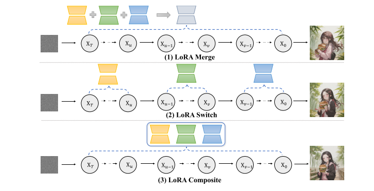

# 目录

- [1.使用lora微调Stable_Diffusion模型](#1.使用lora微调Stable_Diffusion模型)
- [2.用于图像生成的多lora组合](#2.用于图像生成的多lora组合)

<h2 id="1.使用lora微调Stable_Diffusion模型">1.使用lora微调Stable_Diffusion模型</h2>

[LoRA: Low-Rank Adaptation of Large Language Models](https://arxiv.org/abs/2106.09685) 是微软研究员引入的一项新技术，主要用于处理大模型微调的问题。目前超过数十亿以上参数的具有强能力的大模型 (例如 GPT-3) 通常在为了适应其下游任务的微调中会呈现出巨大开销。LoRA 建议冻结预训练模型的权重并在每个 Transformer 块中注入可训练层 (*秩-分解矩阵*)。因为不需要为大多数模型权重计算梯度，所以大大减少了需要训练参数的数量并且降低了 GPU 的内存要求。研究人员发现，通过聚焦大模型的 Transformer 注意力块，使用 LoRA 进行的微调质量与全模型微调相当，同时速度更快且需要更少的计算。

LoRA也是一种微调 Stable Diffusion 模型的技术，其可用于对关键的图像/提示交叉注意力层进行微调。其效果与全模型微调相当，但速度更快且所需计算量更小。

训练代码可参考以下链接：

[全世界 LoRA 训练脚本，联合起来! (huggingface.co)](https://huggingface.co/blog/zh/sdxl_lora_advanced_script)

<h2 id="2.用于图像生成的多lora组合">2.用于图像生成的多lora组合</h2>

论文链接:https://arxiv.org/abs/2402.16843.pdf

### **LoRA Merge**:

- 这种方法通过线性组合多个LoRAs来合成一个统一的LoRA，进而整合到文本到图像的模型中。
- 主要优点是能够统一多个元素，但它的一个缺点是没有考虑到生成过程中与扩散模型的交互，可能导致像汉堡包和手指这样的元素在图像中变形。

### **LoRA Switch (LoRA-S)**:

- LoRA Switch旨在每个去噪步骤中激活单个LoRA，通过在解码过程中定时激活各个LoRA，引入了一种动态适应机制。
- 图中用独特的颜色表示每个LoRA，每个步骤中只激活一个LoRA。
- 这种方法允许在扩散模型的不同解码步骤中精确控制元素的影响，提高了生成图像的灵活性和控制精度。

### **LoRA Composite (LoRA-C)**:

- LoRA Composite探索在每个时间步骤中整合所有LoRA，而不是合并权重矩阵。
- 它通过汇总每个LoRA在每一步的无条件和条件评分估计来实现，从而在图像生成过程中提供平衡的指导。
- 这种方法有助于保持所有不同LoRA代表的元素的连贯整合，增强了图像的整体一致性和质量。

