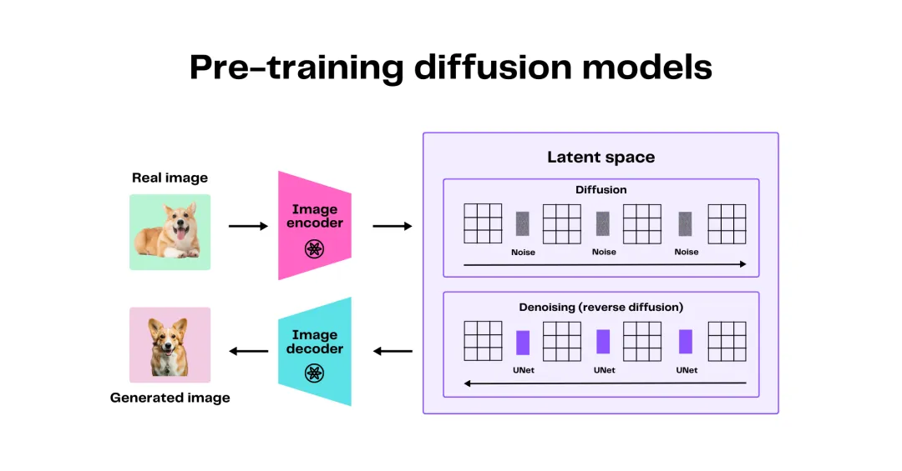
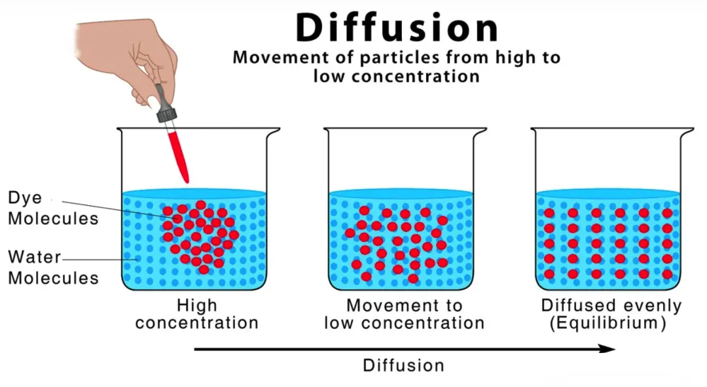

## 目录

- [1.说一下什么是AI视频，包括哪些关键技术?](#1.说一下什么是AI视频，包括哪些关键技术?)
- [2.请介绍下什么是视频生成，主要包括哪些方向？](#2.请介绍下什么是视频生成，主要包括哪些方向？)
- [3.请介绍下视频生成技术的演进路径？](#3.请介绍下视频生成技术的演进路径？)
- [4.请介绍下视频生成技术的应用场景？](#4.请介绍下视频生成技术的应用场景？)
- [5.什么DiT模型？](#5.什么DiT模型？)
- [6.简要解释下什么是扩散模型？](#6.简要解释下什么是扩散模型？)

<h2 id="1.说一下什么是AI视频，包括哪些关键技术?">1.说一下什么是AI视频，包括哪些关键技术?</h2>

AI视频是指利用人工智能技术对视频进行智能处理和分析，包括但不限于视频理解、视频生成、视频编辑、视频推荐等。
关键技术包括计算机视觉、自然语言处理、深度学习、强化学习等。

- 计算机视觉：用于视频理解，如物体识别、场景识别、行为识别等。
- 自然语言处理：用于视频生成，如文本到视频生成、语音识别等。
- 深度学习：用于视频推荐，如用户行为分析、内容推荐等。
- 强化学习：用于视频编辑，如自动剪辑、自动配乐等。

<h2 id="2.请介绍下什么是视频生成，主要包括哪些方向？">2.请介绍下什么是视频生成，主要包括哪些方向？</h2>

**视频生成**是指通过对人工智能的训练，使其能够根据给定的文本、图像、视频等单模态或多模态数据，自动生成符合描述的、高保真的视频内容。
**从生成方式进行划分**，当前AI视频生成可分为**文生视频、图生视频、视频生视频**。

**主要包含以下技术内容：**
- **文生视频、图生视频**：（Runway、Pika labs、SD + Deforum、Stable Video Diffusion、MagicAnimate、DemoFusion等）
- **视频生视频**：又分逐帧生成（SD + Mov2Mov）、关键帧+补帧（SD + Ebsynth、Rerender A Video）、
动态捕捉（Deep motion、Move AI、Wonder Dynamics）、视频修复（Topaz Video AI）
- **AIAvatar+语音生成**：Synthesia、HeyGen AI、D-ID
- **长视频生短视频**：Opus Clip
- **脚本生成+视频匹配**：Invideo AI
- **剧情生成**：Showrunner AI

<h2 id="3.请介绍下视频生成技术的演进路径？">3.请介绍下视频生成技术的演进路径？</h2>

图片生成和视频生成的底层技术框架较为相似，主要包括GAN、自回归模型、扩散模型、DiT四大路径，其中扩散模型（Diffusion model）和DiT为当前主流生成模型。

<h2 id="4.请介绍下视频生成技术的应用场景？">4.请介绍下视频生成技术的应用场景？</h2>

视频生成技术广泛应用于广告、影视、教育、娱乐、医疗、金融等领域，如：
- **广告营销**：利用视频生成技术制作吸引人的广告视频，提高广告效果。
- **影视创作**：利用视频生成技术自动生成剧本、剪辑、配乐等，提高创作效率。
- **教育**：利用视频生成技术制作生动、有趣的课程视频，提高学生的学习兴趣和效果。
- **娱乐**：利用视频生成技术制作

<h2 id="5.什么DiT模型？">5.什么DiT模型？</h2>

**DiT**是一种结合了**Transformer架构的扩散模型**，用于图像和视频生成任务，能够高效地捕获数据中的依赖关系并生成高质量的结果。
其本质是一种新型的扩散模型，结合了去噪扩散概率模型(DDPM)和Transformer架构。

**其核心思想是**：
使用Transformer作为扩散模型的骨干网络，而不是传统的卷积神经网络(如U-Net)，以处理图像的潜在表示。

<h2 id="6.简要解释下什么是扩散模型？">6.简要解释下什么是扩散模型？</h2>

**Diffusion Models**是一种新型的、先进的生成模型，用于生成与训练数据相似的数据，可以生成各种高分辨率图像。

**扩散模型的核心思想：**

**Diffusion Models**是一种受到非平衡热力学启发的生成模型，**其核心思想是**通过模拟扩散过程来逐步添加噪声到数据中，
并随后学习反转这个过程以从噪声中构建出所需的数据样本。

