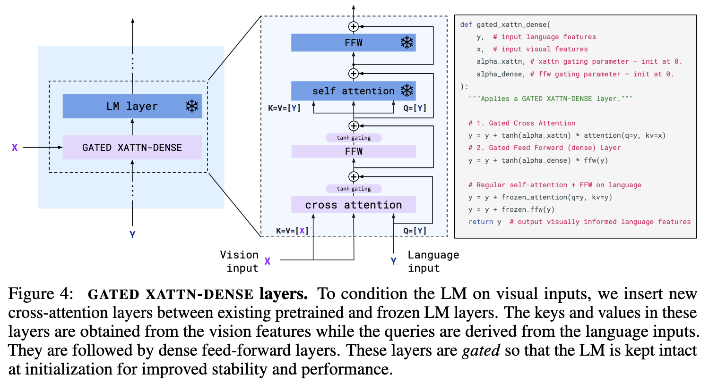
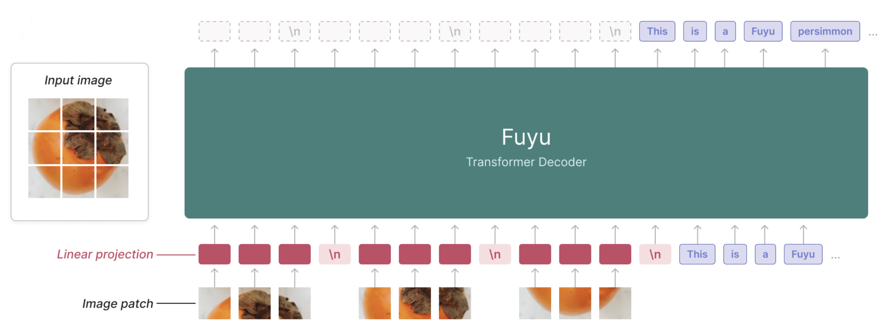

<h1 id="目录">目录</h1>

- [1.指令微调数据制作发展路线](#1.指令微调数据制作发展路线)
- [2.指令微调数据构造有哪些指导原则？](#2.指令微调数据构造有哪些指导原则？)
- [3.简要介绍一下KV-Cache](#3.简要介绍一下KV-Cache)
- [4.多模态大模型中，视觉编码器和文本解码器常见的连接方式有哪几种？](#4.多模态大模型中，视觉编码器和文本解码器常见的连接方式有哪几种？)
- [5.多模态大模型常见的Benchmark及其评估维度](#5.多模态大模型常见的Benchmark及其评估维度)
- [6.简要介绍一下LoRA](#6.简要介绍一下LoRA)
- [7.简要介绍一下LoRA的问题以及常见的LoRA改进方案](#7.简要介绍一下LoRA的问题以及常见的LoRA改进方案)
- [8.为什么现在的大模型大多是 decoder-only 的架构？](#8.为什么现在的大模型大多是decoder-only的架构？)
- [9.LLM中token指的是什么？](#9.LLM中token指的是什么？)
- [10.哪些因素会导致 LLM 中的偏见？](#10.哪些因素会导致LLM中的偏见？)
- [11.如何减轻 LLM 中的“幻觉”现象？](#11.如何减轻LLM中的“幻觉”现象？)
- [12.对LLMs进行数据预处理有哪些常见的做法？](#12.对LLMs进行数据预处理有哪些常见的做法？)
- [13.解释一下大模型的涌现能力？](#13.解释一下大模型的涌现能力？)
- [14.解释一下MOE，它的作用主要是什么？](#14.解释一下MOE，它的作用主要是什么？)
- [15.如何缓解大语言模型inference时候重复的问题？](#15.如何缓解大语言模型inference时候重复的问题？)
- [16.怎么解决训练使用float16导致溢出的问题？](#16.怎么解决训练使用float16导致溢出的问题？)
- [17.llm训练的时候用 float16，还是bfloat16，float32?](#17.llm训练的时候用float16，还是bfloat16，float32?)
- [18.解释 ChatGPT 的“零样本”和“少样本”学习的概念](#18.解释ChatGPT的“零样本”和“少样本”学习的概念)
- [19.多模态大模型为什么需要数据的dense caption化？](#19.多模态大模型为什么需要数据的dense caption化？)

<h1 id='1.指令微调数据制作发展路线'>1.指令微调数据制作发展路线</h1>

1. **Scaling law**：在指令微调数据较为匮乏的时期，收集更多的数据是提升性能的大力出奇迹办法。
2. **人工和启发式的数据多样性**：在数据量积累到一定规模后，数据混合配比成为新的研究话题。一些研究成果验证了合适的数据配比可以提升性能，但数据配比没有通用的万能钥匙。
3. **基于模型的多样性**：随着LLMs/MLLMs，可以让它们参与到数据生产和筛选流程中，例如用GPT3.5/4/4V生产数据，用其它LLMs作为数据质量筛选器。（GPT4/GPT4V为指令微调领域贡献了太多数据，这可能也是一种OpenAI吧）
4. **数据效率**：有了LLMs/MLLMs的加持，数据量似乎已经不成大问题。因此高质量数据的多样性、难度和复杂程度成为了关注焦点。满足上述要求的数据意味着用高质量的响应近似真实用户提示，LIMA论证了只要数据质量足够高，数据量会是次要因素。因此，需要自动化或半自动方案对数据进行过滤：
    1. 基于自然语言规则过滤；
    2. 用InsTag对指令微调数据打语义或意图的标签，从而做聚类分析；
    3. 利用GPT4等语言模型过滤噪声数据；
    4. 利用模型的loss等反馈数据对模型的影响，例如评估模型对指令的不确定性（Active Instruction Tuning）；
5. **数据治理、责任和其他问题**：开始关注数据商业条款、许可，版权等问题。


<h1 id='2.指令微调数据构造有哪些指导原则？'>2.指令微调数据构造有哪些指导原则？</h1>

1. **多样性**：覆盖尽可能多的数据/能力/响应类型；
2. **高质量**：Less is More，最好由算法工程师人工检查每一条指令微调数据，保证每条数据的高质量，三个臭皮匠抵不过一个诸葛亮；
3. **复杂性**：提高每条数据的信息量；
4. **每种能力的激活不需要太多数据**；
5. **更自由的强指令跟随能力需要较多数据**；
6. **精调各项能力配比**，避免遗忘；

<h1 id='3.简要介绍一下KV-Cache'>3.简要介绍一下KV-Cache</h1>


对于单个样本来说，生成式模型是next token prediction，随着序列变长，next token预测成本越来越高，FLOPs越来越大。但实际上它们重复计算了很多previous tokens。

KV-Cache的作用就是将计算过的token缓存起来不再重复计算。

假设没有KV-Cache，则next token prediction遵循如下伪代码。
```python
EOS_token = torch.tensor([198])
cur_tokens = torch.tensor(tokenizer.encode("WeThinkIn is"))
next_token = None
with torch.no_grad():
    while next_token != EOS_token:
        # cur_tokens会包含越来越多的重复计算
        logits, _ = model(cur_tokens)
        next_token = torch.argmax(logits[-1, :], dim=0, keepdim=True)
        # 每次得到next_token后需要和cur_tokens拼接
        cur_tokens = torch.cat((cur_tokens, next_token), 0)
```

```python
EOS_token = torch.tensor([198])
cur_tokens = torch.tensor(tokenizer.encode("WeThinkIn is"))
next_token = None
kv_cache = None
with torch.no_grad():
    while next_token != EOS_token:
        # 通过past_key_values实现
        logits, kv_cache = model(cur_tokens, past_key_values=kv_cache)
        next_token = torch.argmax(logits[-1, :], dim=0, keepdim=True)
        # 不再需要concate，因为需要重复计算的部分会不断增量缓存到kv_cache中，以空间换时间。
        cur_tokens = next_tokens
```

如果一个mini-batch内的样本共享相同的meta/system prompt或图像，则可以先统一做一次预填充，再通过past_key_value参数传入generate的方式实现不同样本间的KV-Cache。


<h1 id='4.多模态大模型中，视觉编码器和文本解码器常见的连接方式有哪几种？'>4.多模态大模型中，视觉编码器和文本解码器常见的连接方式有哪几种？</h1>

常见连接方式有Q-Former，Attention，Linear Layer/ MLP结构。此外还有Fuyu这类较特殊的结构，它没有Image Encoder，而是直接把image patches通过Linear Layer映射后送入LLM。

各结构的代表性方法列举如下：

**Q-Former**

>以BLIP-2为代表的Q-Former结构在其中增加了多个目标函数，希望视觉信息和文本信息在Q-Former中进一步对齐。


**Attention**

>以Flamingo结构为代表的Attention结构没有简单的把视觉tokens和文本tokens拼接到一起，而是在cross-attention层加入，增强了视觉信息和文本信息间的交互。





**Linear Layer / MLP**

>最近的研究工作大大简化的连接方式，以LLaVA为代表的方法仅使用了一个Linear Layer作为连接器，然后把视觉tokens和文本tokens经过拼接后送入LLM。
>在LLaVA 1.5中，Linear Layer升级为了2层MLP。目前MLP结构广受欢迎。


**Fuyu**

>Fuyu架构同样使用了Linear Layer，但更为特殊的是，Fuyu索性将image encoder去掉了，直接将image patches经Linear Layer映射后与文本tokens拼接，并送入LLM中。




<h1 id='5.多模态大模型常见的Benchmark及其评估维度'>5.多模态大模型常见的Benchmark及其评估维度</h1>

| Benchmark | 评估维度 | 链接 |  
|---|---|---|
| OpenCompass | 100+数据集，40w问题，多维度综合 | https://opencompass.org.cn/home  |
| MMMU | 11.5k问题，多维度综合，涵盖六个核心学科: 艺术与设计、商业、科学、健康与医学、人文与社会科学和技术与工程。这些问题涉及30个主题和183个子领域，包括30个高度异构的图像类型，如图表、图表、地图、表格、音乐表和化学结构等。 | https://mmmu-benchmark.github.io/ |
| MME | 涵盖感知和认知在内的共14个子任务  | https://github.com/BradyFU/Awesome-Multimodal-Large-Language-Models/tree/Evaluation | 
| POPE | 幻觉问题评估 | https://github.com/RUCAIBox/POPE |
| TouchStone | 使用GPT4进行指令跟随能力评估，涵盖5个关键维度: 基本描述能力、视觉识别能力、视觉理解能力、视觉叙事能力和多图像分析能力。| https://github.com/OFA-Sys/TouchStone |


<h1 id='6.简要介绍一下LoRA'>6.简要介绍一下LoRA</h1>

LoRA全称Low Rank Adaptation，出自论文《LoRA: Low-Rank Adaptation of Large Language Models》。

LoRA的出发点是：预训练模型的参数量太大，而事实上对下游任务的微调所需要的本征维度(Intrinsic Dimension)并不高。

假设预训练参数$W_0$，微调后的参数为$W_1$，参数更新可以表示：

$$W_1 = W_0 + \Delta W$$

在“本征维度较低”假设下，可以将$\Delta W$做低秩分解：

$$W_1 = W_0 + UV$$

其中$U \in {\mathbb R}^{m \times r}$；$V \in {\mathbb R}^{r \times n}$。$r$可以设置得非常小，而后在微调过程中只微调$UV$。
这样需要被微调的参数量就少了很多很多。

在实践中，要保证模型初始为预训练状态以获得一个好的微调起点，例如将$UV$之一做全0初始化，或者在$W_0$中先减去$UV$.

<h1 id='7.简要介绍一下LoRA的问题以及常见的LoRA改进方案'>7.简要介绍一下LoRA的问题以及常见的LoRA改进方案</h1>
LoRA的低秩思路显著提升了微调效率，但同时也受到低秩限制，微调性能和全参微调还是存在差距。

**（1）PLoRA**
**PLoRA**的改进思路是通过多阶段累积低秩矩阵来逼近全参微调性能。
PLoRA在每个训练阶段做一次LoRA微调并在阶段结束时将训练得到的LoRA合并到主干参数中，然后重新初始化LoRA状态。

**(2) LoRA+**
**LoRA+**可以为UV矩阵设置不同的学习率。

<h1 id='8.为什么现在的大模型大多是decoder-only的架构？'>8.为什么现在的大模型大多是 decoder-only 的架构？</h1>

LLM之所以主要都用Decoder-only架构，除了训练效率和工程实现上的优势外，在理论上是因为Encoder的双向注意力会存在低秩问题，这可能会削弱模型表达能力，就生成任务而言，引入双向注意力并无实质好处。而Encoder-Decoder架构之所以能够在某些场景下表现更好，大概只是因为它多了一倍参数。所以，在同等参数量、同等推理成本下，Decoder-only架构就是最优选择了。

<h1 id='9.LLM中token指的是什么？'>9.LLM中token指的是什么？</h1>

在大语言模型中，Token是模型进行语言处理的基本信息单元，它可以是一个字，一个词甚至是一个短语句子。Token并不是一成不变的，在不同的上下文中，他会有不同的划分粒度。

<h1 id='10.哪些因素会导致LLM中的偏见？'>10.哪些因素会导致 LLM 中的偏见？</h1>

在大型语言模型（LLM）中，偏见可能来源于多个因素，包括以下几个方面：
1. **训练数据的偏差**：LLM 的性能依赖于所使用的训练数据。如果训练数据中包含偏见（例如，种族、性别、年龄、宗教等方面的偏见），模型可能会在生成文本时反映出这些偏见。
2. **数据选择与采样方法**：如果训练数据在选择和采样过程中不够多样化或不够平衡，可能导致模型对某些群体或观点的偏见。某些少数群体或观点可能在训练数据中被低估或忽视，从而导致模型表现出偏见。
3. **模型架构和训练方法**：虽然模型架构本身并不直接产生偏见，但特定的设计选择和训练方法可能会放大训练数据中的偏见。例如，过度优化某些性能指标（如精度）可能会忽视公平性和多样性。
4. **人类标注者的偏见**：在训练监督学习模型时，标注数据的过程通常涉及人类标注者。如果这些标注者带有偏见，他们的偏见可能会传递到训练数据中，从而影响模型的输出。
5. **模型部署和使用环境**：即使模型在训练过程中没有明显偏见，在实际部署和使用过程中，用户交互和反馈也可能引入新的偏见。例如，某些用户输入可能会导致模型生成偏见性回答。
6. **社会和文化背景**：语言和文化是动态变化的，不同社会和文化背景下的语言使用方式不同。如果模型训练数据主要来自特定文化或语言环境，可能会对其他文化或语言产生偏见。
为了减少这些偏见，研究人员和开发者可以采取以下措施：
- **多样化训练数据**：确保训练数据在性别、种族、文化、社会经济背景等方面具有多样性。
- **偏见检测和消除**：使用技术手段检测和消除模型中的偏见，例如通过去偏算法和公平性评估工具。
- **透明度和解释性**：增加模型的透明度，使用户能够理解模型的决策过程，并及时识别和纠正偏见。
- **持续监控和改进**：在模型部署后持续监控其表现，收集用户反馈，并定期更新和改进模型。
这些方法可以帮助减少 LLM 中的偏见，提高其公平性和可靠性。

<h1 id='11.如何减轻LLM中的“幻觉”现象？'>11.如何减轻 LLM 中的“幻觉”现象？</h1>

大模型幻觉问题主要指：指的是模型生成的内容看似合理但实际上是错误或虚构的信息。
减轻大型语言模型（LLM）中的“幻觉”现象可以通过多种方法实现。改进训练数据质量和训练方法，包括数据清洗、监督学习和强化学习，确保数据的准确性和多样性；采用后处理技术，如事实验证和编辑校对，确保生成内容的真实性；改进模型架构，结合外部知识库和多任务学习增强模型对事实的理解；提高模型透明度和可解释性，使用户能够理解和检查模型的输出；建立用户教育和反馈机制，鼓励用户验证生成内容并报告错误；以及定期更新和维护模型和数据。通过这些方法，可以显著减少模型生成错误信息的可能性，提高内容的准确性和可靠性。

<h1 id='12.对LLMs进行数据预处理有哪些常见的做法？'>12.对LLMs进行数据预处理有哪些常见的做法？</h1>

1、质量过滤
直接收集到的文本数据往往掺杂了很多低质量的数据，为了优化模型学习的性能，需要去除语料库中的低质量数据。目前，研究人员主要使用以下两种数据清洗方法：（1）基于启发式规则的方法：设计的规则来针对地识别和剔除低质量的文本数据，（2）基于分类器的方法：训练用于判别数据质量的文本分类器，进行预训练语料的清洗。
2、敏感内容过滤
除了去除低质量内容，收集到的数据还可能包括有毒内容或隐私信息，需要进一步进行更为细致的过滤和处理。
3、数据去重
对预训练数据进行去重处理是一个重要步骤。由于大语言模型具有较强的数据拟合与记忆能力，很容易习得训练数据中的重复模式，可能导致对于这些模式的过度学习。
去重算法的设计可以基于不同的计算粒度以及匹配方法。
• 计算粒度. 去重可以在句子级别、文档级别和数据集级别等多种粒度上进行
• 用于去重的匹配方法. 在去重过程中，可以使用精确匹配算法（即每个字符完全相同）或近似匹配算法（基于某种相似性度量）。

<h1 id='13.解释一下大模型的涌现能力？'>13.解释一下大模型的涌现能力？</h1>

大模型的涌现能力指的是，当模型的规模和复杂度达到一定程度时，出现了一些在较小模型中未曾观察到的新特性或能力，如语言理解与生成、推理、多语言处理和少样本学习等。这些能力并非通过直接编程实现，而是在大量数据和复杂训练过程中自然涌现的。

<h1 id='14.解释一下MOE，它的作用主要是什么？'>14.解释一下MOE，它的作用主要是什么？</h1>

混合专家模型（Mixture of Experts：MoE）是一种稀疏门控制的深度学习模型，它主要由一组专家模型和一个门控模型组成。MoE的基本理念是将输入数据根据任务类型分割成多个区域，并将每个区域的数据分配一个或多个专家模型。每个专家模型可以专注于处理输入这部分数据，从而提高模型的整体性能。
MoE架构的基本原理非常简单明了，它主要包括两个核心组件：GateNet和Experts。GateNet的作用在于判定输入样本应该由哪个专家模型接管处理。而Experts则构成了一组相对独立的专家模型，每个专家负责处理特定的输入子空间。

微软研究报告，参考链接：
https://www.microsoft.com/en-us/research/blog/deepspeed-advancing-moe-inference-and-training-to-power-next-generation-ai-scale/

<h1 id='15.如何缓解大语言模型inference时候重复的问题？'>15.如何缓解大语言模型inference时候重复的问题？</h1>

缓解大语言模型推理时重复问题的方法包括引入重复惩罚机制、多样性采样技术（如温度采样、Top-k采样、Top-p采样）、N-gram去重、改进模型架构和训练方法（如长程记忆机制、训练数据去重）以及生成后的后处理技术。这些策略可以有效减少生成文本中的重复现象，提高生成内容的多样性和连贯性。

<h1 id='16.怎么解决训练使用float16导致溢出的问题？'>16.怎么解决训练使用float16导致溢出的问题？</h1>

在训练过程中使用 float16 可能会导致数值溢出（overflow）或下溢（underflow），特别是在处理大模型和高动态范围的数据时。为了解决这些问题，可以采取以下几种策略：

### 1. **损失缩放（Loss Scaling）**
损失缩放是一种常见的方法，用于在使用 float16 进行训练时保持数值稳定性。具体步骤如下：
- 在前向传播过程中，将损失值乘以一个缩放因子（例如 1024 或 65536）。
- 在反向传播计算梯度时，将梯度除以同样的缩放因子。
通过这种方式，可以在梯度计算中保持足够的数值范围，减少下溢和溢出的风险。
```python
loss_scale = 1024.0
scaled_loss = loss * loss_scale
scaled_loss.backward()
for param in model.parameters():
    if param.grad is not None:
        param.grad.data /= loss_scale
```
### 2. **混合精度训练（Mixed Precision Training）**
混合精度训练结合使用 float16 和 float32，以兼顾计算效率和数值稳定性。通常使用 NVIDIA 的 Apex 或 PyTorch 的 AMP（Automatic Mixed Precision）工具来实现混合精度训练。
在 PyTorch 中，可以使用 `torch.cuda.amp` 进行混合精度训练：
```python
from torch.cuda.amp import GradScaler, autocast
scaler = GradScaler()
for input, target in data_loader:
    optimizer.zero_grad()
    with autocast():
        output = model(input)
        loss = criterion(output, target) 
    scaler.scale(loss).backward()
    scaler.step(optimizer)
    scaler.update()
```
### 3. **模型架构调整**
对于特定的模型，可以通过调整架构来减少溢出和下溢问题。例如：
- 在网络中添加适当的正则化层（如 Batch Normalization）来稳定训练。
- 使用更小的初始学习率，并逐渐增加。
- 采用较浅的网络层，减少过深网络带来的数值不稳定性。
### 4. **动态损失缩放**
动态损失缩放是一种自适应调整损失缩放因子的方法，能够根据训练过程中的数值范围动态调整缩放因子。可以通过 NVIDIA Apex 工具中的 `DynamicLossScaler` 类来实现。
```python
from apex import amp
model, optimizer = amp.initialize(model, optimizer, opt_level="O1")
for input, target in data_loader:
    optimizer.zero_grad()
    with amp.scale_loss(loss, optimizer) as scaled_loss:
        scaled_loss.backward()
    optimizer.step()
```
### 5. **监控和调整训练参数**
在训练过程中，持续监控梯度和权重的数值范围，及时调整训练参数（如学习率、损失缩放因子等）以避免数值问题。可以使用工具（如 TensorBoard）来可视化这些信息，并做出相应的调整。
### 总结
通过结合使用损失缩放、混合精度训练、模型架构调整和动态损失缩放等方法，可以有效解决 float16 训练过程中出现的数值溢出问题，提高训练效率和数值稳定性。

<h1 id='17.llm训练的时候用float16，还是bfloat16，float32?'>17.llm训练的时候用 float16，还是bfloat16，float32?</h1>

在训练大规模语言模型（LLM）时，使用不同的数值精度（如float16、bfloat16、float32）各有其优缺点，具体选择取决于训练的需求、硬件支持和精度要求。以下是每种数值精度的特点和适用情况：
1. **Float32（单精度浮点数）**：
   - **特点**：32位浮点数，提供较高的精度和动态范围。
   - **优点**：高精度，数值稳定性好，广泛支持。
   - **缺点**：内存和计算需求较大，训练速度较慢。
   - **适用情况**：用于需要高精度的训练场景，尤其是在数值稳定性非常关键的情况下。
2. **Float16（半精度浮点数）**：
   - **特点**：16位浮点数，精度和动态范围较低。
   - **优点**：内存和计算需求低，能够显著加速训练过程，适合在支持混合精度训练的硬件（如NVIDIA的Tensor Cores）上使用。
   - **缺点**：数值稳定性较差，容易出现溢出和下溢，需要额外的措施（如损失缩放）来确保训练稳定性。
   - **适用情况**：适用于资源受限、需要加速训练的场景，但需要注意数值稳定性。
3. **BFloat16（单精度浮点数的变种）**：
   - **特点**：16位浮点数，与float16相比，具有更大的动态范围，但精度略低。
   - **优点**：较大的动态范围使其在处理大模型和复杂计算时更加稳定，不需要复杂的损失缩放技术。兼顾计算效率和数值稳定性。
   - **缺点**：精度不如float32，但在大多数情况下足够使用。
   - **适用情况**：适用于需要平衡训练速度和数值稳定性的场景，尤其在支持bfloat16的硬件（如Google的TPUs）上效果更佳。
### 总结：
- **Float32**：适用于需要高精度和数值稳定性的训练任务。
- **Float16**：适用于希望加速训练过程并能应对数值稳定性挑战的任务，适合使用NVIDIA GPU的混合精度训练。
- **BFloat16**：适用于需要兼顾训练速度和数值稳定性的任务，尤其在使用Google TPU时。
在实际操作中，bfloat16和混合精度（float16和float32结合使用）往往是大模型训练中的最佳选择，因其在计算效率和数值稳定性之间达到了较好的平衡。

<h1 id='18.解释ChatGPT的“零样本”和“少样本”学习的概念'>18.解释 ChatGPT 的“零样本”和“少样本”学习的概念</h1>

零样本学习（Zero-Shot Learning）是指模型在没有见过任何特定任务训练样本的情况下直接执行任务的能力，而少样本学习（Few-Shot Learning）是指模型在只有极少量特定任务训练样本的情况下执行任务的能力。这些能力展示了大规模语言模型的灵活性和泛化能力，使其能够在广泛的任务中生成有用且相关的回答，即使缺乏专门的训练数据。
### 零样本学习（Zero-Shot Learning）
**概念**：
- 零样本学习指的是模型在没有见过任何特定任务训练样本的情况下，直接执行该任务。
- 模型通过预先训练的大量数据中学到的知识，能够推理并解决新任务。
**应用**：
- 例如，如果你问ChatGPT关于一种它从未见过的动物的问题，它可以利用已知的类似动物的信息进行推理，给出合理的回答。
- 另一个例子是语言翻译。即使模型没有特定语言对的训练数据，它仍能根据已有的语言知识进行初步的翻译。
### 少样本学习（Few-Shot Learning）
**概念**：
- 少样本学习指的是模型在只有很少量的特定任务训练样本的情况下，执行该任务的能力。
- 这些示例通常作为提示输入给模型，帮助它理解任务的具体要求。
**应用**：
- 例如，在提供了几个示例句子的情况下，模型可以生成风格相似的句子。
- 给定几组问题和答案的示例，模型可以回答类似格式的问题。
**示例**：
- **零样本学习**：如果你问ChatGPT一个从未见过的问题，例如“如何在月球上种植植物？”，模型会利用它的通用知识和语言理解能力生成一个合理的回答，即使没有直接的训练示例。
  **示例对话**：
  ```
  用户：如何在月球上种植植物？
  ChatGPT：在月球上种植植物需要考虑缺乏大气、水和适宜温度等因素。可以考虑使用温室技术，提供人工大气和水循环系统，并控制温度和光照，以模拟地球上的种植环境。
  ```
- **少样本学习**：如果你给ChatGPT几个示例，说明如何回答某类问题，它可以基于这些示例生成类似风格和格式的回答。
  **示例对话**：
  ```
  用户：猫喜欢吃什么？（示例）
  ChatGPT：猫通常喜欢吃肉类，如鸡肉、鱼肉和牛肉。（示例）
  用户：狗喜欢吃什么？
  ChatGPT：狗通常喜欢吃肉类，如鸡肉、牛肉和羊肉，有时也喜欢蔬菜和水果。
  ```
通过零样本和少样本学习，ChatGPT等大规模语言模型展示了在广泛任务中强大的泛化能力，即使在缺乏特定任务数据的情况下，也能生成有用且相关的回答。


<h1 id='19.多模态大模型为什么需要数据的dense caption化？'>19.多模态大模型为什么需要数据的dense caption化？</h1>

一张图像的信息量很大，但现有<Image, Caption>数据中的后者大多较为简短，这导致图像和文本模态在信息密度上没有对齐，
最终导致多模态大模型对图像的理解不够细粒度。

Dense caption是指对图像内容非常详细的文本描述，即<Image, DenseCaption>数据。
用Dense Caption数据训练的多模态大模型能够将Dense Caption对图像的细粒度理解（描述）能力蒸馏到目标检测、VQA等视觉理解任务中。