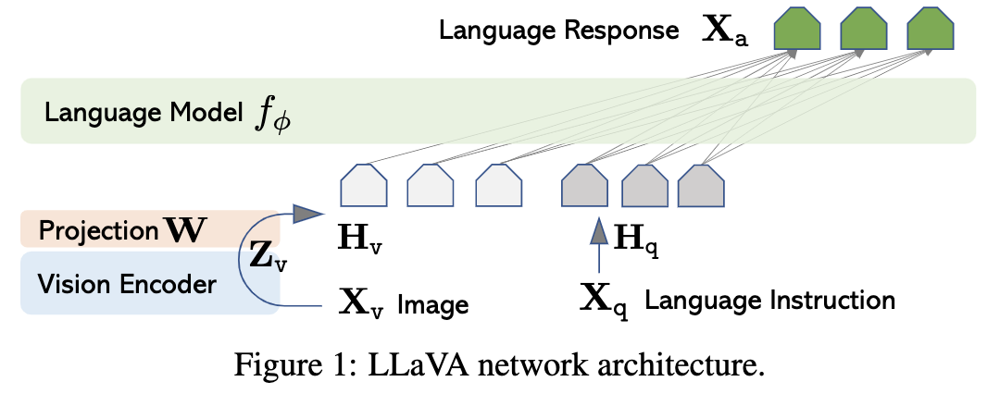

<h1 id="目录">目录</h1>

- [1.指令微调数据制作发展路线](#1.指令微调数据制作发展路线)
- [2.指令微调数据构造有哪些指导原则？](#2.指令微调数据构造有哪些指导原则？)
- [3.简要介绍一下KV-Cache](#3.简要介绍一下KV-Cache)
- [4.多模态大模型中，视觉编码器和文本解码器常见的连接方式有哪几种？](#4.多模态大模型中，视觉编码器和文本解码器常见的连接方式有哪几种？)
- [5.多模态大模型常见的Benchmark及其评估维度](#5.多模态大模型常见的Benchmark及其评估维度)
- [6.简要介绍一下LoRA](#6.简要介绍一下LoRA)
- [7.简要介绍一下LoRA的问题以及常见的LoRA改进方案](#7.简要介绍一下LoRA的问题以及常见的LoRA改进方案)

<h1 id='1.指令微调数据制作发展路线'>1.指令微调数据制作发展路线</h1>

1. **Scaling law**：在指令微调数据较为匮乏的时期，收集更多的数据是提升性能的大力出奇迹办法。
2. **人工和启发式的数据多样性**：在数据量积累到一定规模后，数据混合配比成为新的研究话题。一些研究成果验证了合适的数据配比可以提升性能，但数据配比没有通用的万能钥匙。
3. **基于模型的多样性**：随着LLMs/MLLMs，可以让它们参与到数据生产和筛选流程中，例如用GPT3.5/4/4V生产数据，用其它LLMs作为数据质量筛选器。（GPT4/GPT4V为指令微调领域贡献了太多数据，这可能也是一种OpenAI吧）
4. **数据效率**：有了LLMs/MLLMs的加持，数据量似乎已经不成大问题。因此高质量数据的多样性、难度和复杂程度成为了关注焦点。满足上述要求的数据意味着用高质量的响应近似真实用户提示，LIMA论证了只要数据质量足够高，数据量会是次要因素。因此，需要自动化或半自动方案对数据进行过滤：
    1. 基于自然语言规则过滤；
    2. 用InsTag对指令微调数据打语义或意图的标签，从而做聚类分析；
    3. 利用GPT4等语言模型过滤噪声数据；
    4. 利用模型的loss等反馈数据对模型的影响，例如评估模型对指令的不确定性（Active Instruction Tuning）；
5. **数据治理、责任和其他问题**：开始关注数据商业条款、许可，版权等问题。


<h1 id='2.指令微调数据构造有哪些指导原则？'>2.指令微调数据构造有哪些指导原则？</h1>

1. **多样性**：覆盖尽可能多的数据/能力/响应类型；
2. **高质量**：Less is More，最好由算法工程师人工检查每一条指令微调数据，保证每条数据的高质量，三个臭皮匠抵不过一个诸葛亮；
3. **复杂性**：提高每条数据的信息量；
4. **每种能力的激活不需要太多数据**；
5. **更自由的强指令跟随能力需要较多数据**；
6. **精调各项能力配比**，避免遗忘；

<h1 id='3.简要介绍一下KV-Cache'>3.简要介绍一下KV-Cache</h1>


对于单个样本来说，生成式模型是next token prediction，随着序列变长，next token预测成本越来越高，FLOPs越来越大。但实际上它们重复计算了很多previous tokens。

KV-Cache的作用就是将计算过的token缓存起来不再重复计算。

假设没有KV-Cache，则next token prediction遵循如下伪代码。
```python
EOS_token = torch.tensor([198])
cur_tokens = torch.tensor(tokenizer.encode("WeThinkIn is"))
next_token = None
with torch.no_grad():
    while next_token != EOS_token:
        # cur_tokens会包含越来越多的重复计算
        logits, _ = model(cur_tokens)
        next_token = torch.argmax(logits[-1, :], dim=0, keepdim=True)
        # 每次得到next_token后需要和cur_tokens拼接
        cur_tokens = torch.cat((cur_tokens, next_token), 0)
```

```python
EOS_token = torch.tensor([198])
cur_tokens = torch.tensor(tokenizer.encode("WeThinkIn is"))
next_token = None
kv_cache = None
with torch.no_grad():
    while next_token != EOS_token:
        # 通过past_key_values实现
        logits, kv_cache = model(cur_tokens, past_key_values=kv_cache)
        next_token = torch.argmax(logits[-1, :], dim=0, keepdim=True)
        # 不再需要concate，因为需要重复计算的部分会不断增量缓存到kv_cache中，以空间换时间。
        cur_tokens = next_tokens
```

如果一个mini-batch内的样本共享相同的meta/system prompt或图像，则可以先统一做一次预填充，再通过past_key_value参数传入generate的方式实现不同样本间的KV-Cache。


<h1 id='4.多模态大模型中，视觉编码器和文本解码器常见的连接方式有哪几种？'>4.多模态大模型中，视觉编码器和文本解码器常见的连接方式有哪几种？</h1>

常见连接方式有Q-Former，Attention，Linear Layer/ MLP结构。此外还有Fuyu这类较特殊的结构，它没有Image Encoder，而是直接把image patches通过Linear Layer映射后送入LLM。

各结构的代表性方法列举如下：

**Q-Former**

>以BLIP-2为代表的Q-Former结构在其中增加了多个目标函数，希望视觉信息和文本信息在Q-Former中进一步对齐。


**Attention**

>以Flamingo结构为代表的Attention结构没有简单的把视觉tokens和文本tokens拼接到一起，而是在cross-attention层加入，增强了视觉信息和文本信息间的交互。


**Linear Layer / MLP**

>最近的研究工作大大简化的连接方式，以LLaVA为代表的方法仅使用了一个Linear Layer作为连接器，然后把视觉tokens和文本tokens经过拼接后送入LLM。
>在LLaVA 1.5中，Linear Layer升级为了2层MLP。目前MLP结构广受欢迎。




**Fuyu**

>Fuyu架构同样使用了Linear Layer，但更为特殊的是，Fuyu索性将image encoder去掉了，直接将image patches经Linear Layer映射后与文本tokens拼接，并送入LLM中。


<h1 id='5.多模态大模型常见的Benchmark及其评估维度'>5.多模态大模型常见的Benchmark及其评估维度</h1>

| Benchmark | 评估维度 | 链接 |  
|---|---|---|
| OpenCompass | 100+数据集，40w问题，多维度综合 | https://opencompass.org.cn/home  |
| MMMU | 11.5k问题，多维度综合，涵盖六个核心学科: 艺术与设计、商业、科学、健康与医学、人文与社会科学和技术与工程。这些问题涉及30个主题和183个子领域，包括30个高度异构的图像类型，如图表、图表、地图、表格、音乐表和化学结构等。 | https://mmmu-benchmark.github.io/ |
| MME | 涵盖感知和认知在内的共14个子任务  | https://github.com/BradyFU/Awesome-Multimodal-Large-Language-Models/tree/Evaluation | 
| POPE | 幻觉问题评估 | https://github.com/RUCAIBox/POPE |
| TouchStone | 使用GPT4进行指令跟随能力评估，涵盖5个关键维度: 基本描述能力、视觉识别能力、视觉理解能力、视觉叙事能力和多图像分析能力。| https://github.com/OFA-Sys/TouchStone |


<h1 id='6.简要介绍一下LoRA'>6.简要介绍一下LoRA</h1>

LoRA全称Low Rank Adaptation，出自论文《LoRA: Low-Rank Adaptation of Large Language Models》。

LoRA的出发点是：预训练模型的参数量太大，而事实上对下游任务的微调所需要的本征维度(Intrinsic Dimension)并不高。

假设预训练参数$W_0$，微调后的参数为$W_1$，参数更新可以表示：

$$W_1 = W_0 + \Delta W$$

在“本征维度较低”假设下，可以将$\Delta W$做低秩分解：

$$W_1 = W_0 + UV$$

其中$U \in {\mathbb R}^{m \times r}$；$V \in {\mathbb R}^{r \times n}$。$r$可以设置得非常小，而后在微调过程中只微调$UV$。
这样需要被微调的参数量就少了很多很多。

在实践中，要保证模型初始为预训练状态以获得一个好的微调起点，例如将$UV$之一做全0初始化，或者在$W_0$中先减去$UV$.

<h1 id='7.简要介绍一下LoRA的问题以及常见的LoRA改进方案'>7.简要介绍一下LoRA的问题以及常见的LoRA改进方案</h1>
