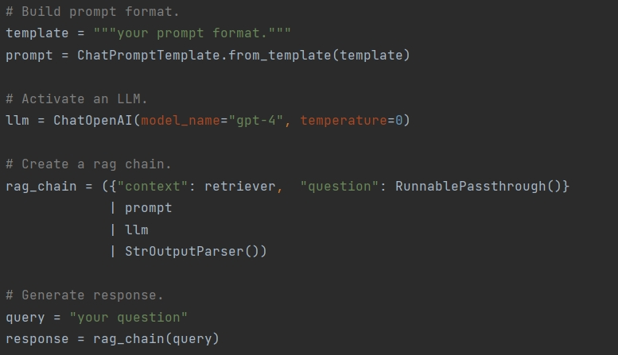

- [1.RAG文档召回率是什么？](#1.RAG文档召回率是什么？)
- [2.RAG技术的难点有哪些？](#2.RAG技术的难点有哪些？)
- [3.RAG存在的一些问题和避免方式有哪些？](#3.RAG存在的一些问题和避免方式有哪些？)
- [4.在大模型工程应用中RAG与LLM微调优化哪个是最优解?](#4.在大模型工程应用中RAG与LLM微调优化哪个是最优解?)
- [5.基于langchain的本地文档问答系统实现步骤有哪些?](#5.基于langchain的本地文档问答系统实现步骤有哪些?)
- [6.如何保证文档切片不会造成相关内容的丢失？文档切片的大小如何控制？](#6.如何保证文档切片不会造成相关内容的丢失？文档切片的大小如何控制？)
  

### 相关论文
- Retrieval-Augmented Generation for Large Language Models: A Survey (https://arxiv.org/abs/2312.10997)

### RAG是什么？
检索增强生成 (RAG) 是一种使用来自私有或专有数据源的信息来辅助大模型进行文本生成的技术。

### RAG的目的？
 解决大模型的幻觉问题（信息过时，效率不高，缺乏垂直领域知识）
 
### RAG的流程？
- 索引：将信息（PDF，TXT等文档）分为不同的信息片段（chunks），并通过编码器构建片段的向量索引库。
- 检索：基于问题的向量相似性来检索相关chunks。
- 增强：基于相关chunks，构建大模型的上下文条件或者额外的prompt信息。
- 生成：通过增强得到的上下文或者prompt指导大模型生成更加合理的回答。
>
### RAG的分类
- Naive RAG
仅包含基本流程的RAG（索引，检索，增强和生成）。
- Advanced RAG
相较于Naive RAG， Advanced RAG在索引和检索阶段实施了多项优化措施。在索引阶段，通过数据清洗和文档结构化等手段，提高了数据的质量和可用性。在检索阶段，采用了问题重写和扩充策略，以及针对检索到的chunks的重排序方法，从而显著提升了相关chunks的检索准确性和一致性。
- Modular RAG
随着RAG技术的进步，出现了模块化RAG，它在结构上更加灵活，包含了更多功能模块，如搜索引擎查询和回答融合。技术上，它结合了检索、微调、强化学习等方法。流程上，它对RAG模块进行了设计和编排，形成了多种模式。
>
### RAG的优势
- 及时性和时效性。通过定期更新索引文档，可以确保大模型能够访问最新、最及时的信息。
- 减少偏见和幻觉。通过索引相关chunks，可以为大型模型提供更精准的信息，从而指导其生成过程，确保回答的准确性和相关性。
- 迁移性高。仅需替换索引文档，即可将大模型迁移至其他垂直领域。
- 成本低廉，操作简单，仅需构建向量数据库和调用已有的LLM。

### RAG和微调的比较
>
### NAIVE RAG 示例代码
【包】

 >

【索引】

 >

【检索】

 >

【增强&生成】

 >

<h2 id="1.RAG文档召回率是什么？">1.RAG文档召回率是什么？</h2>
RAG（Retrieval-Augmented Generation）中的文档召回率（Document Recall）是指在检索阶段，模型能够成功找到与用户查询相关的所有文档的比例。具体来说，它衡量的是在所有相关文档中，有多少被成功检索到了。
文档召回率是评估检索系统性能的重要指标。它可以用以下公式计算：文档召回率=成功检索到的相关文档数量/所有相关文档数量
在RAG中，文档召回率的高低直接影响生成模型的表现。如果召回率低，生成模型可能会缺乏足够的背景信息，从而影响答案的准确性和相关性。
要提高文档召回率，可以采取以下措施：
1. 改进检索模型：使用更先进的检索模型，如Dense Passage Retrieval (DPR) 或改进BM25算法，来提高相关文档的检索效果。
2. 扩展检索范围：增加知识库的规模和多样性，以确保包含更多潜在相关文档。
3. 优化检索策略：调整检索策略，使用多轮检索或结合多个检索模型的结果，来提高召回率。
高召回率可以确保生成模型有更丰富的信息源，从而提高最终生成答案的准确性和可靠性。

<h2 id="2.RAG技术的难点有哪些？">2.RAG技术的难点有哪些？</h2>
（1）数据处理
目前的数据文档种类多，包括doc、ppt、excel、pdf扫描版和文字版。ppt和pdf中包含大量架构图、流程图、展示图片等都比较难提取。而且抽取出来的文字信息，不完整，碎片化程度比较严重。
而且在很多时候流程图，架构图多以形状元素在PPT中呈现，光提取文字，大量潜藏的信息就完全丢失了。
（2）数据切片方式
不同文档结构影响，需要不同的切片方式，切片太大，查询精准度会降低，切片太小一段话可能被切成好几块，每一段文本包含的语义信息是不完整的。
（3）内部知识专有名词不好查询
目前较多的方式是向量查询，对于专有名词非常不友好；影响了生成向量的精准度，以及大模型输出的效果。
（4）新旧版本文档同时存在
一些技术报告可能是周期更新的，召回的文档如下就会出现前后版本。
（5）复杂逻辑推理
对于无法在某一段落中直接找到答案的，需要深层次推理的问题难度较大。
（6）金融行业公式计算
如果需要计算行业内一些专业的数据，套用公式，对RAG有很大的难度。
（7）向量检索的局限性
向量检索是基于词向量的相似度计算，如果查询语句太短词向量可能无法反映出它们的真实含义，也无法和其他相关的文档进行有效的匹配。这样就会导致向量检索的结果不准确，甚至出现一些完全不相关的内容。
（8）长文本
（9）多轮问答

<h2 id="3.RAG存在的一些问题和避免方式有哪些？">3.RAG存在的一些问题和避免方式有哪些？</h2>
（1）分块（Chunking）策略以及Top-k算法
一个成熟的RAG应该支持灵活的分块，并且可以添加一点重叠以防止信息丢失。用固定的、不适合的分块策略会造成相关度下降。最好是根据文本情况去适应。
在大多数设计中，top_k是一个固定的数字。因此，如果块大小太小或块中的信息不够密集，我们可能无法从向量数据库中提取所有必要的信息。
（2）世界知识缺失
比如我们正在构建一个《西游记》的问答系统。我们已经把所有的《西游记》的故事导入到一个向量数据库中。现在，我们问它：人有几个头?
最有可能的是，系统会回答3个，因为里面提到了哪吒有“三头六臂”，也有可能会说很多个，因为孙悟空在车迟国的时候砍了很多次头。而问题的关键是小说里面不会正儿八经地去描述人有多少个头，所以RAG的数据有可能会和真实世界知识脱离。
（3）多跳问题（推理能力）
让我们考虑另一个场景：我们建立了一个基于社交媒体的RAG系统。那么我们的问题是：谁知道埃隆·马斯克？然后，系统将遍历向量数据库，提取埃隆·马斯克的联系人列表。由于chunk大小和top_k的限制，我们可以预期列表是不完整的；然而，从功能上讲，它是有效的。
现在，如果我们重新思考这个问题：除了艾梅柏·希尔德，谁能把约翰尼·德普介绍给伊隆·马斯克？单次信息检索无法回答这类问题。这种类型的问题被称为多跳问答。解决这个问题的一个方法是:
    找回埃隆·马斯克的所有联系人
    找回约翰尼·德普的所有联系人
    看看这两个结果之间是否有交集，除了艾梅柏·希尔德
    如果有交集，返回结果，或者将埃隆·马斯克和约翰尼·德普的联系方式扩展到他们朋友的联系方式并再次检查。
有几种架构来适应这种复杂的算法，其中一个使用像ReACT这样复杂的prompt工程，另一个使用外部图形数据库来辅助推理。我们只需要知道这是RAG系统的限制之一。
（4）信息丢失
RAG系统中的流程链:
    将文本分块（chunking）并生成块（chunk）的Embedding
    通过语义相似度搜索检索数据块
    根据top-k块的文本生成响应

<h2 id="4.在大模型工程应用中RAG与LLM微调优化哪个是最优解?">4.在大模型工程应用中RAG与LLM微调优化哪个是最优解?</h2>

RAG: 将检索(或搜索)的能力集成到LLM文本生成中，结合了检索系统(从大型语料库中获取相关文档片段)和LLM(使用这些片段中的信息生成答案)。
微调: 对预训练的LLM模型在特定数据集上进一步训练，使其适应特定任务或提高其性能的过程。

一般在工程中考虑使用RAG还是LLM需要从以下几点考虑：
（1）如果需要访问大量的外部数据，并且要实时更新。RAG系统在具有动态数据的环境中具有固有的优势。它们的检索机制不断地查询外部源，确保它们用于生成响应的信息是最新的。随着外部知识库或数据库的更新，RAG系统无缝地集成了这些更改，在不需要频繁的模型再训练的情况下保持其相关性。
（2）如果我们需要改变模型的输出风格，如我们想让模型听起来更像医学专业人士，用诗意的风格写作，或者使用特定行业的行话，那么对特定领域的数据进行微调可以让我们实现这些定制。
RAG虽然在整合外部知识方面很强大，但主要侧重于信息检索。
（3）一般来说RAG与LLM微调可以单独使用也可以组合使用。
（4）通过将模型在特定领域的数据中微调可以一定程度上减少幻觉。然而当面对不熟悉的输入时，模型仍然可能产生幻觉。相反，RAG系统天生就不容易产生幻觉，因为它们的每个反应都是基于检索到的证据。
    
<h2 id="5.基于langchain的本地文档问答系统实现步骤有哪些?">5.基于langchain的本地文档问答系统实现步骤有哪些?</h2>

项目实现过程包括加载文件、读取文本、文本分割、文本向量化、问句向量化、在文本向量中匹配出与问句向量最相似的topk个、匹配出的文本作为上下文和问题一起添加到prompt中、提交给LLM生成回答。

<h2 id="6.如何保证文档切片不会造成相关内容的丢失？文档切片的大小如何控制？">6.如何保证文档切片不会造成相关内容的丢失？文档切片的大小如何控制？</h2>
一、一般的文本切分可以按照字符、长度或者语义（经过NLP语义分析的模型）进行拆分。

二、刚好有一段完整的文本，如果切太小，那么则会造成信息丢失，给 LLM 的内容则不完整。太大则不利于向量检索命中。
文本切片不要使用固定长度，可以采用 LangChain 的 MultiVector Retriever ，它的主要是在做向量存储的过程进一步增强文档的检索能力。LangChain 有 Parent Document Retriever 采用的方案是用小分块保证尽可能找到更多的相关内容，用大分块保证内容完整性， 这里的大块文档是指 Parent Document 。MultiVector Retriever 在 Parent Document Retriever 基础之上做了能力扩充。
参考链接：https://python.langchain.com/v0.1/docs/modules/data_connection/retrievers/multi_vector/

<h2 id="7.根据提问匹配文本的方式有哪些？">6.如何保证文档切片不会造成相关内容的丢失？文档切片的大小如何控制？</h2>
