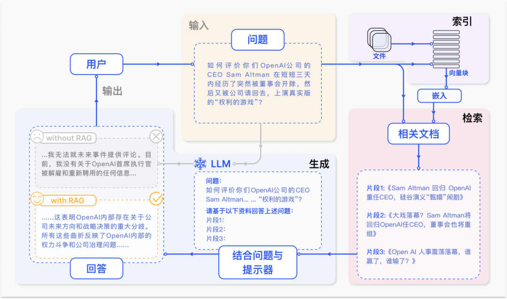
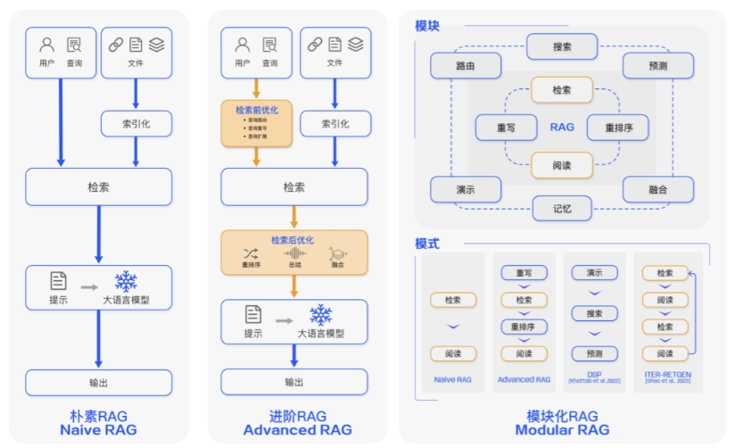
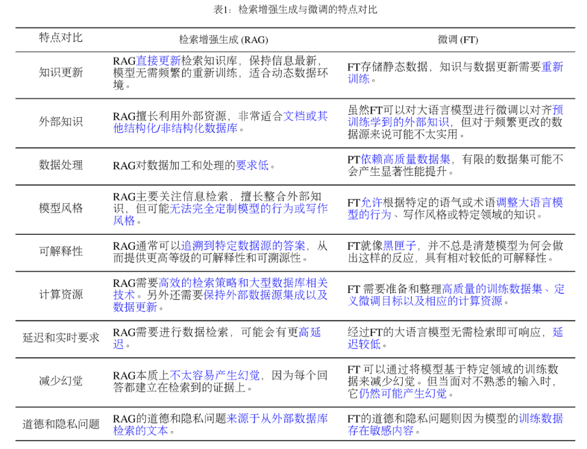
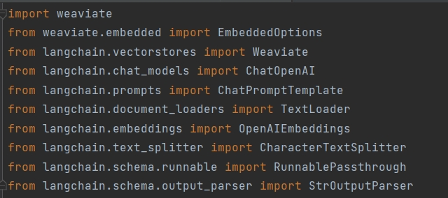

### 相关论文
- Retrieval-Augmented Generation for Large Language Models: A Survey (https://arxiv.org/abs/2312.10997)

### RAG是什么？
检索增强生成 (RAG) 是一种使用来自私有或专有数据源的信息来辅助大模型进行文本生成的技术。

### RAG的目的？
 解决大模型的幻觉问题（信息过时，效率不高，缺乏垂直领域知识）
 
### RAG的流程？
- 索引：将信息（PDF，TXT等文档）分为不同的信息片段（chunks），并通过编码器构建片段的向量索引库。
- 检索：基于问题的向量相似性来检索相关chunks。
- 增强：基于相关chunks，构建大模型的上下文条件或者额外的prompt信息。
- 生成：通过增强得到的上下文或者prompt指导大模型生成更加合理的回答。
>
### RAG的分类
- Naive RAG
仅包含基本流程的RAG（索引，检索，增强和生成）。
- Advanced RAG
相较于Naive RAG， Advanced RAG在索引和检索阶段实施了多项优化措施。在索引阶段，通过数据清洗和文档结构化等手段，提高了数据的质量和可用性。在检索阶段，采用了问题重写和扩充策略，以及针对检索到的chunks的重排序方法，从而显著提升了相关chunks的检索准确性和一致性。
- Modular RAG
随着RAG技术的进步，出现了模块化RAG，它在结构上更加灵活，包含了更多功能模块，如搜索引擎查询和回答融合。技术上，它结合了检索、微调、强化学习等方法。流程上，它对RAG模块进行了设计和编排，形成了多种模式。
>
### RAG的优势
- 及时性和时效性。通过定期更新索引文档，可以确保大模型能够访问最新、最及时的信息。
- 减少偏见和幻觉。通过索引相关chunks，可以为大型模型提供更精准的信息，从而指导其生成过程，确保回答的准确性和相关性。
- 迁移性高。仅需替换索引文档，即可将大模型迁移至其他垂直领域。
- 成本低廉，操作简单，仅需构建向量数据库和调用已有的LLM。

### RAG和微调的比较
>
### NAIVE RAG 示例代码
【包】
 >
【索引】
 >
【检索】
 >
【增强&生成】
 >

