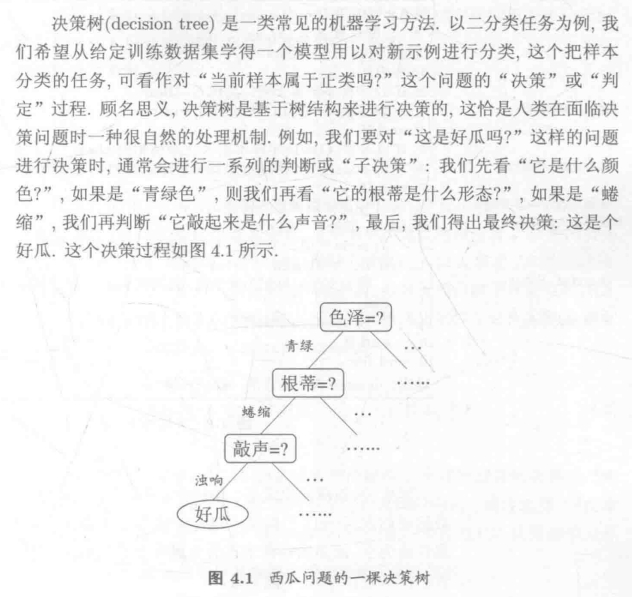
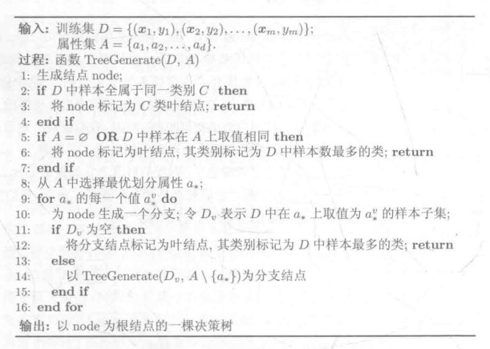

# 目录

- [1.什么是K最近邻算法？](#user-content-1.什么是K最近邻算法介绍)
- [2.什么是朴素贝叶斯？](#user-content-2.什么是朴素贝叶斯)
- [3.什么是决策树？](#user-content-3.什么是决策树)
- [4.什么是支持向量机？](#user-content-4.什么是支持向量机)
- [5.什么是逻辑回归？](#user-content-5.什么是逻辑回归)

<h2 id="1.什么是K最近邻算法？">1.什么是K最近邻算法？（K-nearest neighbor， KNN）</h2>

### （1）K最近邻算法介绍（K-nearest neighbor， KNN）
KNN算法是一种用于分类任务的非参数统计方法。
- 核心思想：当预测一个新样本的标签时，**根据它距离最近的 $k$ 个样本点是什么标签来判断该新样本属于哪个标签**（多数投票）。
- 输入输出：输入为特征空间中的一个点，输出为该点所对应的类别标签。

### （2）KNN的算法流程
 假设一个样本数据集${(x_i, y_i)}$, $x_i$是一个多维向量，$y_i$是该向量的标签，对于未知向量$x_j$，预测其对应的标签$y_j$
 - 计算$x_j$到每一个$x_i$的距离；
 - 对距离进行排序；
 - 选择最接近$x_j$的$k$个样本（也可通过kd树搜索）；
 - 根据多数投票原则，预测$x_j$的标签。
 
### （3）核心参数
#### 距离度量
两个向量$x_i= (x_i^1,x_i^2,x_i^3...x_i^n)$，$x_j=(x_j^1,x_j^2,x_j^3...x_j^n)$的距离 → 两个向量的相似程度，其公式为：
$$L_p(x_i,x_j)=(\sum_{j=1}^{n}{|x_{i}^{l}-x_{j}^{l}|^p})^{\frac{1}{p}}$$
当p=1，为曼哈顿距离；
当p=2，为欧氏距离；
当p=$\infty$，为向量分量的最大距离差。

#### $k$值选取
- 过小的$k$值分类器：未知样本对邻近的样本十分敏感，易受到噪声干扰；
- 过大的$k$值分类器：未知样本易被预测为占比较大的标签类型。

**常用的方法**：  
（1）从$k=1$开始，使用交叉验证法从样本数据集中分出检验集估计分类器的误差率。  
（2）重复该过程，每次$k$增值1，允许增加一个近邻。  
（3）选取产生最小误差率的$k$。
（4）一般$k$值不超过20，上限为$n$的开方。

####  分类决策规则
- **KNN的分类决策规则**：对未知样本的最邻近$k$个样本进行标签统计，采用多数投票进行分类预测。

### （4）Python实现
使用**sklearn.neighbors.KNeighborsClassifier**即可创建KNN分类器，参数包括：
- **n_neighbors**：设定k值，默认为5；
- **weights**：设定k个邻近样本对型统计的权重，默认为平均权重；
- **algorithm**：设定搜索邻近样本的方法，包括ball tree， kd tree和 brute。

### （5）算法优劣
- **优点**：简单易用，无需训练；对异常值不敏感。
- **缺点**：惰性算法，计算量大。

### （6）算法应用场景
- 人脸识别，文字识别，医学图像处理等。 （毋雪雁,王水花,张煜东.K最近邻算法理论与应用综述[J].计算机工程与应用,2017,53(21):1-7.）

### （7）KNN用于回归问题
- 对于k个邻近样本的标签，采用平均值作为未知样本标签的预测值。

<h2 id="2.什么是朴素贝叶斯？">2.什么是朴素贝叶斯？</h2>

### （1） 贝叶斯定理
**先验概率** - Prior probability
- **定义**：在观测数据前，表达不确定量的不确定性的概率分布，记为$P(A)$。
- **释义**：根据已知的经验和分析得到的概率，即由因求果。

**后验概率** - Posterior probability
- **定义**： 考虑和给出相关证据或数据后所得到的条件概率，记为$P(B|A)$。
- **释义**：依据得到的结果所计算出的事件发生的概率，即由果溯因。

**联合概率** - Joint probability
- **定义**：两个事件共同发生的概率，记为$P(AB)$。

**条件概率** - Conditional probability
- **定义**：事件$A$在事件$B$发生的条件下发生的概率。
- **公式**：
$$P(A|B)=\frac{P(AB)}{P(B)}$$

**全概率公式** - Law of total probability
- **定义**：将一复杂事件$A$的概率求解问题转化为不同独立条件（$P({B_1}\bigcap{B_2}...)=0$ & $P({B_1}\bigcup{B_2}...)=1$）下发生的事件概率的求和问题。
- **公式**：
$$P(A)=\sum_{i=1}^n{{P(A|B_i)}\times{P(B_i)}} $$

**贝叶斯定理** - Bayes' theorem
- **定义**：描述条件概率和后验概率的乘法关系。
- **公式**:
$$P(B_j|A)=\frac{{P(A|B_j)}\times{P(B_j)}}{P(A)} $$
$$P(B_j|A)=\frac{{P(A|B_j)}\times{P(B_j)}}{\sum_{i=1}^n{{P(A|B_i)}\times{P(B_i)}}} （独立事件）$$

**后验概率与条件概率的联系**
- 后验概率是一种条件概率，用于描述在给定观测结果的情况下，因变量取某个值的概率。

### （2）案例释义（以信号发射为例）
**案例**：有一个信号的发射端和接收端。发射端只发射A、B两种信号，其中发射信号A的概率为0.6，发射信号B的概率为0.4。当发射信号A时，接收端接收到信号A的概率是0.9，接收到信号B的概率是0.1。当发射信号B时，接收端接收到信号B的概率为0.8，接收到信号A的概率为0.2。求当接收到信号A时，发射信号为A的概率。

**概率**
- **先验概率**：
-$P(sendA)$ = 0.6，$P(sendB)$ = 0.4
- **条件概率**：
-$P(receiveA|sendA)$ = 0.9，$P(receiveB|sendB)$ = 0.8，$P(receiveA|sendB)$ = 0.2
- **后验概率**：
$P(sendA|receiveA)$ = ? 

### （3）朴素贝叶斯 - Naive bayes
**基本假设**
 - 给定数据样本的每个特征相互独立。

**简要推导**
给定训练数据集，其中每个样本$x$都包含$n$维特征，即$x=(x_1, x_2 ..., x_n)$，标签集合有$k$种标签，即$y=(y_1, y_2 ..., y_k)$。对于新样本$x$，判断其标签$y$，根据贝叶斯定理，可以到$x$属于$y_k$标签的概率为：
$$P(y_k|x)=\frac{{P(x|y_k)}\times{P(y_k)}}{\sum_{i=1}^k{{P(x|y_i)}\times{P(y_i)}}}$$
- 后验概率最大的标签则为对新样本$x$的预测标签。

由于朴素贝叶斯的基本假设，所以条件概率$P(x|y_k)$可以转化为：
$$P(x|y_k)=P(x_1,x_2 ..., x_n|y_k)=\prod_{j=1}^n{P(x_j|y_k)}$$
整合上式，朴素贝叶斯算法可以表示为：
$$f(x)={\mathop{argmax}\limits_{y_1, y_2 ..., y_k}}{\frac{\prod_{j=1}^n{P(x_j|y_k)}{P(y_k)}}{\sum_{i=1}^k{{\prod_{j=1}^n{P(x_j|y_i)}}\times{P(y_i)}}}}$$
 由于对于所有的标签，分母一样，因此忽略分母部分，将朴素贝叶斯化简为：
 $$f(x)={\mathop{argmax}\limits_{y_1, y_2 ..., y_k}}{\prod_{j=1}^n{P(x_j|y_k)}{P(y_k)}}$$
 
### （4）细分模型（以文本分类为例）
**高斯模型**
- **连续型变量特征**
- **条件概率**
$$P(x_i|y_k) = \frac{1}{\sqrt{2\pi\sigma_{y_k,i}^2}}\times{e^{-\frac{(x_i-u_{y_k,i})^2}{2\sigma_{y_k,i}^2}}}$$

<smaller> $u_{y_k,i}$ - $y_k$类中，第i维特征的均值；
$\sigma_{y_k,i}^2$ - $y_k$类中，第i维特征的方差。

在文本分类场景下，样本$x$就是文档，特征$x_i$就是单词，标签就$y$就是文档类别，对于新样本$x$判断其类别。

**多项式模型**
- 以**单词的频次**参与统计计算。
- **先验概率**：
$$P(y_k)=\frac{y_k类文档的所有单词}{所有文档的所有单词}$$
- **条件概率**
$$P(x_i|y_k)=\frac{单词x_i在y_k类文档中出现的次数之和+1}{y_k类文档的所有单词+所有文档的单词种类}$$

**伯努利模型**
- 以**是否出现**参与统计计算。
- **先验概率**：
$$P(y_k)=\frac{y_k类文档的个数}{所有文档的个数}$$
- **条件概率**
$$P(x_i|y_k)=\frac{y_k类文档中包含单词x_i的文档个数+1}{y_k类文档的个数+2}$$

### （5）拉普拉斯平滑

由于$P(y_k)\times{\prod_{j=1}^n{P(x_j|y_k)}{P(y_k)}}$为多项连乘，其中一项为0，则整个公式为0(**零概率事件**)。因此，假定训练样本很大时，每个特征$x_i$和样本$x$的计数加1造成的估计概率变化可以忽略不计，但可以方便有效的避免零概率问题。

### （6）Python代码
	sklearn.naive_bayes.MultinomialNB()

### （7）算法优劣

**优点**
- 分类稳定，可以处理多分类任务；
-  对确实数据不敏感，且可以进行增量训练。

**缺点**
- 需要知道事件发生的先验概率。

<h2 id="3.什么是决策树？">3.什么是决策树？</h2>

### （1）决策树（Decision Tree）
决策树是一种树形结构模型，由一个根节点，若干个内部节点和叶节点组成。其中，根节点和内部结点表示一个特征或属性，叶结点表示一个类别。西瓜分类的一颗决策树如下所示：

>

### （2）基本流程
 决策树一个由根到叶的递归过程，通过根节点和内部节点划分属性，直到只剩单一类型/无可用属性后停止。其伪代码如下所示：
>

**具体停止条件**
 - 当前节点包含的样本属于同一类别，视为叶节点，无需划分；
 - 无可用属性进行后续划分，视为同一类别（叶节点），无需划分；
 - 当点节点不包含样本，删除该节点，回退至父节点重新划分。
 
### （3）算法分类
- **ID3**： 在决策树的内部节点和根节点上，使用信息增益方法作为划分属性的选择标准，信息增益越大越好。
- **C4.5**：使用信息增益率来选择节点属性，增益率越高越好。
-  **CART**：使用基尼指数选择划分属性，基尼指数越小越好。

### （4）划分属性的选择标准
#### 信息增益
假定离散属性$a$有$V$个可能的取值${a^1, a^2, ..., a^n}$，若使用$a$来对样本集$D$进行划分，则会产生$V$个内部节点，其中第$v$个内部节点包含了$D$中所有在属性$a$上取值为${a^n}$的样本，记为$D_v$，根据式（1）计算出$D_v$的信息熵，并给予该节点权重$\frac{|D^v|}{|D|}$。再考虑到其他内部节点，计算出属性$a$对样本集进行划分所获得的“信息增益”，如式（2）所示。
$$Ent(D) = - \sum_1^n{p_klog_2p_k}$$
 - <smaller> $Ent(D)$ - 信息熵；
 - $n$ - 类别数目；
 - $p_k$ - 样本集中第$k$类样本所占的比例
 $$Gain(D,a) = Ent(D) - \sum_1^V\frac{|D^v|}{|D|}Ent(D^v)$$
 - $Gain(D, a)$ - 信息增益。
 - 
#### 信息增益率
$$Gain_ratio(D) =\frac{Gain(D,a)}{-\sum_1^V\frac{|D^v|}{|D|}log_2\frac{|D^v|}{|D|}}$$

#### 基尼指数
$$Gini(D) = - \sum_{k_1=1}^n\sum_{k_2!=k_1}{p_{k_1}}{p_{k_2}}$$
$$Gini_index(D,a) =  \sum_{1}^V\frac{|D^v|}{|D|}Gini(D^v)$$

### （5）Python代码
	from sklearn import tree #导入需要的模块
	clf = tree.DecisionTreeClassifier() #实例化模型对象
	class sklearn.tree.DecisionTreeClassifier (criterion=’gini’/'entropy', splitter=’best’, max_depth=None,min_samples_split=2, min_samples_leaf=1, min_weight_fraction_leaf=0.0, max_features=None,random_state=None, max_leaf_nodes=None, min_impurity_decrease=0.0, min_impurity_split=None,class_weight=None, presort=False)

### （6）算法优劣
**优点**

- 易于理解和实现；
-   数据准备简单；

**缺点**
- 类别过多时，分类困难且时间较长。

<h2 id="4.什么是支持向量机？">4.什么是支持向量机？</h2>

### （1）支持向量机（Support vector machine）  
支持向量机(Support Vector Machine, SVM)是一种有监督的机器学习算法,主要用于分类和回归分析。它的基本思想是在高维空间中构建一个超平面，将不同类别的数据点分开,使得两类数据点到超平面的距离最大化。  

- **超平面**  
	 超平面是指 $n$ 维线性空间中维度为 $n-1$ 的子空间。该子空间可以把线性空间分割成不相交的两个部分，例如：二维空间的线和三维空间的面。其描述方程为 $w^Tx+b=0$ ，记为超平面 $(w,b)$ ；而由于方程的乘法性质，对于任意的 $k$ 值， $(w,b)$ 和 $(kw,kb)$ 为同一超平面，因此下述用$(w,b)$表示。其中， $w=(w_1,w_2,...,w_{n})$ 为超平面的法向量； $b$ 为位移项，决定超平面与原点的距离。    
  
- **函数间隔与支持向量**  
	 函数间隔 $y_i\times(wx_i+b)$ 表示样本点距离超平面的距离，其值越大，距离越远。而支持向量则表示满足函数 $y_i\times(wx_i+b)=k$ 的样本点。  

- **工作原理**   
  **线性可分情况（硬间隔SVM）**：对于线性可分的数据,SVM试图找到一个能将两类数据完全分开的超平面,并使两类数据点到超平面的距离最大化(即最大间隔)。这个最大间隔超平面由最靠近它的几个支持向量决定。 
  **线性不可分情况（软间隔SVM）**：对于线性不可分的数据,SVM引入了软间隔,允许一些数据点位于间隔区域内或错分,从而使分类更加鲁棒。通过引入松弛变量和惩罚参数,SVM在最大化间隔和最小化误分类之间寻求平衡。 
  **非线性情况**：对于非线性数据,SVM使用核技巧将数据映射到高维特征空间,使得在高维空间中线性可分,从而实现非线性分类。常用的核函数包括线性核、多项式核、高斯核等。  

### （2）模型推导   
- **线性可分**   
  （a）**函数间隔和支持向量**  
	 已知超平面 $(w,b)$ ，对于任一样本 $(x_i,y_i)$ $\in$ 样本集 $D$ ，都满足函数间隔 $y_i\times(wx_i+b)>0$ 。若定义最小函数间隔 $\gamma$ 为 $\underset {i} {min} {(y_i\times (wx_i+b))}$ ，则所有正样本一定满足 ${y_i\times (wx_i+b )} \geq \gamma >0$ 。为了保证分类的鲁棒性，一定存在合适的超平面 $(w,b)$ ，使得任一正样本 $(x_i,y_i)\in{D}$ 都满足函数间隔 ${y_i\times (wx_i+b )} \geq 1$ 。其中，函数间隔 ${y_i\times (wx_i+b )} = 1$ 对应的样本点，称为支持向量。若 $y_i=+1$ ，则 $x_i$ 落在超平面 $H_1:wx+b=1$ 上；若 $y_i=-1$ ，则 $x_i$ 落在超平面 $H_1:wx+b=-1$ 上。如图所示，超平面 $H_1$ 和 $H_2$ 均与超平面 $H_0$ 平行，且等距分布在两侧。其中，支持向量（超平面 $H_1$ ）到超平面 $H_0$ 的距离 $\frac{1}{\Vert w \Vert_2}$ 为最短间隔，而超平面 $H_1$ 到的超平面 $H_2$ 的距离 $\frac{2}{\Vert w \Vert_2}$ 为几何间隔。
  
  
    
  （b）**硬间隔最大化**   
	 支持向量机通过最大化最短间隔和集合间隔，完成对训练样本的最佳线性分类，即**硬间隔最大化**。公式表达为 $\underset {(w,b)} {max}{\frac {1}{{\Vert w \Vert_2}}},s.t. {{y_i\times (wx_i+b )} \geq 1}$ 。而最大化 $\frac{1}{\Vert w \Vert_2}$ 和最小化 $\frac{1}{2}{\Vert w \Vert_2}$ 等价，因此硬间隔最大化可以重写成一个凸二次规划函数，即 $\underset {(w,b)} {min}{\frac {1}{2}{{\Vert w \Vert_2}}},s.t. {{y_i\times (wx_i+b )} \geq 1}$ 。若样本集线性可分，则该凸二次规划函数的解一定存在且唯一。
  
  （c）**对偶求解**   
	  引入拉格朗日算子，即可写出凸二次规划函数的拉格朗日函数，如下：   
  $$L(w,b,\alpha) = \frac {1}{2}{\Vert w \Vert_2}- \sum_{i=1}^{n}{\alpha_i y_i(wx_i+b)+\sum_{i=1}^{n}\alpha_i}$$
  其中，$\alpha=(\alpha_1,\alpha_2,...\alpha_n)$是拉格朗日乘子。 
  根据朗格朗日的对偶性，将求解问题转化为一个极大极小问题$\underset {\alpha} {max} \underset {(w,b)} {min} L(w,b,\alpha)$。解法如下： 
  Step 1： 将拉格朗日函数其$L(w,b,\alpha)$分别对$w,b$求偏导可得： 
$$\frac {\partial L}{\partial w} = w - \sum_{i=1}^{n}\alpha_iy_ix_i=0$$
$$\frac {\partial L}{\partial b} = - \sum_{i=1}^{n}\alpha_ix_i=0$$
  Step 2： 将拉格朗日函数化简为：  
$$L(w,b,\alpha) = -\frac{1}{2} \sum_{i=1}^{n}\sum_{j=1}^{n}{\alpha_i\alpha_jy_iy_j(x_ix_j)}+\sum_{i=1}^{n}\alpha_i$$
  Step 3: 将极大极小问题化简为：  
$$\underset {\alpha} {min} \frac {1}{2} \sum_{i=1}^{n}\sum_{j=1}^{n}{\alpha_i\alpha_jy_iy_j(x_ix_j)} -\sum_{i=1}^{n}\alpha_i,$$
$$s.t. \sum_{i=1}^{n}\alpha_iy_i=0$$
  Step 4：求解出最佳的超平面$(w,b)$：  
$$w=\sum_{i=1}^{n}\alpha_iy_ix_i$$
$$b=y_i-x_j\sum_{i=1}^{n}\alpha_iy_ix_i$$
$$s.t.  y_j(wx_j+b)=1$$

- **线性不可分**    
	线性可分问题的支持向量机对线性不可分是不适用的，因此本节采用软间隔将支持向量机推广到线性不可分的情况。  
（a）**软间隔最大化**  
	**假设条件**：样本集 $D$ 不是线性可分的，但剔除特异点之后，剩下的大部分样本 $(x_i,y_i)$ 是线性可分的。  
	线性不可分意味着某些样本点 $(x_i,y_i)$ 不能满足函数间隔 ${y_i\times (wx_i+b )} \geq 1$ 的约束条件。因此，引入一个松弛变量 $\xi_i \geq0$ ，使得函数间隔更加宽松 ${y_i\times (wx_i+b )} \geq 1-\xi_i$ 。同时，对每个松弛变量 $\xi_i$ ，引入一个代价变量 $\xi_i$ 和惩罚参数 $C$ 。软间隔最大化的凸二次规划函数则可以转化为：  
$${\frac {1}{2}{{\Vert w \Vert_2}}} + C \sum_{i=1}^{n}{\xi_i}$$
$$s.t. 	{y_i(wx_i+b) \geq 1-\xi_i},({ \xi_i\geq 0})$$
（2）**对偶求解**  
	引入拉格朗日乘子$\alpha,\beta$，写出凸二次规划函数的对偶问题，如下：  
$$\underset {\alpha, \beta}{max}{- \frac{1}{2} \sum_{i=1}^{n}\sum_{j=1}^{n}\alpha_i \alpha_j y_i y_j (x_ix_j)}+\sum_{i=1}^{n}\alpha_i$$
$$s.t. \sum_{i=1}^{n}\alpha_iy_i=0$$
$$C-\alpha_i-\beta_i=0$$
$$\alpha_i \geq 0, \beta_i \geq 0$$
如果 $0 < \alpha_i < C$ ，则 $C − \alpha_i = \beta_i > 0$ ，可以求得对应的 $\xi_i=0$ 。因此，该条件下最终求解的最优超平面 $(w,b)$ 同线性可分类似，为
$$w=\sum_{i=1}^{n}\alpha_iy_ix_i$$
$$b=y_j-x_j\sum_{i=1}^{n}\alpha_iy_ix_i$$
$$s.t.  y_j(wx_j+b)=1$$
在线性不可分的情况下，最优超平面 $(w,b)$ 的法向量 $w$ 是唯一的，但是偏置 $b$ 不一定是唯一的。因此，采用多次求解后的均值作为偏置 $b$ 。
对于 $\alpha_i =C$ 来说，满足 $\xi_i >0$ 都是特异点。特异点到所属边界超平面的距离为 $\frac {\xi_i}{\Vert w \Vert_2}$ 。如果 $0<\xi_i<1$ ，则位于超平面 $H_1,H_2$ 和 $H_0$ 之间，仍被分类成功：如果 $\xi_i=1$ ，在超平面 $H_0$ 上，无法分类； $\xi_i>1$ ，则被分类错误。

  
  
- **非线性**
在非线性情况下，SVM通过某种事先选择的非线性映射（核函数）将输入变量映到一个高维特征空间，将其变成在高维空间线性可分，在这个高维空间中构造最优分类超平面。
参考：[支持向量机原理之线性SVM与非线性SVM](https://blog.csdn.net/qq_45823424/article/details/113420320)

### （3）Python代码
`from sklearn.svm import SVC`

参考：[【ML】支持向量机SVM及Python实现（详细）_支持向量机代码（鸢尾花为案例）](https://blog.csdn.net/weixin_66845445/article/details/137054240)

### （4）优缺点

- **优点**：线性/非线性分类，小样本，高维数据。
-  **缺点**： 对核函数和惩罚参数的选择十分敏感。

<h2 id="5.什么是逻辑回归？">5.什么是逻辑回归？</h2>

### （1）核心思想
对样本集$X$中的样本$x=(x_1,x_2...x_i)$的特征进行线性拟合，并采用Sigmoid函数将拟合的预测结果值映射到值域为(0，1)的概率空间。其中，当线性回归的输出值大于0，Sigmoid函数将输出大于0.5的值；当线性回归的输出值等于0，Sigmoid函数将输出等于0.5的值；当线性回归的输出值小于0，Sigmoid函数将输出小于0.5的值。因此，可以将大于等于0.5的情况视为正分类（$y_1$），而小于0.5的情况视为负分类（$y_0$）。

- **Sigmoid函数**
由于线性回归的结果范围为正负无穷，因此通过**对数几率**将线性回归的**预测结果**非线性映射到固定区间(0~1)之间，数学表达式为:
$$S(x)=\frac{1}{1+e^{-x}}$$
>

### （2）逻辑回归

- **数学表达**
$$P(y=1|x,\theta)=\frac{1}{1+e^{-\theta^Tx}}$$
$P(y=1|x,\theta)$表示给定样本$x$，其预测标签为正分类的概率。$\theta$表示样本特征$x_i$的权重参数。这个表达式的核心思想可以通过2步来分解和理解：**第一步：回归假设**：$z = h_\theta(x)=\theta^Tx$；**第二步：Sigmoid函数**：$y =g(z)=\frac{1}{1+e^{-z}}$。当$\theta^Tx≥0, h_\theta(x)≥0,g(z)≥0.5$为正分类，反之$g(z)<0.5$为负分类，因此逻辑回归算法的核心就在于求解权重$\theta$和回归假设的函数，即确定决策边界。

- **决策边界的定义**
逻辑回归算法通常不拟合样本分布，而且通过权重$\theta$和回归函数确定决策边界，将样本划分为2类。其中，决策边界包括线性决策边界和非线性决策边界。
	**线性决策边界**：即第一步**线性回归**：$h_\theta(x)=\theta_0+\theta_1x_1+\theta_2x_2...+\theta_ix_i$$。

	**非线性决策边界**：即将线性回归拓展成**多项式回归**：$h_\theta(x)=\theta_0+\theta_1x_1+\theta_2x_2^2...+\theta_ix_i^i$$。

 
- **决策边界的确定**
决策边界通过梯度下降法最小化损失函数得到。
**损失函数**： 损失函数通过衡量训练样本标签与预测标签之间的差异，确定最优的决策边界。其中，损失函数越小，决策边界越好。损失函数包括：**均方误差损失(MSE)**和**对数损失函数**。
均方差误差：
$$MSE=\frac{1}{m}\sum_{x\in{X}}({f(x)-y_{1/2})}$$
对数损失函数：
$$J(\theta)=-\frac{1}{m}[\sum_{x\in{X}}(y_{1/2}\log{h_\theta(x)+(1-y_{1/2})\log(1-h_\theta(x))}]$$
**梯度下降**：梯度下降法通过向函数上当前点对应梯度（或者是近似梯度）的反方向的规定步长距离点进行迭代搜索，找到一个函数的局部极小值。该局部极小值对应的参数$\theta$即为最佳的参数$\theta$。其公式为：
$$J(\theta_1)=\theta_1-\alpha\frac{dJ(\theta_1)}{d\theta_1}$$

### （3）算法正则化
在训练数据不够多，或者模型复杂又过度训练时，模型会陷入过拟合（Overfitting）状态。通过对损失函数添加正则化项，可以约束参数的搜索空间，从而缓解过拟合现象，以下是对对数损失函数添加L2正则化项的公式。其中，$m$为样本集$X$的个数；$\lambda$为正则化系数，$\lambda$值越大，$J(\theta)$越大，越不容易发生过拟合现象。
$$J(\theta)=\frac{1}{m}[\sum_{x\in{X}}(y_{1/2}\log{h_\theta(x)+(1-y_{1/2})\log(1-h_\theta(x))}]+\frac{\lambda}{2m}\sum_{j=1}^i{\theta_j^2}$$

### （4）Python代码
参见厦门大学数据实验室
<smaller>[Python实现逻辑回归(Logistic Regression in Python)_厦大数据库实验室博客 (xmu.edu.cn)](https://dblab.xmu.edu.cn/blog/84/)

