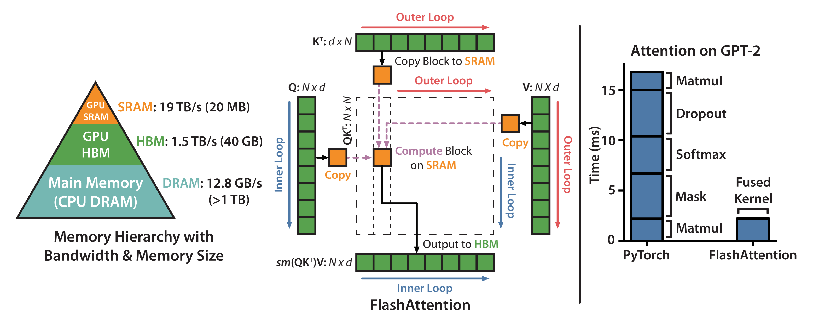
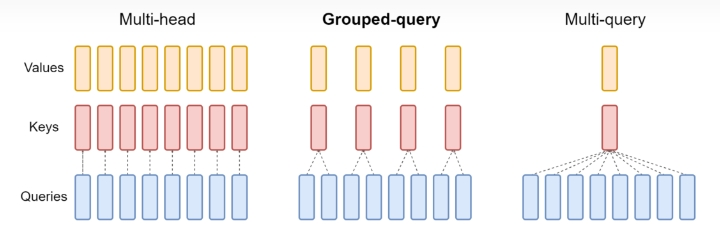

# 目录

- [1.什么是Page-Attention？](#user-content-1.什么是Page-Attention？)
- [2.什么是Flash-Attention？](#user-content-2.什么是Flash-Attention？)
- [3.大模型的流式输出介绍](#user-content-3.大模型的流式输出介绍)
- [4.MQA和GQA介绍](#user-content-4.MQA和GQA介绍)
- [5.vLLM部署示例以及相关参数介绍](#user-content-5.vLLM部署示例以及相关参数介绍)
- [6.AWQ量化介绍](#user-content-6.AWQ量化介绍)
- [7.GPTQ量化介绍](#user-content-7.GPTQ量化介绍)
- [8.介绍一下xformers技术](#user-content-8.介绍一下xformers技术)

<h2 id="1.什么是Page-Attention？">1.什么是Page-Attention？</h2>

### 为什么要使用Page-Attention
LLM推理过程通常分为两个阶段：prefill和decode。通常会使用KV cache技术加速推理。

1) 预填充阶段。在这个阶段中，整段prompt喂给模型做forward计算。如果采用KV cache技术，在这个阶段中我们会把prompt过后得到的保存在cache k和cache v中。这样在对后面的token计算attention时，无需对前面的token重复计算了，可以节省推理时间。

在上面的图例中，假设prompt中含有3个token，prefill阶段结束后，这三个token相关的KV值都被装进了cache。
2) decode阶段，在这个阶段中，根据prompt的prefill结果，一个token一个token地生成response。
同样，如果采用了KV cache，则每走完一个decode过程，就把对应response token的KV值存入cache中，以便能加速计算。例如对于图中的t4，它与cache中t0~t3的KV值计算完attention后，就把自己的KV值也装进cache中。对t6也是同理。

由于Decode阶段的是逐一生成token的，因此它不能像prefill阶段那样能做大段prompt的并行计算，所以在LLM推理过程中，Decode阶段的耗时一般是更大的。
从上述过程中，我们可以发现使用KV cache做推理时的一些特点：

- 随着prompt数量变多和序列变长，KV cache也变大，对gpu显存造成压力
- 由于输出的序列长度无法预先知道，所以很难提前为KV cache量身定制存储空间
### Page-Attention原理
虚拟内存的分页管理技术
- 将物理内存划分为固定大小的块，称每一块为页（page）。从物理内存中模拟出来的虚拟内存也按相同的方式做划分
- 对于1个进程，不需要静态加载它的全部代码、数据等内容。想用哪部分，或者它当前跑到哪部分，就动态加载这部分到虚拟内存上，然后由虚拟内存做物理内存的映射。
- 对于1个进程，虽然它在物理内存上的存储不连续（可能分布在不同的page中），但它在自己的虚拟内存上是连续的。通过模拟连续内存的方式，既解决了物理内存上的碎片问题，也方便了进程的开发和运行。

Page-Attention可在不连续的显存空间存储连续的 key 和 value。用于将每个序列的 KV cache 分块（blocks），每块包含固定数量的 token 的 key 和 value 张量。

可以看到for的attention计算，KV cache 被划分为多个块，块在内存空间中不必连续
因为 blocks 在显存中不必连续，所以可以像虚拟内存分页一样，以更灵活的方式管理键和值：
- 将 block 视为 page
- 将 token 视为 bytes
- 将序列视为进程
序列的连续逻辑块通过 block table 映射到非连续物理块。物理块可在生成新 token 时按需分配。因此只有最后一个block会发生显存浪费，小于4%。

通过 block table 将逻辑块映射到物理块

在并行采样时，同一个 prompt 生成多个输出序列，这些序列生成时可以共享 prompt 的 attention 计算和显存。
与 OS 中进程共享物理 page 的方式类似，不同序列可以通过将其逻辑块映射到同一物理块来共享块。为了确保共享安全，Paged Attention 跟踪物理块的引用计数，并实现 “写时复制”（Copy-on-Write）机制，即需要修改时才复制块副本。内存共享使得显存占用减少 55%，吞吐量提升 2.2x。

注：写时复制（Copy-on-write，简称COW）是一种计算机程序设计领域的优化策略。其核心思想是，如果有多个调用者（callers）同时请求相同资源（如内存或磁盘上的数据存储），他们会共同获取相同的指针指向相同的资源，直到某个调用者试图修改资源的内容时，系统才会真正复制一份专用副本（private copy）给该调用者，而其他调用者所见到的最初的资源仍然保持不变。


<h2 id="2.什么是Flash-Attention？">2.什么是Flash-Attention？</h2>

GPU的内存由多个不同大小和不同读写速度的内存组成。内存越小，读写速度越快。对于A100-40GB来说，内存分级图如下所示

- SRAM内存分布在108个流式多处理器上，每个处理器的大小为192K，合计为192*108KB=20.25MB
相当于计算块，但内存小
- 高带宽内存HBM（High Bandwidth Memory），也就是我们常说的显存，大小为40GB。SRAM的读写速度为19TB/s，而HBM的读写速度只有1.5TB/s，不到SRAM的1/10
相当于计算慢，但内存大

在标准注意力实现中，注意力的性能主要受限于内存带宽，是内存受限的，频繁地从HBM中读写N * N 的矩阵是影响性能的主要瓶颈。稀疏近似和低秩近似等近似注意力方法虽然减少了计算量FLOPs，但对于内存受限的操作，运行时间的瓶颈是从HBM中读写数据的耗时，减少计算量并不能有效地减少运行时间(wall-clock time)。

针对内存受限的标准注意力，Flash Attention是IO感知的，目标是避免频繁地从HBM中读写数据，减少对HBM的读写次数，有效利用更高速的SRAM来进行计算是非常重要的，而对于性能受限于内存带宽的操作，进行加速的常用方式就是kernel融合，该操作的典型方式分为三步：
1) 每个kernel将输入数据从低速的HBM中加载到高速的SRAM中
2) 在SRAM中，进行计算
3) 计算完毕后，将计算结果从SRAM中写入到HBM中

但SRAM的内存大小有限，不可能一次性计算完整的注意力，因此必须进行分块计算，使得分块计算需要的内存不超过SRAM的大小。
分块计算的难点在于softmax的分块计算，softmax与矩阵K的列是耦合的，通过引入了两个额外的统计量m(x),l(x)来进行解耦，实现了分块计算。需要注意的是，可以利用GPU多线程同时并行计算多个block的softmax。为了充分利用硬件性能，多个block的计算不是串行（sequential）的,而是并行的。

总的来说，Flash Attention通过调整注意力的计算顺序，引入两个额外的统计量进行分块计算，避免了实例化完整的N×N 的注意力矩阵S,P，将显存复杂度从$O(N^2)$降低到了$O(N)$


<h2 id="3.大模型的流式输出介绍">3.大模型的流式输出介绍</h2>

### 什么是流式输出SSE

指的是在与用户进行对话时，大模型能够实时地、连续地输出文本内容，而不是等待整个回答完全生成后再一次性输出。这种流式输出的方式，使得大模型的响应更加迅速，用户体验更加流畅。

### SSE原理

SSE，全称Server-Sent Events，是一种基于HTTP协议的服务器推送技术。它允许服务器主动向客户端发送数据和信息，实现了服务器到客户端的单向通信。

大模型采用SSE技术实现流式输出，其原理如下：

1) 建立连接：当用户与大模型进行对话时，客户端与服务器之间会建立一个基于HTTP的长连接。这个连接通过SSE机制保持打开状态，允许服务器随时向客户端发送数据。
2) 分步生成与实时推送：大模型根据用户的输入和当前的上下文信息，逐步生成回答的一部分。每当有新的内容生成时，服务器就会通过SSE连接将这些内容作为事件推送给客户端。
3) 客户端接收与展示：客户端通过JavaScript的EventSource对象监听SSE连接上的事件。一旦接收到服务器推送的数据，客户端会立即将其展示给用户，实现流式输出的效果。

### SSE的优点

1) 实时性：SSE技术使得服务器能够实时地将数据推送给客户端，无需客户端频繁发起请求，提高了数据的实时性。
2) 效率：通过保持长连接的方式，SSE技术避免了频繁建立和断开连接的开销，提高了数据传输的效率。
3) 轻量级：SSE技术基于HTTP协议，无需额外的协议支持，使得实现更加轻量级和简单。

### SSE的使用注意事项

1) 服务器性能：由于流式输出需要服务器实时推送数据，因此对服务器的性能要求较高。确保服务器具备足够的处理能力和带宽，以应对大量并发连接和数据传输的需求。
2) 数据安全性：在传输过程中，要确保数据的安全性，防止敏感信息泄露或被恶意利用。可以采用加密传输、身份验证等措施来增强数据安全性。
3) 用户体验：流式输出功能应关注用户体验，确保数据的实时性和准确性。同时，也要注意避免过度推送数据，以免给用户造成困扰或疲劳。


<h2 id="4.MQA和GQA介绍">4.MQA和GQA介绍</h2>

### MHA、MQA、GQA

MHA即Multi-Head Attention，QKV 三部分有相同数量的头，且一一对应。每次做 Attention，head1 的 QKV 就做好自己运算就可以，输出时各个头加起来就行。

MQA，全称 Multi Query Attention，让 Q 仍然保持原来的头数，但 K 和 V 只有一个头，相当于所有的 Q 头共享一组 K 和 V 头。实现改变了会不会影响效果呢？确实会影响但相对它能带来的收益，性能的些微降低是可以接受的。
收益：实验发现一般能提高 30%-40% 的吞吐。
收益主要就是由降低KV cache 带来的。实际上 MQA 运算量和 MHA 是差不多，可理解为读取一组 KV 头之后，给所有 Q 头用，但因为之前提到的内存和计算的不对称，所以是有利的。



GQA，全称 Group-Query Attention，是 MHA 和 MQA 的折衷方案，既不想损失性能太多，又想获得 MQA 带来的推理加速好处。具体思想是，不是所有Q 头共享一组 KV，而是分组一定头数 Q 共享一组 KV，比如上面图片就是两组 Q 共享一组 KV。

这两种技术的加速原理:
1) 降低了从内存中读取的数据量，所以也就减少了计算单元等待时间，提高了计算利用率
2) KV cache 变小了 head_num 倍，也就是显存中需要保存的 tensor 变小了，空出来空间就可以加大 batch size，从而又能提高利用率。

需要注意的是GQA和MQA需要在模型训练的时候开启，按照相应的模式生成模型。


<h2 id="5.vLLM部署示例以及相关参数介绍">5.vLLM部署示例以及相关参数介绍</h2>

### 部署Qwen为例

```
from vllm import LLM, SamplingParams

prompts = [
    "Hello, my name is",
    "The president of the United States is",
    "The capital of France is",
    "The future of AI is",
]
sampling_params = SamplingParams(temperature=0.8, top_p=0.95)

llm = LLM(model="qwen/Qwen-7B-Chat", revision="v1.1.8", trust_remote_code=True)

outputs = llm.generate(prompts, sampling_params)

for output in outputs:
    prompt = output.prompt
    generated_text = output.outputs[0].text
    print(f"Prompt: {prompt!r}, Generated text: {generated_text!r}")

```
### 参数介绍
SamplingParams有关参数
- temperature：Temperature 参数是文本生成模型中用于控制生成文本的随机性和创造性的一个重要的超参数。Temperature参数通常设置为 0.1 到 1.0 之间。
- top_k:模型预测的前k个最可能的下一个词。
- max_tokens:模型生成的最大长度。
- stop:生成模型停止生成的符号。

LLM有关参数
- model:LLM模型路径。
- tensor_parallel_size:并行处理的大小。
- gpu_memory_utilization:默认为0.9， cpu_swap_space默认4个G。若gpu_memory_utilization参数过小(分配的内存大小低于模型使用内存)或者过大(接近1.0)时，代码会崩溃。
- request_rate:请求速率

<h2 id="6.AWQ量化介绍">6.AWQ量化介绍</h2>

### AWQ量化是什么

AWQ（Activation-aware Weight Quantization）量化是一种基于激活值分布(activation distribution)挑选显著权重(salient weight)进行量化的方法，其不依赖于任何反向传播或重建，因此可以很好地保持LLM在不同领域和模式上的泛化能力，而不会过拟合到校准集，属训练后量化(Post-Training Quantization, PTQ)大类。

### AWQ量化原理

计算一个scale系数tensor，shape为[k]，k为矩阵乘的权重reduce的维度大小。对激活除以该tensor，并对矩阵乘的权重乘以该tensor，这降低了权重量化的难度，使得权重可以采用常规的group量化(直接根据最大最小值计算scale, zero point)。AWQ的核心技术一是这个对激活和权重应用scale的方法，另外就是如何计算这个scale tensor。因为激活是fp16不量化，对激活进行scale一般不会牺牲精度，因此可以对权重进行一些处理降低量化的难度。

<h2 id="7.GPTQ量化介绍">7.GPTQ量化介绍</h2>

### GPTQ量化的特点

1) 高效率： GPTQ是一种一次性量化方法，无需进行模型重新训练，因此在时间上非常高效。它能够在相对较短的时间内将大规模GPT模型（如GPT-3-175B）的参数量化为较低的位宽，减小了模型的存储需求。
2) 高准确性： 尽管GPTQ采用了量化技术，但它能够在几乎不影响模型准确性的情况下，将参数位宽减小到3或4位。这意味着压缩后的模型仍然能够保持与未压缩基线相近的性能水平，对于许多应用而言，这是非常重要的。
3) 扩展性： GPTQ的方法可以扩展到处理具有数百亿参数的GPT模型，如OPT-175B和BLOOM-176B。这种扩展性使得它在处理大规模模型时非常有用。
4) 极端量化： GPTQ还能够在极端的量化情况下表现出色，如将权重量化为2位甚至三值（ternary）量化水平。这意味着它不仅适用于相对较低的位宽，还适用于极度的位宽减小，而仍能够保持合理的准确性。
5) 快速执行： 为了支持压缩模型的高效执行，研究人员还开发了执行工具，使得压缩后的模型能够在GPU上高效运行。这包括对GPU内存加载的优化，从而在高端GPU（如NVIDIA A100）上实现约3.25倍的性能提升，在更经济的GPU（如NVIDIA A6000）上实现4.5倍的性能提升。

### GPTQ量化的优点

1) 减小了GPU内存需求： GPTQ使用了一种称为"Lazy Batch-Updates"的方法，将模型分成块并逐块压缩。这种方法允许在GPU内存较小的情况下执行模型量化，而不需要一次性加载整个模型。这样，GPTQ可以在资源受限的环境中执行大型模型的量化，这对于之前的一次性量化方法来说可能是不可行的。
2) 提高了GPU利用率： GPTQ采用批量化更新操作，这意味着多个权重可以同时进行量化操作，从而提高了GPU的利用率。这种效率提升对于执行175亿参数模型的生成推断至关重要，因为生成推断通常需要大量的计算资源。


<h2 id="8.介绍一下xformers技术">8.介绍一下xformers技术</h2>

### Xformers 技术原理概述

**Xformers** 是 Meta 开发的一个高效、模块化的深度学习库，专注于优化 **Transformer** 架构的性能。Xformers 提供了对 Transformer 组件的多种加速技术，当模型规模庞大时，它能够显著提高训练速度和降低显存占用，特别是在资源受限的环境下（如嵌入式设备、移动设备）。随着 Transformer 架构的不断普及，Xformers 将继续在 AIGC 、传统深度学习以及自动驾驶领域中扮演重要角色。

### 1. **Xformers 的背景与目标**

Transformer 模型在自然语言处理（NLP）和计算机视觉（CV）任务中已经取得了巨大的成功，但随着模型规模的扩大，其巨大的计算开销和显存需求成为了模型部署中的瓶颈。Xformers的核心目标是：

- **降低显存消耗**：通过高效的注意力机制和其他模块优化来减少计算资源的占用。
- **提高计算效率**：在不损失性能的前提下，加速模型训练和推理的过程。
- **模块化与可扩展性**：提供易于集成的模块，便于用户按需组合和优化模型。

### 2. **Xformers 的技术原理**

#### 2.1 **Sparse Attention**（稀疏注意力）

Transformer 模型的主要瓶颈之一是自注意力机制的计算复杂度，标准的全连接注意力（Full Attention）在序列长度为 $N$ 的情况下，其计算复杂度为 $O(N^2)$ 。这对于长序列任务，如机器翻译或长文本生成任务，代价非常高。

**Xformers 提供了稀疏注意力机制**，即通过减少不必要的查询-键值对（Query-Key pairs）的计算来降低复杂度，通常可以将计算复杂度降至 $O(N \log N)$ 或 $O(N)$ ：

- **局部注意力（Local Attention）**：仅计算局部范围内的注意力权重，而忽略远程依赖关系。
- **因式分解注意力（Factorized Attention）**：将注意力计算分解为更小的矩阵运算，降低计算需求。

#### 2.2 **Memory-Efficient Attention**（显存高效的注意力机制）

Transformer 模型的另一个重要问题是其显著的显存占用。标准的注意力机制需要为整个输入序列保留注意力矩阵（即 Query-Key 和 Value 之间的所有匹配），这会占用大量显存。

**Xformers 引入了内存高效注意力（Memory-Efficient Attention）机制**，即只在需要时计算注意力权重和中间值，而不保留整个矩阵。这可以通过逐步计算的方式实现，将显存占用从原先的 $O(N^2)$ 降低到 $O(N)$ ，在不影响准确率的情况下大幅减少显存开销。

#### 2.3 **Block-Sparse Attention**

在一些应用中（例如图像生成任务），并不需要全局范围的注意力，某些位置的交互作用可以忽略。因此，Xformers 提供了 **Block-Sparse Attention**，它通过在稀疏矩阵中定义固定的稀疏模式来降低计算复杂度。这种方法特别适用于图像处理任务，例如使用块级操作来计算注意力。

- **局部窗口**：例如在图像生成任务中，注意力只在局部窗口内进行计算，可以跳过与远距离像素的注意力交互，从而减少计算负担。
- **灵活性与可定制性**：Block-Sparse Attention 的稀疏模式可以根据具体任务灵活定义，提供了更多的自定义选项。

#### 2.4 **Flash Attention**

Xformers 引入了 **Flash Attention** 技术，进一步优化了注意力机制的性能。Flash Attention 通过将注意力的计算与显存优化结合，允许在 GPU 上高效执行注意力操作。它可以通过在低精度硬件（如混合精度训练）中使用时，进一步提升计算效率。

### 3. **Xformers 在实际应用中的优势**

#### 3.1 **更快的训练速度**

通过使用稀疏注意力和内存高效注意力，Xformers 可以显著减少训练时间。在处理长序列任务时，Xformers 的优化能将训练时间减少 50% 以上，同时保持相似的性能。这对于需要快速迭代的大规模模型训练尤其重要。

#### 3.2 **显存占用大幅减少**

Xformers 的稀疏注意力机制和内存优化技术，使得显存占用可以减少一半以上。特别是在使用大型模型时，显存的节省能够使得相同的硬件资源可以训练更大的模型或处理更长的输入序列。

#### 3.3 **广泛的应用领域**

Xformers 不仅适用于 NLP 任务，也被广泛应用于计算机视觉、图像生成、时间序列预测等多种任务中。它的灵活性使其能够适配多种 Transformer 架构（如 Vision Transformers、BERT、GPT 等）。

