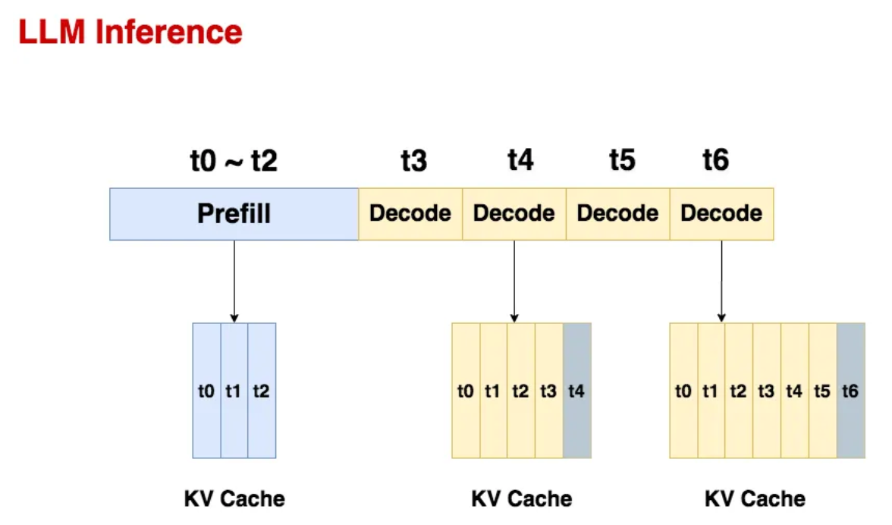
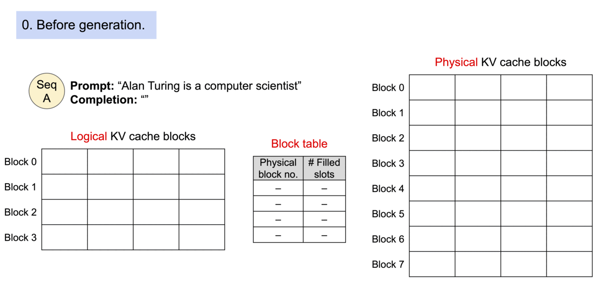

# 目录

- [1.什么是Page-Attention？](#user-content-1.什么是Page-Attention？)
- [2.什么是Flash-Attention？](#user-content-2.什么是Flash-Attention？)

<h2 id="1.什么是Page-Attention？">1.什么是Page-Attention？</h2>

### 为什么要使用Page-Attention
LLM推理过程通常分为两个阶段：prefill和decode。通常会使用KV cache技术加速推理。

1) 预填充阶段。在这个阶段中，整段prompt喂给模型做forward计算。如果采用KV cache技术，在这个阶段中我们会把prompt过后得到的保存在cache k和cache v中。这样在对后面的token计算attention时，无需对前面的token重复计算了，可以节省推理时间。

在上面的图例中，假设prompt中含有3个token，prefill阶段结束后，这三个token相关的KV值都被装进了cache。
2) decode阶段，在这个阶段中，根据prompt的prefill结果，一个token一个token地生成response。
同样，如果采用了KV cache，则每走完一个decode过程，就把对应response token的KV值存入cache中，以便能加速计算。例如对于图中的t4，它与cache中t0~t3的KV值计算完attention后，就把自己的KV值也装进cache中。对t6也是同理。

由于Decode阶段的是逐一生成token的，因此它不能像prefill阶段那样能做大段prompt的并行计算，所以在LLM推理过程中，Decode阶段的耗时一般是更大的。
从上述过程中，我们可以发现使用KV cache做推理时的一些特点：

- 随着prompt数量变多和序列变长，KV cache也变大，对gpu显存造成压力
- 由于输出的序列长度无法预先知道，所以很难提前为KV cache量身定制存储空间
### Page-Attention原理
虚拟内存的分页管理技术
- 将物理内存划分为固定大小的块，称每一块为页（page）。从物理内存中模拟出来的虚拟内存也按相同的方式做划分
- 对于1个进程，不需要静态加载它的全部代码、数据等内容。想用哪部分，或者它当前跑到哪部分，就动态加载这部分到虚拟内存上，然后由虚拟内存做物理内存的映射。
- 对于1个进程，虽然它在物理内存上的存储不连续（可能分布在不同的page中），但它在自己的虚拟内存上是连续的。通过模拟连续内存的方式，既解决了物理内存上的碎片问题，也方便了进程的开发和运行。

Page-Attention可在不连续的显存空间存储连续的 key 和 value。用于将每个序列的 KV cache 分块（blocks），每块包含固定数量的 token 的 key 和 value 张量。

可以看到for的attention计算，KV cache 被划分为多个块，块在内存空间中不必连续
因为 blocks 在显存中不必连续，所以可以像虚拟内存分页一样，以更灵活的方式管理键和值：
- 将 block 视为 page
- 将 token 视为 bytes
- 将序列视为进程
序列的连续逻辑块通过 block table 映射到非连续物理块。物理块可在生成新 token 时按需分配。因此只有最后一个block会发生显存浪费，小于4%。

通过 block table 将逻辑块映射到物理块

在并行采样时，同一个 prompt 生成多个输出序列，这些序列生成时可以共享 prompt 的 attention 计算和显存。
与 OS 中进程共享物理 page 的方式类似，不同序列可以通过将其逻辑块映射到同一物理块来共享块。为了确保共享安全，Paged Attention 跟踪物理块的引用计数，并实现 “写时复制”（Copy-on-Write）机制，即需要修改时才复制块副本。内存共享使得显存占用减少 55%，吞吐量提升 2.2x。

注：写时复制（Copy-on-write，简称COW）是一种计算机程序设计领域的优化策略。其核心思想是，如果有多个调用者（callers）同时请求相同资源（如内存或磁盘上的数据存储），他们会共同获取相同的指针指向相同的资源，直到某个调用者试图修改资源的内容时，系统才会真正复制一份专用副本（private copy）给该调用者，而其他调用者所见到的最初的资源仍然保持不变。

<h2 id="2.什么是Flash-Attention？">2.什么是Flash-Attention？</h2>

GPU的内存由多个不同大小和不同读写速度的内存组成。内存越小，读写速度越快。对于A100-40GB来说，内存分级图如下所示

- SRAM内存分布在108个流式多处理器上，每个处理器的大小为192K，合计为192*108KB=20.25MB
相当于计算块，但内存小
- 高带宽内存HBM（High Bandwidth Memory），也就是我们常说的显存，大小为40GB。SRAM的读写速度为19TB/s，而HBM的读写速度只有1.5TB/s，不到SRAM的1/10
相当于计算慢，但内存大

在标准注意力实现中，注意力的性能主要受限于内存带宽，是内存受限的，频繁地从HBM中读写N * N 的矩阵是影响性能的主要瓶颈。稀疏近似和低秩近似等近似注意力方法虽然减少了计算量FLOPs，但对于内存受限的操作，运行时间的瓶颈是从HBM中读写数据的耗时，减少计算量并不能有效地减少运行时间(wall-clock time)。

针对内存受限的标准注意力，Flash Attention是IO感知的，目标是避免频繁地从HBM中读写数据，减少对HBM的读写次数，有效利用更高速的SRAM来进行计算是非常重要的，而对于性能受限于内存带宽的操作，进行加速的常用方式就是kernel融合，该操作的典型方式分为三步：
1) 每个kernel将输入数据从低速的HBM中加载到高速的SRAM中
2) 在SRAM中，进行计算
3) 计算完毕后，将计算结果从SRAM中写入到HBM中

但SRAM的内存大小有限，不可能一次性计算完整的注意力，因此必须进行分块计算，使得分块计算需要的内存不超过SRAM的大小。
分块计算的难点在于softmax的分块计算，softmax与矩阵K的列是耦合的，通过引入了两个额外的统计量m(x),l(x)来进行解耦，实现了分块计算。需要注意的是，可以利用GPU多线程同时并行计算多个block的softmax。为了充分利用硬件性能，多个block的计算不是串行（sequential）的,而是并行的。

总的来说，Flash Attention通过调整注意力的计算顺序，引入两个额外的统计量进行分块计算，避免了实例化完整的N×N 的注意力矩阵S,P，将显存复杂度从$O(N^2)$降低到了$O(N)$